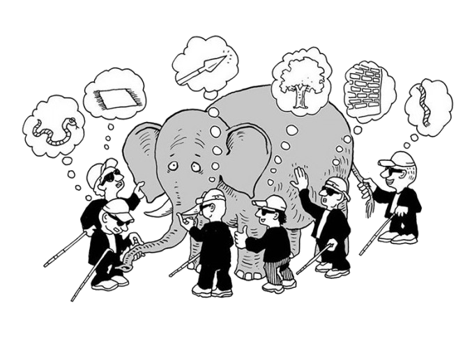

<!-- .slide: data-background="img/motivation.jpg" -->

### O que é Bioinformática?
### Qual a correlação com o Elefante?

====

<!-- .slide: data-background="img/motivation.jpg" -->

> ### Bioinformática:
>
> "Pesquisa, desenvolvimento e aplicação de ferramentas e abordagens computacionais que permitem o **uso de dados** biológicos, comportamentais ou da área de saúde, incluindo sua aquisição, organização, visualização, análise e **armazenamento**."

-- <cite>National Center for Biotechnology Information</cite>
