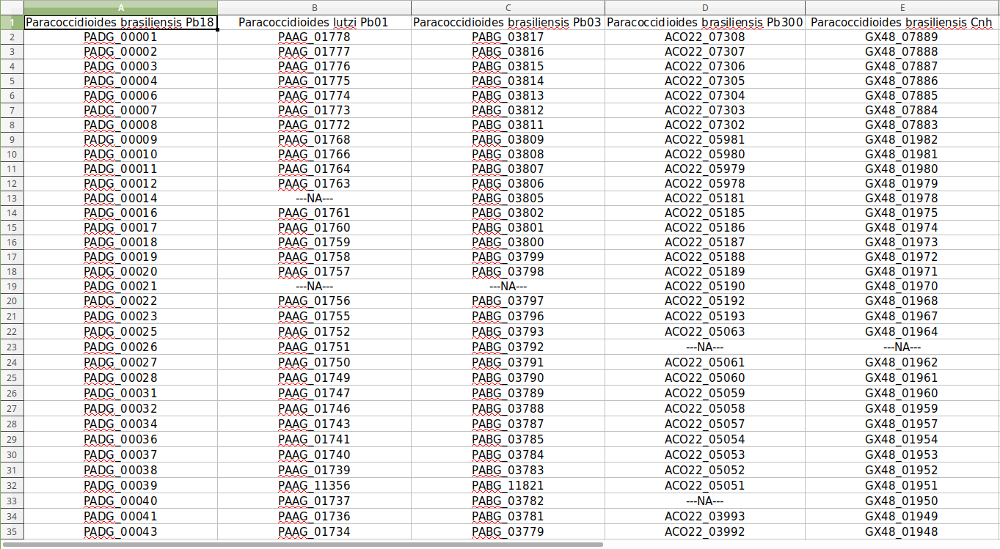

<!-- .slide: data-background="img/motivation.jpg" -->

Como tratavam (e ainda tratam) os dados em laboratórios?

## Planilhas, inúmeras planilhas...
## Infinitas Planilhas

====

<small> Planilha com identificadores de genes relacionais entre espécies diferentes de fungos patogênicos.</small>
