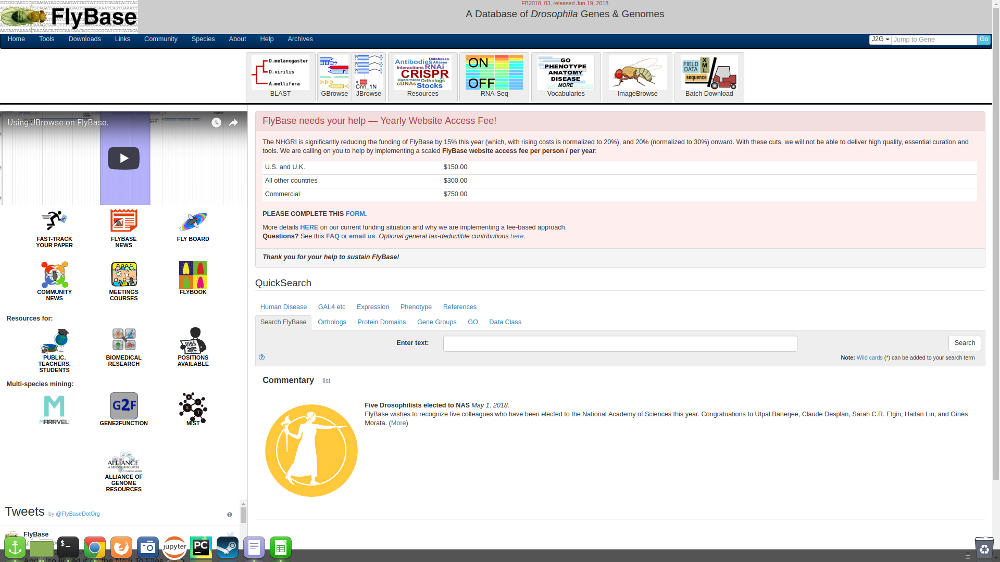
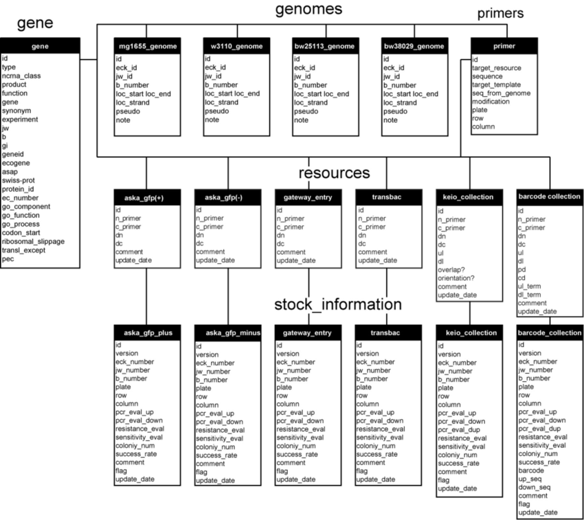
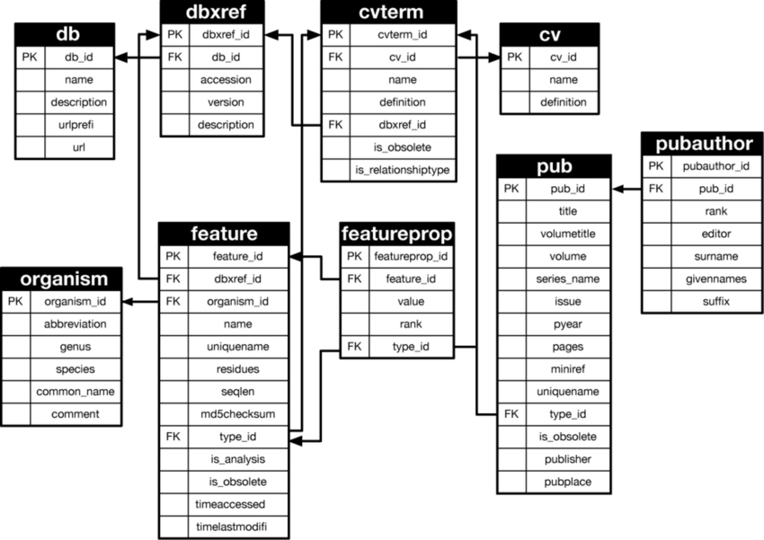

<!-- .slide: data-background="img/motivation.jpg" -->

Uma tentativa de solução:

## Chado

> "Um schema de banco de dados relacional, desenvolvido para diferentes plataformas (com maior aceitação e desenvolvimento em ambientes Postgres), que é amplamente utilizado para o gerenciamento do conhecimento biológico para uma grande variedade de organismos."

====
<!-- .slide: data-background="img/motivation.jpg" -->

### O que é exatamente o Chado

- Primeiro, um schema de banco de dados desenvolvido inicialmente para o FlyBase
- Um schema de banco de dados para curadoria profunda
- Um schema de banco de dados integrado
- Um schema de banco de dados que é genérico o suficiente para ser usado por qualquer organismo

====

<!-- .slide: data-background="img/motivation.jpg" -->

<small><b>Fig 3.</b> FlyBase: banco de dados genômico para <b><i>Drosophila</i></b> (mosca-da-fruta)  </small>

====

<!-- .slide: data-background="img/motivation.jpg" -->

### Características do Chado

- Esquema de banco de dados relacional que serve de base para muitos projetos de Bioinformática.
- Capaz de representar inúmeras classes gerais de dados frequentemente encontradas na biologia moderna.
- Projetado para lidar com representações complexas do conhecimento biológico.
- Pode ser considerado um dos esquemas relacionais mais sofisticado e disponível atualmente na biologia molecular.

====

<!-- .slide: data-background="img/motivation.jpg" -->

### Um schema modular

| Módulos                    | Descrição                              |
|----------------------------|----------------------------------------|
| Audit                      | auditorias de banco de dados           |
| Companalysis               | dados de análise computacional         |
| Contact                    | pessoas e grupos                       |
| Controlled Vocabulary (cv) | controle de vocabulários e ontologias  |
| Expression                 | sumário de expressão de RNA e proteína |
| General                    | identificadores                        |
| Genetic                    | dados genéticos e genótipos            |

====

<!-- .slide: data-background="img/motivation.jpg" -->

| Module                     | Description                            |
|----------------------------|----------------------------------------|
| Library                    | descrições de bibliotecas moleculares  |
| Mage                       | dados de microarray                    |
| Map                        | mapas sem sequência                    |
| Organism                   | espécies                               |
| Phenotype                  | dados fenotípicos                      |
| Phylogeny                  | árvores filogenéticas                  |
| Publication (pub)          | publicações e referências              |
| Sequence                   | sequências                             |
| Stock                      | espécimes e coleções biológicas        |
| WWW                        | classes genéricas para web             |

====

<!-- .slide: data-background="img/motivation.jpg" -->

====

<!-- .slide: data-background="img/motivation.jpg" -->

