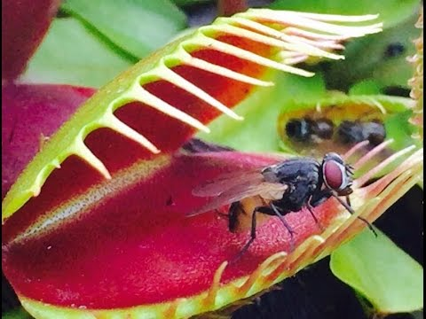
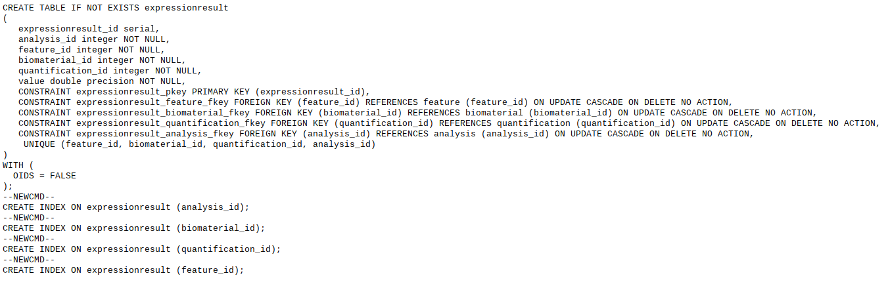
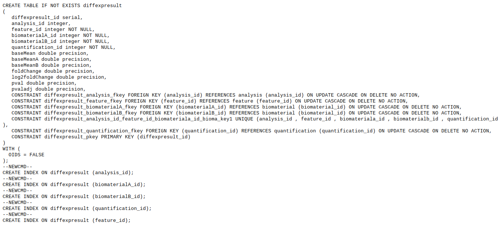

<!-- .slide: data-background="img/motivation.jpg" -->

## Estudo de Caso: Venus Flytrap Transcriptome

====

<!-- .slide: data-background="img/motivation.jpg" -->

## Organismo

====

<!-- .slide: data-background="img/motivation.jpg" -->

## Etapas

- Decisão dos experimentos (4 experimentos)
- Sequenciamento do transcriptoma do organismo
- Obtenção dos dados brutos
- Análise dos dados
- Geração dos resultados do tipo tabular

====

<!-- .slide: data-background="img/motivation.jpg" -->

## Chado

- Escolha dos módulos que seriam usados
- Input dos dados
- Criação de novos módulos para o projeto
- Input dos novos dados

====

<!-- .slide: data-background="img/motivation.jpg" -->

## Módulo de Expressão

====

<!-- .slide: data-background="img/motivation.jpg" -->

## Módulo de Expressão Diferencial

