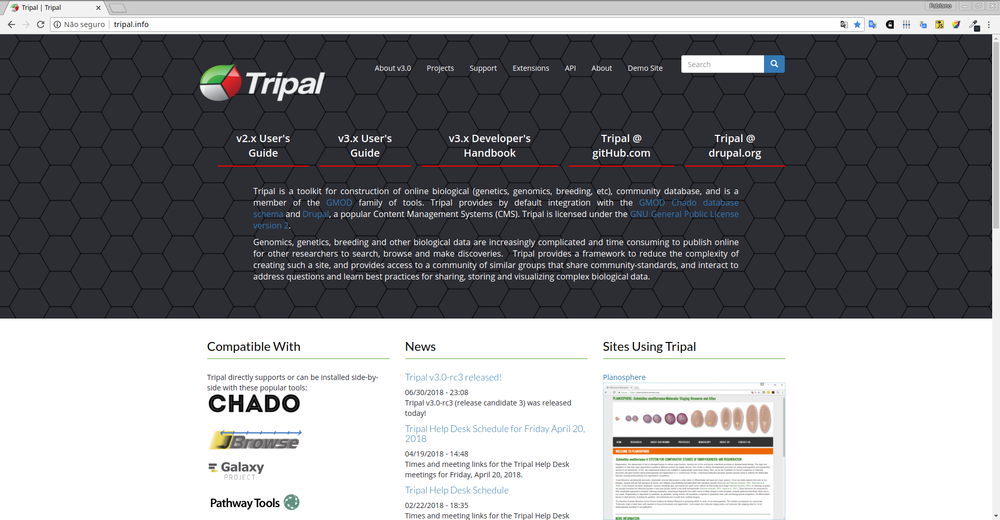
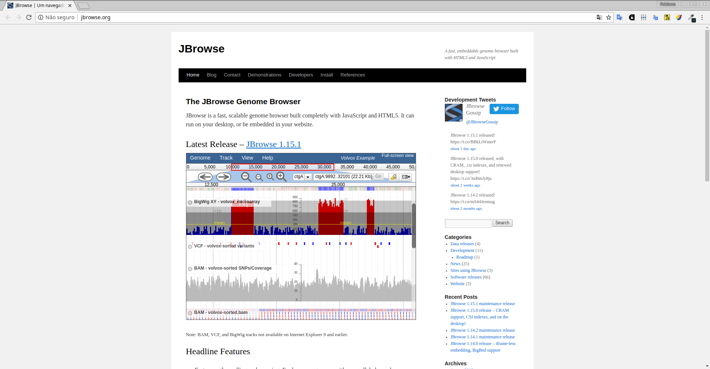
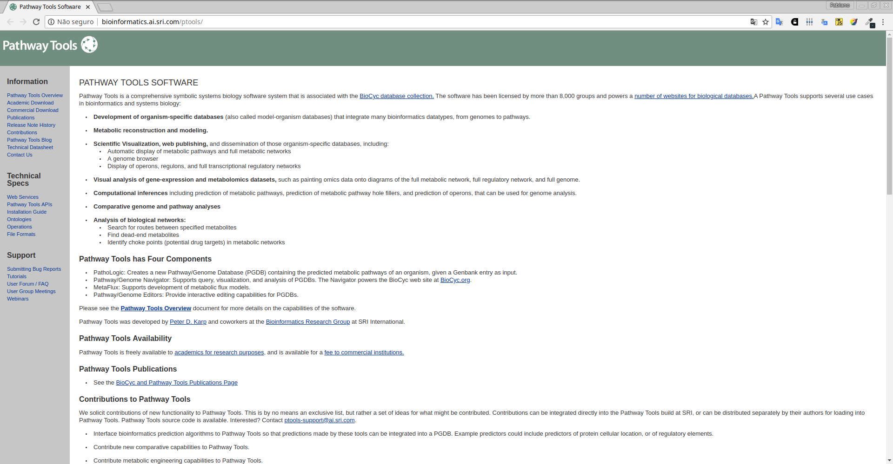
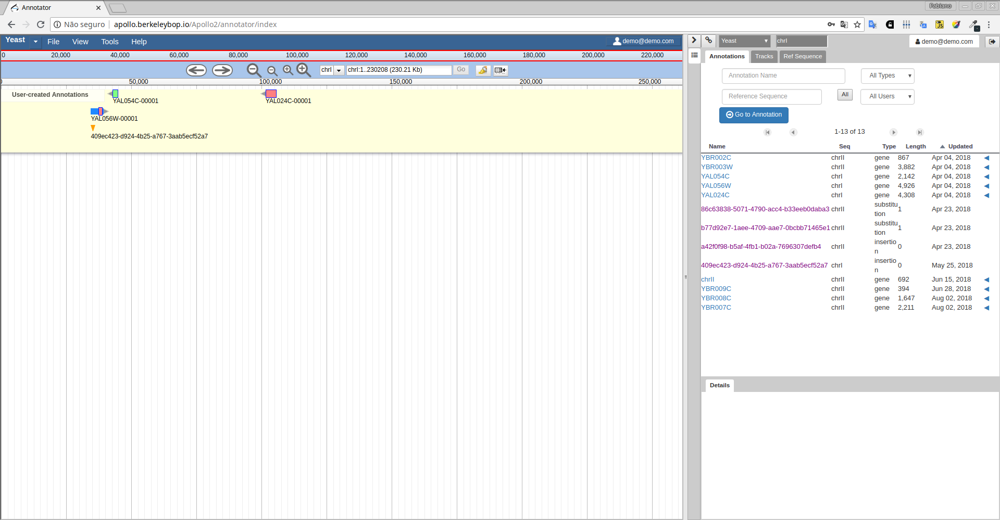
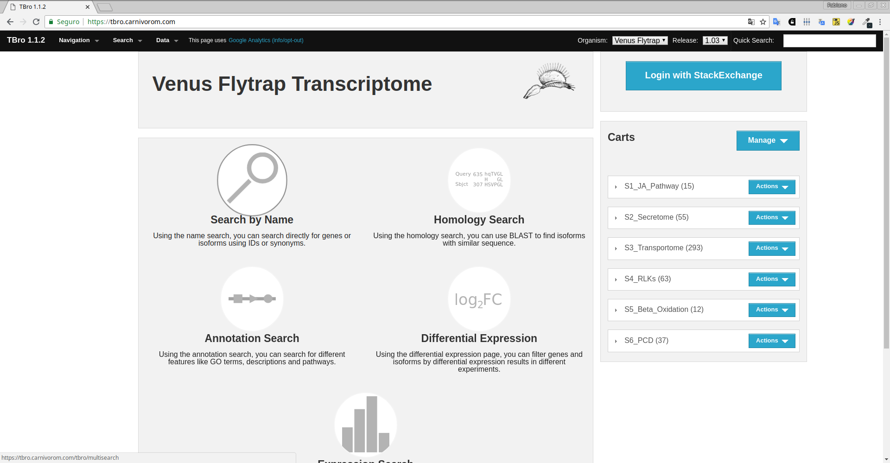

<!-- .slide: data-background="img/motivation.jpg" -->

## Chado em diferentes projetos científicos

====

<!-- .slide: data-background="img/motivation.jpg" -->

### Tripal

====

<!-- .slide: data-background="img/motivation.jpg" -->

### JBrowser

====

<!-- .slide: data-background="img/motivation.jpg" -->

### Pathway Tools

====

<!-- .slide: data-background="img/motivation.jpg" -->

### Apollo Annotation

====

<!-- .slide: data-background="img/motivation.jpg" -->

### TBro

====

<!-- .slide: data-background="img/motivation.jpg" -->

## Chado em diferentes databases biológicos

====

<!-- .slide: data-background="img/motivation.jpg" -->

### Tripal
