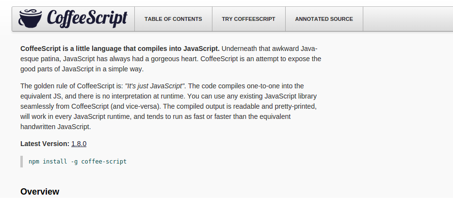
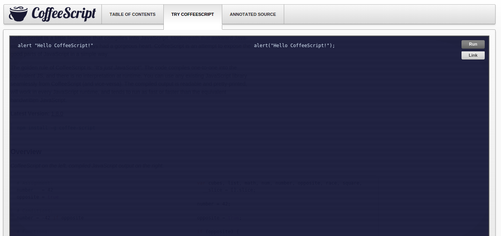

 <!-- .element: class="no-border no-background" -->

> tome um gole de café

<small>Versão 0.1</small>

----

_CoffeeScript_ é uma pequena liguagem que compila em Javascript.

====
<!-- .slide: class="compile" -->

###### CoffeeScript &rarr; Javascript

```coffeescript
# Assignment:
number   = 42
opposite = true

# Conditions:
number = -42 if opposite

# Functions:
square = (x) -> x * x
```

```javascript
var number, opposite, square;

number = 42;

opposite = true;

if (opposite) {
  number = -42;
}

square = function(x) {
  return x * x;
};
```

Note:
Alguns exemplos simples

====

> É apenas Javascript

* compilação 1 para 1
* sem interpretação em tempo de execução
* uso transparente de qualquer biblioteca Javascript
* Javascript gerado é legível e bem formatado e pode ser executado
  qualquer _engine_ Javascript

Note:
"É apenas Javascript" significa que a linguagem
não adicionada nenhuma funcionalidade nova ao Js.

Em outras palavras, nada que não é possível em
Javascript pode ser feito em CoffeeScript.

----

### Introdução

====

Criada em Dezembro de 2009 por _Jeremy Ashkenas_.

Inspirada em linguagens mais modernas como _Python_,
_Ruby_ e _Haskell_.

====

CoffeeScript permite escrever Javascript de forma
mais breve e legível.

* Blocos separados por indentação
* Parênteses, chaves e vírgulas são opcionais
* "Tudo é uma expressão"

====

#### Website e documentação



====

#### Experimente CoffeeScript



====

#### Instalação

O compilador de linha de comando  do CoffeeScript está disponível
como um utilitário em Node.js e deve ser instalado via NPM.

    npm install -g coffee-script

====

#### Forma de uso <small>do compilador</small>

    coffee -c script.coffee

Principais opções:

    -c  --compile   gera *.js para cada *.coffee
    -j  --join      concatena scripts antes de compilar
    -o  --output    define o diretório de saida
    -p  --print     imprime o javascript compilado
    -w  --watch     observa scripts por modificações
    -m  --map       gera source maps

----

### Parte 1: Variáveis e funções

====
<!-- .slide: class="compile" -->

#### Variáveis

###### CoffeeScript &rarr; Javascript

```coffeescript
message = "Ready for some Coffee?"
alert(message)
```

```javascript
var message;
message = "Ready for some Coffee?";
alert(message);
```

* sem declaração de variáveis
* sem ponto-e-vírgula

====
<!-- .slide: class="compile" -->

#### Funções

###### CoffeeScript &rarr; Javascript

```coffeescript
coffee = ->
  confirm "Read for some Coffee?"

coffee()
```

```javascript
var coffee;

coffee = function() {
  return confirm("Read for some Coffee?");
};

coffee();
```

* apenas _function expressions_
* sempre retornam um valor

====
<!-- .slide: class="compile" -->

#### Argumentos para funções

###### CoffeeScript &rarr; Javascript

```coffeescript
sayMyName = (name) ->
  console.log name
```

```javascript
var sayMyName;

sayMyName = function(name) {
  return console.log(name);
};
```

* definidos entre parênteses, antes da `->
`
====
<!-- .slide: class="compile" -->

#### valores padrão

###### CoffeeScript &rarr; Javascript

```coffeescript
sayMyName = (name = "Heinsenberg") ->
  console.log name
```

```javascript
var sayMyName;

sayMyName = function(name) {
  if (name == null) {
    name = "Heinsenberg";
  }
  return console.log(name);
};
```

* utilizando um `=`

====
<!-- .slide: class="compile" -->

#### executando funções

###### CoffeeScript &rarr; Javascript

```coffeescript
coffee()

sayMyName("Paulo Diovani")

console.log "coffee", "script"

alert confirm("Ready for Coffee?")

caution using functions arguments
```

```javascript
coffee();

sayMyName("Paulo Diovani");

console.log("coffee", "script");

alert(confirm("Ready for Coffee?"));

caution(using(functions(arguments)));
```

* parênteses são opionais
    - desde que fornecidos argumentos

----

### Parte 2: Operadores e condicionais

====
<!-- .slide: class="compile" -->

#### if

###### CoffeeScript &rarr; Javascript

```coffeescript
if (age >= 18)
  "drink beer"

if age < 18
  "drink coffee"
```

```javascript
if (age >= 18) {
  "drink beer";
}

if (age < 18) {
  "drink coffee";
}
```

* Parênteses são opcionais

====
<!-- .slide: class="compile" -->

#### reduzindo as linhas

###### CoffeeScript &rarr; Javascript

```coffeescript
if age >= 18 then "drink beer" else "drink coffee"
```

```javascript
if (age >= 18) {
  "drink beer";
} else {
  "drink coffee";
}
```

* Não existe operador ternário (`a ? b : c`)

====
<!-- .slide: class="compile" -->

#### Operadores

###### CoffeeScript &rarr; Javascript

```coffeescript
== is
!= isnt
not
and
or
true yes on
false no off
```

```javascript
===
!==
!
&&
||
true
false
```

====
<!-- .slide: class="compile" -->

#### Exemplos, `unless` e operadores encadeados

###### CoffeeScript &rarr; Javascript

```coffeescript
if paid() and coffee() is on then pour()

addCaffeine() if not Decaf()
addCaffeine() unless Decaf()

if 2 < newLevel < 5
  alert "In Range!"
```

```javascript
if (paid() && coffee() === true) {
  pour();
}

if (!Decaf()) {
  addCaffeine();
}
if (!Decaf()) {
  addCaffeine();
}

if ((2 < newLevel && newLevel < 5)) {
  alert("In Range!");
}
```

====
<!-- .slide: class="compile" -->

#### Operator de existência

###### CoffeeScript &rarr; Javascript

```coffeescript
drink(coffee) if coffee?
```

```javascript
if (typeof coffee !== "undefined" && coffee !== null) {
  drink(coffee);
}
```

* verifica se variável está definida e não é nula

====
<!-- .slide: class="compile" -->

#### Switch

###### CoffeeScript &rarr; Javascript

```coffeescript
switch hasSugar
  when yes
    dontPutSugar()
  when "stevia", "aspartame"
    dontPutSugar()
  else
    putSugar()
```

```javascript
switch (hasSugar) {
  case true:
    dontPutSugar();
    break;
  case "stevia":
  case "aspartame":
    dontPutSugar();
    break;
  default:
    putSugar();
}
```

* sempre adiciona breaks
* porém, pode combinar condições com `,`

====
<!-- .slide: class="compile" -->

#### Switch

###### CoffeeScript &rarr; Javascript

```coffeescript
message = switch cupsOfCoffee
  when 0 then 'Asleep'
  when 1 then 'Eyes Open'
  when 2 then 'Buzzed'
  else 'Dangerous'
```

```javascript
var message;

message = (function() {
  switch (cupsOfCoffee) {
    case 0:
      return 'Asleep';
    case 1:
      return 'Eyes Open';
    case 2:
      return 'Buzzed';
    default:
      return 'Dangerous';
  }
})();
```

* switches podem também retornar um valor
    - Lembre-se: "tudo é uma expressão"

====
<!-- .slide: class="compile" -->

#### Switch

###### CoffeeScript &rarr; Javascript

```coffeescript
score = 76
grade = switch
  when score < 60 then 'F'
  when score < 70 then 'D'
  when score < 80 then 'C'
  when score < 90 then 'B'
  else 'A'
```

```javascript
var grade, score;

score = 76;

grade = (function() {
  switch (false) {
    case !(score < 60):
      return 'F';
    case !(score < 70):
      return 'D';
    case !(score < 80):
      return 'C';
    case !(score < 90):
      return 'B';
    default:
      return 'A';
  }
})();
```

* switches podem ainda ser usados sem uma expressão de controle,
  tornando-os uma alternativa a `if`s aninhados

----

### Fontes

* wikipedia.org
* coffeescript.org
* codeschool.com

====

### Créditos da apresentação

por [Paulo Diovani Gonçalves](mailto:paulo@diovani.com)

<small>[paulo@diovani.com]((mailto:paulo@diovani.com)</small>

_powered by: [reveal.js](http://lab.hakim.se/reveal-js/)_

<small>[http://lab.hakim.se/reveal-js/](http://lab.hakim.se/reveal-js/)</small>
