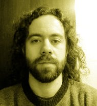
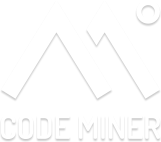
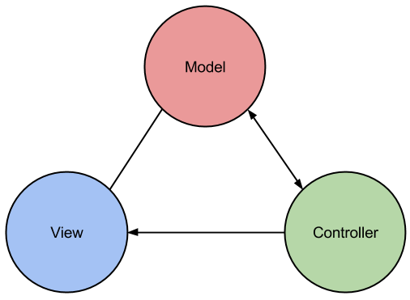

## Desenvolvimento Web rápido com [CakePHP 3.0][cake-site]

<small>Versão 0.1.0</small>

[cake-site]: http://cakephp.org/

====
<!-- .slide: class="author" -->

#### Paulo Diovani Gonçalves

*  <!-- .element: class="pull-right" -->
* Desenvolvedor na Codeminer 42.
* Graduando em Sistemas para Internet na Universidade Feevale.
* Palestrante em eventos FLISOL e Dia da Liberdade de Software.
* Usuário GNU/Linux desde 2005.
* PHP, Javascript, Node.js, Ruby, Python, Arduino.
* Entusiasta de novas tecnologias.
*  <!-- .element: class="pull-right no-border" -->

----

### Expectativas

* Desenvolvimento web com CakePHP
* Conceitos de MVC
* Boas práticas de programação

====

### Este curso não inclui

* Instalação de ambiente (Apache, PHP, etc.)
* ~~Programação PHP~~
* Desenvolvimento _front end_ (HTML, CSS, Javascript)
* _Deploy_ na nuvem
* Café

----

[![cakephp][cake-logo]][cake-site] <!-- .element: class="no-border" -->

_The rapid development PHP framework_

[cake-logo]: img/cakephp_logo_250_trans.png
[cake-site]: http://cakephp.org/

Note:
O que é CakePHP?

* Um framework PHP, MVC, para desenvolvimento rápido de aplicações web

====

> CakePHP makes building web applications simpler, faster and require less code.

====

### Recursos para CakePHP

[CakePHP website](http://cakephp.org/) <!-- .element: class="with-url" -->

[Cookbook](http://book.cakephp.org/) <!-- .element: class="with-url" -->

[API](http://api.cakephp.org/) <!-- .element: class="with-url" -->

Note:
Documentação e principais referências para o CakePHP.

====

[The Bakery](http://bakery.cakephp.org/) <!-- .element: class="with-url" -->

[CakePHP on StackOverflow](http://stackoverflow.com/tags/cakephp) <!-- .element: class="with-url" -->

[Google Group](https://groups.google.com/forum/#!forum/cake-php) <!-- .element: class="with-url" -->

[CakePHP Tuga](https://groups.google.com/forum/#!forum/cakephp-pt) <!-- .element: class="with-url" -->

Note:
Referências adicionais: artigos, QA, fóruns, etc.

----

### Material do curso

[Slides](http://slides.diovani.com/slides/curso-cakephp) <!-- .element: class="with-url" -->

[Pasta pública](http://bit.ly/cake30-paulodiovani) <!-- .element: class="with-url" -->

[Repositório no Github](https://github.com/paulodiovani/vagrantfile-cakephp) <!-- .element: class="with-url" -->

Note:
A pasta pública contém PDF dos slides e outros materiais.

O repositório no github contém

====

### O que vamos precisar?

<small>Softwares necessários para o curso</small>

* [Apache httpd 2.2](http://httpd.apache.org/) <!-- .element: class="with-url" -->
* [MySQL 5.x](http://www.mysql.com/) <!-- .element: class="with-url" -->
* [Notepad++](http://notepad-plus-plus.org/) <!-- .element: class="with-url" -->
* [PHP 5.4](http://php.net) <!-- .element: class="with-url" -->

Note:
Essencial para o desenvolvimento com CakePHP e para este curso

====

<small>Softwares recomendados</small>

* [Composer](https://getcomposer.org/) <!-- .element: class="with-url" -->
* [Git](http://git-scm.com/) <!-- .element: class="with-url" -->
* [Oracle Virtual Box](https://www.virtualbox.org/) <!-- .element: class="with-url" -->
* [PuTTY](http://www.putty.org/) <!-- .element: class="with-url" -->
* [Vagrant](https://www.vagrantup.com/) <!-- .element: class="with-url" -->

Note:
Ferramentas recomendadas para acompanhar o curso

----

### Subindo o ambiente <small>com Vagrant</small>

```bash
git clone https://github.com/paulodiovani/vagrantfile-cakephp.git curso-cakephp
cd curso-cakephp
vagrant up
```

Note:
Subindo o ambiente disponível em https://github.com/paulodiovani/vagrantfile-cakephp

====

* [web server](http://localhost:8080) <!-- .element: class="with-url" -->
    - Diretório `/curso-cakephp/www`
* [phpMyAdmin](http://localhost:8080/phpmyadmin) <!-- .element: class="with-url" -->
    - user: `root`, pass: `root`

Note:
Acesso ao ambiente

----

# Parte 1

## CakePHP 2.x

Versão estável

====

### Instalação via git

```bash
git clone --depth=1 https://github.com/cakephp/cakephp.git cakephp2
cd cakephp2
```

====

```
/path_to_document_root
    /app
    /lib
    /plugins
    /vendors
    .htaccess
    index.php
    README
```

Note:
Diretórios base do CakePHP

====

```
/Config
/Console
/Controller
index.php
/Lib
/Locale
/Model
/Plugin
/Test
/tmp
/Vendor
/View
/webroot
```

Note:
Conteúdo do diretório `App`

Note as pastas `Controller`, `Model` e `View`

====

#### Configuração inicial

* Habilitar `mode_rewrite`
* Dar permissão de escrita na pasta `app/tmp/`
* Alterar `Security.salt` em `app/Config/core.php`
* Alterar `Security.cipherSeed` em `app/Config/core.php`

====

 <!-- .element: class="no-border" -->

Note:
Esquema básico de uma aplicação MVC.

O controller recebe as requisições do cliente,
obtém/salva dados em um ou mais Models e, por fim,
exibe uma view para o cliente.

- Lógica da aplicação deve ficar no Model
- Controller apenas "amarra" o Model à View

====

#### Desenvolvendo com Cake

Criar um blog simples (adicionar e editar posts)
utilizando CakePHP 2.x.

<small>
Baseado no [Cake Blog Tutorial][cake-blog-tutorial] <!-- .element: class="with-url" -->
</small>

[cake-blog-tutorial]: http://book.cakephp.org/2.0/en/tutorials-and-examples/blog/blog.html

----

# Parte 2

## Configuração de ambiente

----

### Créditos

por [Paulo Diovani Gonçalves](mailto:paulo@diovani.com)

<small>[paulo@diovani.com]((mailto:paulo@diovani.com)</small>

_powered by: [reveal.js](http://lab.hakim.se/reveal-js/)_

<small>[http://lab.hakim.se/reveal-js/](http://lab.hakim.se/reveal-js/)</small>
