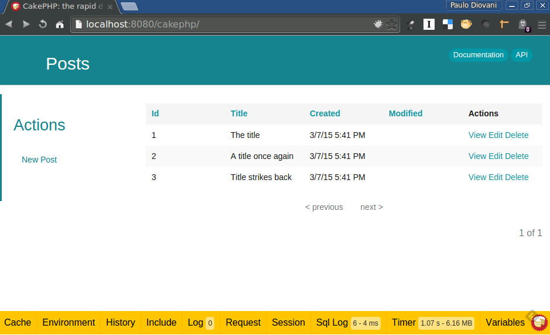
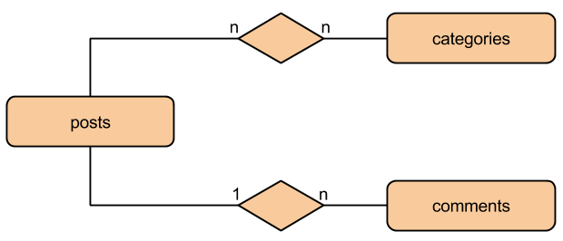

## Desenvolvimento Web rápido com [CakePHP 3.0][cake-site]

<small>Versão 0.1.0</small>

[cake-site]: http://cakephp.org/

====
<!-- .slide: class="author" -->

#### Paulo Diovani Gonçalves

*  <!-- .element: class="pull-right" -->
* Desenvolvedor na Codeminer 42.
* Graduando em Sistemas para Internet na Universidade Feevale.
* Palestrante em eventos FLISOL e Dia da Liberdade de Software.
* Usuário GNU/Linux desde 2005.
* PHP, Javascript, Node.js, Ruby, Python, Arduino.
* Entusiasta de novas tecnologias.
*  <!-- .element: class="pull-right no-border" -->

----

### Expectativas

* Desenvolvimento web com CakePHP
* Conceitos de MVC
* Boas práticas de programação

====

### Este curso não inclui

* Instalação de ambiente (Apache, PHP, etc.)
* ~~Programação PHP~~
* Desenvolvimento _front end_ (HTML, CSS, Javascript)
* _Deploy_ na nuvem

----

[![cakephp][cake-logo]][cake-site] <!-- .element: class="no-border" -->

_The rapid development PHP framework_

[cake-logo]: img/cakephp_logo_250_trans.png
[cake-site]: http://cakephp.org/

Note:
O que é CakePHP?

* Um framework PHP, MVC, para desenvolvimento rápido de aplicações web

====

> CakePHP makes building web applications simpler, faster and require less code.

====

### Recursos para CakePHP

[CakePHP website](http://cakephp.org/) <!-- .element: class="with-url" -->

[Cookbook](http://book.cakephp.org/) <!-- .element: class="with-url" -->

[API](http://api.cakephp.org/) <!-- .element: class="with-url" -->

Note:
Documentação e principais referências para o CakePHP.

====

[The Bakery](http://bakery.cakephp.org/) <!-- .element: class="with-url" -->

[CakePHP on StackOverflow](http://stackoverflow.com/tags/cakephp) <!-- .element: class="with-url" -->

[Google Group](https://groups.google.com/forum/#!forum/cake-php) <!-- .element: class="with-url" -->

[CakePHP Tuga](https://groups.google.com/forum/#!forum/cakephp-pt) <!-- .element: class="with-url" -->

Note:
Referências adicionais: artigos, QA, fóruns, etc.

----

### Material do curso

[Slides](http://slides.diovani.com/slides/curso-cakephp) <!-- .element: class="with-url" -->

[Pasta pública](http://bit.ly/cake30-paulodiovani) <!-- .element: class="with-url" -->

#### Repositórios no Github

[Vagrantfile](https://github.com/paulodiovani/vagrantfile-cakephp) <!-- .element: class="with-url" -->

[Exemplos](https://github.com/paulodiovani/cakephp-course-examples) <!-- .element: class="with-url" -->

Note:
A pasta pública contém PDF dos slides e outros materiais.

O repositório no github contém

====

### O que vamos precisar?

<small>Softwares necessários para o curso</small>

* [Apache httpd 2.2](http://httpd.apache.org/) <!-- .element: class="with-url" -->
* [MySQL 5.x](http://www.mysql.com/) <!-- .element: class="with-url" -->
* [Notepad++](http://notepad-plus-plus.org/) <!-- .element: class="with-url" -->
* [PHP 5.4](http://php.net) <!-- .element: class="with-url" -->

Note:
Essencial para o desenvolvimento com CakePHP e para este curso

====

<small>Softwares recomendados</small>

* [Composer](https://getcomposer.org/) <!-- .element: class="with-url" -->
* [Git](http://git-scm.com/) <!-- .element: class="with-url" -->
* [Oracle Virtual Box](https://www.virtualbox.org/) <!-- .element: class="with-url" -->
* [PuTTY](http://www.putty.org/) <!-- .element: class="with-url" -->
* [Vagrant](https://www.vagrantup.com/) <!-- .element: class="with-url" -->

Note:
Ferramentas recomendadas para acompanhar o curso

----

### Subindo o ambiente <small>com Vagrant</small>


#### A partir da box fornecida

```bash
vagrant box add wheezy32-cakephp /path/to/wheezy32-cakephp.box

mkdir -p cakephp/www
cd cakephp/
vagrant init wheezy32-cakephp
vagrant up
```

#### Obtendo do GitHub

```bash
git clone https://github.com/paulodiovani/vagrantfile-cakephp.git cakephp
cd cakephp
vagrant up
```

Note:
Subindo o ambiente disponível em https://github.com/paulodiovani/vagrantfile-cakephp

====

* [web server](http://localhost:8080) <!-- .element: class="with-url" -->
    - Diretório `cakephp/www/`
* [phpMyAdmin](http://localhost:8080/phpmyadmin) <!-- .element: class="with-url" -->
    - user: `root`, pass: `root`
* ssh
    - host: `localhost`
    - port: `2222`
    - user: `vagrant`
    - pass: `vagrant`

Note:
Acesso ao ambiente

----

# Parte 1

## CakePHP 2.x

Versão estável

2.6.2

====

### Instalação via git

```bash
git clone --depth=1 https://github.com/cakephp/cakephp.git cakephp2
cd cakephp2
```

====

```
/path_to_install_root
    /app
    /lib
    /plugins
    /vendors
    .htaccess
    index.php
    README
```

Note:
Diretórios base do CakePHP

====

```
/app
    /Config
    /Console
    /Controller
    /Lib
    /Locale
    /Model
    /Plugin
    /Test
    /tmp
    /Vendor
    /View
    /webroot
    index.php
```

Note:
Conteúdo do diretório `App`

Note as pastas `Controller`, `Model` e `View`

====

#### Configuração inicial

* Habilitar `mode_rewrite`
* Dar permissão de escrita na pasta `app/tmp/`
* Alterar `Security.salt` em `app/Config/core.php`
* Alterar `Security.cipherSeed` em `app/Config/core.php`

====

 <!-- .element: class="no-border" -->

Note:
Esquema básico de uma aplicação MVC.

O controller recebe as requisições do cliente,
obtém/salva dados em um ou mais Models e, por fim,
exibe uma view para o cliente.

- Lógica da aplicação deve ficar no Model
- Controller apenas "amarra" o Model à View

====

### Desenvolvendo com CakePHP 2.0

Criar um blog simples (adicionar e editar posts)
utilizando CakePHP 2.x.

<small>
Baseado no [Cake Blog Tutorial][cake-blog-tutorial] <!-- .element: class="with-url" -->
</small>

[cake-blog-tutorial]: http://book.cakephp.org/2.0/en/tutorials-and-examples/blog/blog.html

----

# Parte 2

## Web server

Apache httpd 2.2

php 5.4+

====

#### Um típico Virtual Host do Apache.

```apache
<VirtualHost *:80>
    ServerAdmin webmaster@localhost

    DocumentRoot /var/www

    <Directory /var/www/>
        Options Indexes FollowSymLinks MultiViews
        AllowOverride None
        Order allow,deny
        allow from all
    </Directory>
</VirtualHost>
```

Note:
No Debian/Ubuntu, VHots ficam em `/etc/apache2/sites-enabled`.

====

#### Mod Rewrite

```apache
AllowOverride All
```

CakePHP `.htaccess` (em `/app/webroot`)

```apache
<IfModule mod_rewrite.c>
    RewriteEngine On
    RewriteCond %{REQUEST_FILENAME} !-d
    RewriteCond %{REQUEST_FILENAME} !-f
    RewriteRule ^ index.php [L]
</IfModule>
```

Note:
O Mod Rewrite é o que permite as _pretty urls_ do
CakePHP, isto é, urls sem acessar `*.php`.

====

#### Logs

Logs de acesso:

```bash
/var/log/apache2/access.log
```

Logs de erro:

```bash
/var/log/apache2/error.log
```

Note:
Em uma instalação tradicional, qualquer erro do PHP
é gravado junto aos logs do servidor web.
Este comportamento pode ser alterado no `php.ini`.

Estes caminhos são os padrões em ambiente unix.

====

### CakePHP sem Mod rewrite

```php
// file: /app/Config/core.php

Configure::write('App.baseUrl', env('SCRIPT_NAME'));
```

Exemplo de url sem Mod Rewrite:

```bash
http://example.com/index.php/posts/view/13
```

Note:
CakePHP pode rodar em qualquer web server que suporte
PHP, incluindo IIS, Lighttpd e outros.

Para aqueles que não suportem uma _rewrite engine_, 
ele pode rodar desta forma.

====

### PHP Build-in web server

```bash
php -S localhost:8080
```

Note:
O Built-in web server é voltado apenas para desenvolvimento
e não deve ser utilizado em produção.
Contudo deve ser sufiente para testar uma aplicação em CakePHP.

----

# Parte 3

## CakePHP 3.0

3.0.0-RC2

Note:
Versão estável deve ser lançada em Abril.

====

### Instalação via Composer

```bash
composer create-project --prefer-dist -s dev cakephp/app cakephp
```

Note:
CakePHP 3 deve ser instalado via Composer.

Para liberar o protocolo git://
`git config --global url."https://".insteadOf git://`

`composer config --global github-protocols https`

====

* Requerimentos
    * PHP 5.4.16 ou maior
    * mbstring
    * intl
* Estrutura de diretórios (agora [PSR4](http://www.php-fig.org/psr/psr-4/) <!-- .element: class="with-url" -->)
* Instalação via [Composer](http://getcomposer.org/) <!-- .element: class="with-url" -->
* Namespaces
* Novo ORM
* Sem _Scaffold_
* etc.

Note:
Diferenças mais notáveis com a versão 2.x

====

```
/path_to_install_root
    /bin
    /config
    /logs
    /plugins
    /src
    /tests
    /tmp
    /vendor
    /webroot
    index.php

```

====

### Cake Development Server

```bash
bin/cake server
```

* [web server](http://localhost:8765) <!-- .element: class="with-url" -->

Note:
O Cake 3 vem com um servidor para desenvolvimento,
assim não é necessário Apache ou outro servidor web
instlado.

====

### Cake Bake

```bash
bin/cake bake all posts
```

Note:
Bake é um utilitário para gerar o skeleton
de uma aplicação Cake.

Como já possuímos uma tabela `posts`, podemos
logo gerar os fontes a partir dela.

====

```bash
src/Controller/PostsController.php
src/Model/Entity/Post.php
src/Model/Table/PostsTable.php
src/Template/Posts/add.ctp
src/Template/Posts/edit.ctp
src/Template/Posts/index.ctp
src/Template/Posts/view.ctp
tests/Fixture/PostsFixture.php
tests/TestCase/Controller/PostsControllerTest.php
tests/TestCase/Model/Table/PostsTableTest.php
```

Note:
Sripts gerados pelo `cake bake`.

No momento vamos nos preocupar apenas com
`Controller`, `Model` e `Template`.

====

Em `PostsController`

```php
// query
debug($this->Posts->find('all'));
// result set
debug($this->Posts->find('all')->all());
// entidade
debug($this->Posts->find('all')->first());

// entidade pelo id
debug($this->Posts->get(1));
// acesso aos dados
debug($this->Posts->get(1)->id);
debug($this->Posts->get(1)->title);

// disponibilizando no template
$this->set('posts', $this->Posts->find('all'));
```

Note:
`debug()` é uma função para depuração simples do Cake.

====

Em `src/Template/Posts/index.ctp`

```php
// variáveis fornecidas pelo controller
foreach ($posts as $post):

// imprimindo dados
h($post->title);

// links
$this->Html->link(__('View'), ['action' => 'view', $post->id]);
```

Note:
`h()` é um alias para `htmlspecialchars()`

`$this->Html` e `$this->Paginator` são Helpers.

====



[Debug Kit](https://github.com/cakephp/debug_kit) <!-- .element: class="with-url" -->

Note:
Permite visualizar consultas SQL, variáveis, resisições, etc,
sem necessidade de mexer no código-fonte.

Debug kit já vem como dependência do Cake 3.0.

----

### Desenvolvendo com CakePHP 3.0

Adicionar comentários e categorias aos posts.

Note:
Utilizar `cake bake` para criar comentários e 
categorias.

====

 <!-- .element: class="no-border" -->

====

#### Associações

* hasOne
    - `1-<>-1`
* hasMany
    - `1-<>-n`
* belongsTo
    - `1-<>-1` ou `n-<>-1`
* belongsToMany
    - `n-<>-n`

====

#### Validação de dados

```php
$validator
    ->add('id', 'valid', ['rule' => 'numeric'])
    ->allowEmpty('id', 'create')
    ->requirePresence('name', 'create')
    ->notEmpty('name')
    ->requirePresence('slug', 'create')
    ->notEmpty('slug')
    ->add('slug', 'custom', [
        'rule' => function($value, $context) {
            return (bool) preg_match('/^[a-z0-9\-]+$/', $value);
        },
        'message' => 'Slug cannot contain spaces or special characters'
    ]);
```

====

#### Rotas

```php
Router::scope('/artigos', ['controller' => 'Posts'], function($routes){
    $routes->connect('/*', ['action' => 'view']);
    $routes->connect('/novo', ['action' => 'add']);
    $routes->connect('/editar/*', ['action' => 'edit']);
    $routes->connect('/deletar/*', ['action' => 'delete']);
});
```

====

### Deployment

* Desabilitar debug em `/config/app.php`
    ```php
        'debug' => false,
    ```

* `DocumentRoot` deve ser `/webroot`


----

### Créditos

por [Paulo Diovani Gonçalves](mailto:paulo@diovani.com)

<small>[paulo@diovani.com]((mailto:paulo@diovani.com)</small>

_powered by: [reveal.js](http://lab.hakim.se/reveal-js/)_

<small>[http://lab.hakim.se/reveal-js/](http://lab.hakim.se/reveal-js/)</small>
