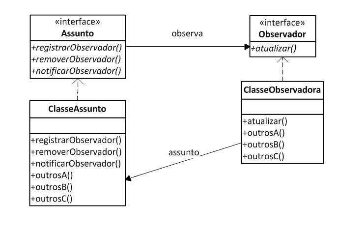

# Software Design Patterns

<small>Versão 0.1</small>

Note:

====

* Adapter
* Dependency Injection
* Observer

----
<!-- .slide: data-background="img/adapter-trans.png" -->

# Adapter

====

### Vamos pensar o que acontece na vida real

Utilizávamos nas nossas construções civis um padrão de tomadas e plugues. 
Um belo dia saiu o padrão brasileiro de tomadas e plugues, quando você 
compra um aparelho que atende a essa norma logo pensa: 

Vou ter que comprar um **adaptador** para _adaptar_ esse plugue à _tomada_ que esta em casa, pois são padrões (modelos) diferentes.

<small>Fonte: http://www.devmedia.com.br/design-patterns-adapter/17160</small>

====

## Em resumo: 

Adapter é uma classe intermediaria entre outras duas classes.

====

### Interface Tomada

```
public interface Tomada {
	public void conectar();
	public void desconectar();
	
	@Override
	public String toString();
}```

====

### Classe NovaTomada

```
public class NovaTomada implements Tomada{
	@Override
	public void conectar() {
		System.out.println("Tomada conectada");
	}

	@Override
	public void desconectar() {
		System.out.println("Tomada desconectada");
	}

	@Override
	public String toString(){
		return "Nova Tomada de 3 pinos";
	}
}```

====

### Interface TomadaSemTerra

```
public interface TomadaSemTerra {
	public void conectar_sem_terra();
	public void desconectar();
	
	@Override
	public String toString();
}```

====

### Classe VelhaTomada

```
public class VelhaTomada implements TomadaSemTerra{
	@Override
	public void conectar_sem_terra() {
		System.out.println("Tomada conectada");
	}

	@Override
	public void desconectar() {
		System.out.println("Tomada desconectada");
	}
	
	@Override
	public String toString(){
		return "Velha Tomada de 2 pinos";
	}
}```

====

### Adapter TomadaAdapter

```
public class TomadaAdapter implements Tomada{
	TomadaSemTerra tomadaAdaptada;
	
	public TomadaAdapter(TomadaSemTerra tomadaVelha){
		tomadaAdaptada = tomadaVelha;}

	@Override
	public void conectar() {
		tomadaAdaptada.conectar_sem_terra();}

	@Override
	public void desconectar() {
		tomadaAdaptada.desconectar();}

    @Override
    public String toString() {
        return tomadaAdaptada.toString();}
}```

----
<!-- .slide: data-background="img/injection-trans.png" -->

# Dependency Injection 

====

### Explicando _Dependency Injection_ para uma criança de 5 anos

Quando você pega coisas do refrigerador por conta própria você pode 
causar problemas. Você pode deixar a porta aberta, pode pegar alguma
coisa que mamãe e papai não querem que você pegue. Você pode até mesmo
estar procurandopor algo que não tenhamos ou que tenha acabado.

O que você deveria fazer é dizendo o que quer, "Eu quero alguma coisa para
beber durante o almoço," então iremos garantir que você receba algo quando
sentar para comer.

<small>Fonte: http://stackoverflow.com/a/1638961/1712589</small>

====

 <!-- .element: class="no-border" -->

====

#### Observações sobre a implementação

_Dependency Injection_ e _Strategy_ funcionam da mesma maneira, mas
_Strategy_ é usado para dependências mais minimalistas e de vida curta.

<small>Fonte: http://stackoverflow.com/a/4176811/1712589</small>

----

### Implementação em Java

Utilizando _Interface injection_

```java
// Interface para o setter, a ser usada por clients
public interface ServiceSetter {
    public void setService(Service service);
}
```
 
```java
// Classe cliente
public class Client implements ServiceSetter {
    // Referência interna ao serviço, a ser usada pelo client
    private Service service;
 
    // Define o serviço que este cliente usará
    @Override
    public void setService(Service service) {
        this.service = service;
    }
}
```

====

Exemplo de _DI_ em Java

```java
public interface LogServiceSetter {
    public void setLogger(Logger logger);
}
```

```java
public interface Logger {
    public void writeLog(String text);
}
```

```java
public class UserText implements LoggerServiceSetter {
    // referência interna
    private Logger logger;

    // setter
    public void setLogger(Logger logger) {
        this.logger = logger;
    }

    // método utilizando o serviço
    public void askUser() {
        Scanner scan = new Scanner(System.in);
        String userInput = scan.nextLine();
        this.logger.writeLog(userInput);
    }
}
```

====

Exemplo de _DI_ em Java (cont.)

Implementando o serviço

```java
// classe responsável pelos logs
public class FileSystemLogger implements Logger {
    //grava o log num arquivo
    public void writeLog(String text) {
        PrintWriter writer = new PrintWriter("my-log-file.txt", "UTF-8");
        writer.println(text);
        writer.close();    
    }
}
```

```java
// classe com método main exemplificando o uso
public class javaIsBoring {
    // executa o programa
    public static void main(String[]) {
        UserText ut = new UserText();

        // Posso usar qualquer serviço que implemente Logger
        Logger fsLogger = new FileSystemLogger();
        ut.setLogger(fsLogger);

        ut.askUser();
    }
}
```

====

Exemplo de DI em Javascript

Utilizando _Contructor injection_

```javascript
function UserText(Service) {
    this.logger = Service
}

UserText.prototype.askUser = function() {
    var userInput = prompt();
    this.logger.writeLog(userInput);
}
```

Implementando o serviço

```javascript
function AlertLogger() {}

AlertLogger.prototype.writeLog = function(text) {
    alert(text);
}
```

```javascript
var logger = new AlertLogger();
var ut = new UserText(logger);
ut.askUser();
```

----
<!-- .slide: data-background="img/binoculars-trans.png" -->

# Observer

====


_Definir uma dependência um-para-muitos entre objetos para que quando um objeto mudar de estado, todos os seus dependentes sejam notificados e
atualizados automaticamente._

====

## Diagrama

 <!-- .element: class="no-border" -->

====

Neste padrão a essência está na possibilidade de uma classe poder fazer uma 'notificação' a um conjunto de classes associadas de que o Estado
(Conjunto de Atributos) dela foi alterado por algum motivo. 

====

Você deve estar pensando "Eu posso fazer essa notificação manualmente ou até mesmo utilizando eventos como actionPerformed para fazer a
notificação através de chamadas a métodos de cada instância". Porém dessa maneira você estará criado um sistema com alto acoplamento e de
difícil manutenabilidade.

====

Temos um operário de obras que esta trabalhando em uma construção junto com seus 'companheiros'.. O fato de uma sirene tocar implica em uma mudança (mudança de estado), que pode ser um sinal para a hora do almoço, pode ser o final do expediente e etc.


Temos então o seguinte ambiente, o objeto observável (Sirene) e os observadores (Operários). Quando o objeto observável alterar o seu estado,
enviará um sinal sonoro (mensagem) alertando os objetos observadores.

====

## Exemplo no NetBeans

====

O segundo exemplo foi utilizado quatro classes: **Soma.java**, **Par.java**, **Impar.java** e **Programa.java**


O padrão Observador parte do conceito de um Objeto Observável (**Soma.java**), onde a cada mudança de estado ele notifica aqueles que estão Observando sua instância (**Par.java** e **Impar.java**)

====

## Soma.java

Nesta classe, implemento outro padrão de projeto, o Singleton, onde possuo uma única instancia desta classe em todo meu projeto.
Esta classe basicamente inicia um contador, dentro de uma Thread, incrementando a cada 1 segundo, e a cada mudança de valor todos os Objetos que estão observando este, são notificados.


----

## Créditos da apresentação

por 

* [Paulo Diovani Gonçalves](mailto:paulo@diovani.com)
* [Sandro Schmitz](mailto:sandro.s@fevale.br)
* [Fabio Beneditto](mailto:fabiobeneditto@feevale.br)

_powered by: [reveal.js](http://lab.hakim.se/reveal-js/)_

<small>[http://lab.hakim.se/reveal-js/](http://lab.hakim.se/reveal-js/)</small>

====

### Fontes utilizadas

#### Dependency Injection

* http://en.wikipedia.org/wiki/Dependency_injection
* http://martinfowler.com/articles/injection.html

#### Observer

* GAMA, Rrich; HELM, Richard; JOHNSON, Ralph; VLISSIDES, John. Padrões de projeto

====

### Créditos das imagens

* adapter, binoculars http://shoptime.com.br
* injection http://wisegeek.com