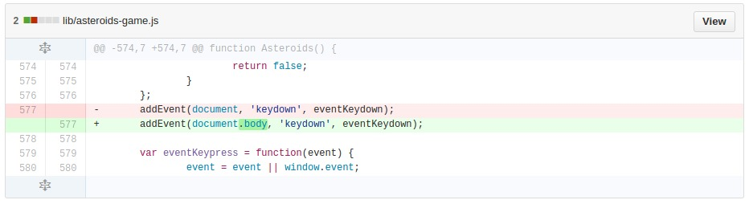
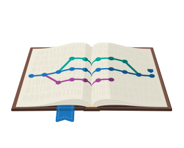
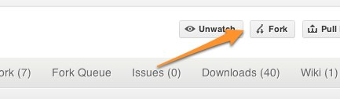

## ![gh][gh] <!-- .element: class="no-border no-background" --> GitHub como portfolio pessoal

<small>Versão 0.1.0</small>

[gh]: img/GitHub-Mark-Light-64px.png

Note:
Uma breve demonstração de como o Github pode ser usado como portfólio,
demonstrando as capacidades do desenvolvedor e auxiliando na seleção 
pelas empresas.

====
<!-- .slide: class="author" -->

#### Paulo Diovani Gonçalves

*  <!-- .element: class="pull-right" -->
* Desenvolvedor na Codeminer 42.
* Graduando em Sistemas para Internet na Universidade Feevale.
* Já palestrou em eventos FLISOL e Dia da Liberdade de Software.
* Usuário GNU/Linux desde 2005.
* PHP, Javascript, Node.js, Ruby, Python, Arduino.
* Entusiasta de novas tecnologias.
*  <!-- .element: class="pull-right no-border no-background" -->

====

[slides.diovani.com/slides/github-as-portfolio][slides]

[slides]: http://slides.diovani.com/slides/github-as-portfolio/

Note:
Slides disponíveis no seguinte endereço.

----

# [github.com][github]

> Build software better, together.

[github]: https://github.com

Note:
Se ainda não possui uma conta no github,
faça agora.

====
<!-- .slide: data-background="#666" -->

 <!-- .element: class="no-border no-background" -->

Note:
Github é a plataforma/site/rede social que possui o marcote
mais carismático já criado. O octocat.

Como não amar um cruzamento de um gato e um polvo? <3

==== 

## ![gh][gh] <!-- .element: class="no-border no-background" --> GitHub é

* Hospedagem de repositórios (git)
* Colaboração <!-- .element: class="fragment" data-fragment="1" -->
* Comunicação entre times <!-- .element: class="fragment" data-fragment="1" -->
* Gestor de códigos/projetos <!-- .element: class="fragment" data-fragment="1" -->
* Bug tracker <!-- .element: class="fragment" data-fragment="1" -->
* Hospedagem de página estáticas <!-- .element: class="fragment" data-fragment="1" -->
* Wiki <!-- .element: class="fragment" data-fragment="1" -->
* Pastebin (gist.github.com) <!-- .element: class="fragment" data-fragment="1" -->
* Rede social <!-- .element: class="fragment" data-fragment="1" -->

[gh]: img/GitHub-Mark-Light-64px.png

Note:
Github pode ser utilizado de várias formas.

====

### ...e portfólio de projetos Open Source

Note:
Vamos falar sobre como utilizá-lo como portfólio.

Mas o que é um portfolio?

----
<!-- .slide: data-background="img/portfolio-01.png" -->

## Portfólio

> Portfólio, portfolio (português brasileiro) ou portefólio,
> porta-fólio (português europeu) é uma lista de trabalhos
> de um profissional, empresa ou estudante, no caso de
> ambientes educacionais.

<small>_fonte: wikipedia_</small>

Note:
Sendo um pouco mais literal, portfolio é um tipo de 
pasta.

====
<!-- .slide: data-background="img/portfolio-02.png" -->

## Portfólio de artista

> Uma amostra do trabalho do artista ou um estudo de caso para
> exibição de trabalhos de arte, fotografias, etc.

<small>_fonte: wikipedia_</small>

====
<!-- .slide: data-background="img/portfolio-03.png" -->

### E programador, tem portfólio?

Note:
Preciso imprimir meus códigos-fonte?

====
<!-- .slide: data-background="img/portfolio-04.png" -->

Note:
Devo levar meu portfolio sempre comigo,
por exemplo, numa entrevista?

Relembrando, portfolio, literalmente, é uma _pasta_.

----

## O que o GitHub tem a dizer sobre você?

====

 <!-- .element class="pull-left" -->

* Fotinho
* Localização
* Seguidores
* Organizações

<small>_[Linus Torvalds](https://github.com/torvalds), criador do 
kernel Linux... E do git._</small>

====

* Repositórios mais populares
* Repositórios em que contribuiu

<small>_[Yukihiro Matsumoto](https://github.com/matz)_, criador do
Ruby.</small>

====

* Contribuições públicas
* Atividade (frequência de commits)

<small>_[TJ Holowaychuk](https://github.com/tj)_, criador do Express,
Mocha, etc.</small>

====

 <!-- .element class="pull-right" -->

* Linguagens mais usadas

<small>_[John Resig](https://github.com/jeresig)_, criador do jQuery.</small>

====

* Seus códigos-fonte

<small>_[Tom Preston-Werner](https://github.com/mojombo)_, criador do GitHub.</small>

Note:
...e, claro, seus códigos-fonte.

----

## Como expor meu trabalho no GitHub?

Note:
Ter seu trabalho publicado no github permite que outros,
inclusive empresas, o cnoheçam e saibam do que é capaz.

Mas como expor meu trabalho no gh?

====

 <!-- .element class="pull-left" -->

### Crie um repositório

Seja para um projeto pessoal, trabalhos da universidade
ou provas de conceito. Coloque no GitHub.

====

 <!-- .element class="pull-right" -->

### Faça um _Fork_

Colaboração é o _core_ do GitHub.

Faça _forks_ de projetos dos quais queira 
participar. Ajude a melhorá-los enviando _pull-requests_.

====

 <!-- .element class="pull-left" -->

### Socialize-se

Acompanhe (_watch_) e marque como favorito (_star_) repositórios
que lhe interessem.

Teste, comente, revise, abra _issues_...

====

 <!-- .element class="pull-right no-border no-background" -->

### Publique

Você pode facilmente publicar sites estáticos no
GitHub (HTML, Markdown) ou até criar um blog
utilizando [Jekyll](http://jekyllrb.com/) ou
outro _static site generator_.

----

### Créditos das imagens

Em ordem de apresentação.

* github.com
* gottabemobile.com
* lifeclever.com
* backgroundwallpapershd.com
* Pulp Fiction (1994)
* jekyllrb.com

====

### Créditos da apresentação

por [Paulo Diovani Gonçalves](mailto:paulo@diovani.com)

<small>[paulo@diovani.com]((mailto:paulo@diovani.com)</small>

_powered by: [reveal.js](http://lab.hakim.se/reveal-js/)_

<small>[http://lab.hakim.se/reveal-js/](http://lab.hakim.se/reveal-js/)</small>

====

##### Extra

Conheça o Octodex.

[![megacat][megacat]][octodex]

[megacat]: img/megacat.jpg
[octodex]: https://octodex.github.com/ "GitHub Octodex"

====

##### Extra 2

Que tal um pouco de _Graffiti_ no seu GitHub?

[![gitfigi][gitfiti]][gitfiti-gh]

[gitfiti]: img/gitfiti.png
[gitfiti-gh]: https://github.com/gelstudios/gitfiti
