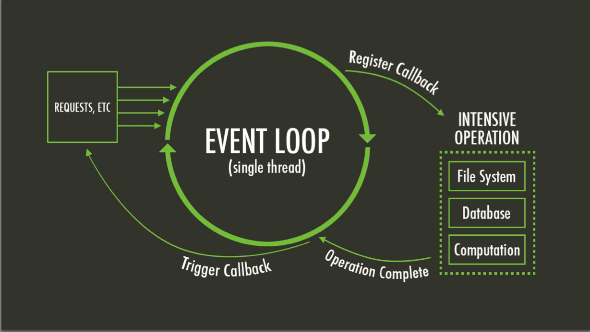

### Um simples servidor web

```javascript
var http = require('http');

http.createServer(function (req, res) {
    res.writeHead(200, {'Content-Type': 'text/plain'});
    res.end('Hello World\n');
}).listen(1337, '127.0.0.1');

console.log('Server running at http://127.0.0.1:1337/');
```

#### Rodando o webserver

```
$ node example.js
Server running at http://127.0.0.1:1337/
```

Note:
Criando um webserver em 30 segundos

====

> Javascript (JS) é uma linguagem de programação usada
> primeiramente por _web browsers_ para permitir conteúdo
> dinâmico em páginas web.
>
> Ela pode também ser utilizada
> no servidor para qualquer tipo de ações.

Fonte: <!-- .element: class="reference" -->
[MDN](https://developer.mozilla.org/en-US/docs/Glossary/JavaScript)

Note:
Reparem que é escrito em Javascript.
"Mas javascript é para browsers?"

Definição de Javascript no glossáro da MDN (Mozilla Developer Network)

====

### Javascript no servidor não é novidade

* 4D Wakanda
* APE project
* [Aptana Jaxer](https://github.com/aptana/Jaxer)
* Narwhal
* [Node.js](http://nodejs.org)
    * Joyent NodeJS
* [Rhino Javascript engine](https://developer.mozilla.org/en-US/docs/Mozilla/Projects/Rhino)
    * Sitepoint Persevere
    * RingoJS

Fonte: <!-- .element: class="reference" -->
[stackoverflow](http://stackoverflow.com/questions/1992367/best-server-side-javascript-servers)

Note:
Node.js não é a primeira, tampouco a única, solução para utilizar Javascript no servidor.

====

Node.js permite escrever aplicações _server side_ com Javascript, incluindo...

* Aplicações web _realtime_
* Webservice APIs
* Aplicações em linha de comando
* Aplicações desktop (com widgets, CURSES, HTML, etc.)

Note:
Uma explicação livre de Node.js

====

### Por que Node.js?

- Rápido e escalável
- Para APIs, mobile, web e IoT
- Baixa curva de aprendizagem
- Comunidade crescente e participativa
- Javascript é a linguagem mais popular atualmente
  ([GitHut](http://githut.info/))

====

### Quem usa Node.js?


Fonte: <!-- .element: class="reference" -->
[strongloop](https://strongloop.com/node-js/why-node/)

Note:
Algumas pequenas empresas que usam node.js

----

 <!-- .element: class="no-border no-background" -->
 <!-- .element: class="no-border no-background" -->

> ##### LinkedIn muda de Rails para Node: 27 servidores cortados e até 20x mais rápido.

Fonte: <!-- .element: class="reference" -->
[highscalability][linkedin-to-node]

<small>Obs: existem alguns [fatos não mencionados][some-facts]
no artigo original.</small>

[linkedin-to-node]: http://highscalability.com/blog/2012/10/4/linkedin-moved-from-rails-to-node-27-servers-cut-and-up-to-2.html
[some-facts]: http://ikaisays.com/2012/10/04/clearing-up-some-things-about-linkedin-mobiles-move-from-rails-to-node-js/

====

 <!-- .element: class="no-border no-background" -->
 <!-- .element: class="no-border no-background" -->

> ##### Como o LinkedIn usou Node.js e HTML5 para construir uma app melhor e mais rápida

Fonte: <!-- .element: class="reference" -->
[venturebeat][linkedin-to-node-2]

[linkedin-to-node-2]: http://venturebeat.com/2011/08/16/linkedin-node/

====

 <!-- .element: class="no-border no-background" -->
 <!-- .element: class="no-border no-background" -->

> ##### PayPal muda de Java para Javascript
>
> |                  | Java/Spring      | Node.js                 |
> | --               | --               | --                      |
> | Preparação       | 0                | 2 meses                 |
> | Desenvolvimento  | ~5 meses         | ~3 meses                |
> | Equipe           | 5                | 5                       |
> | Linhas de código | não especificado | 66% de não especificado |

Fonte: <!-- .element: class="reference" -->
[infohq][paypal-to-node]

[paypal-to-node]: http://www.infoq.com/news/2013/11/paypal-java-javascript

====

 <!-- .element: class="no-border no-background" -->
 <!-- .element: class="no-border no-background" -->

> ##### Node.js no PayPal
>
> - Construído quase 2x mais rápido com menos pessoas
> - 33% menos linhas de código
> - 40% menos arquivos
> - Dobradas as requisições por segundo
> - Queda de média de 35% no tempo de resposta

Fonte: <!-- .element: class="reference" -->
[paypal-enginering][paypal-to-node-2]

[paypal-to-node-2]: https://www.paypal-engineering.com/2013/11/22/node-js-at-paypal/

====

 <!-- .element: class="no-border no-background" -->
 <!-- .element: class="no-border no-background" -->

> ##### Por que Wallmart está usando Node.js?
>
> [...] Executivos do Wallmart deixaram claro que o benefício
> em usar Node.js era, de longe, maior que o risco [...]

Fonte: <!-- .element: class="reference" -->
[venturebeat][wallmart-in-node]

[wallmart-in-node]: http://venturebeat.com/2012/01/24/why-walmart-is-using-node-js/

====

 <!-- .element: class="no-border no-background" -->
 <!-- .element: class="no-border no-background" -->

> ##### Node.js em chamas
>
> [...] notamos que a latência de requisições para a aplicação
> em Node.js aumentava à medida do tempo [...]

<small>Culpa do Express?</small><br>
<small>[Resposta por hueniverse no GitHub.][answer-on-flames]</small>

Fonte: <!-- .element: class="reference" -->
[netflix techblog][netflix-node-on-fire]

[netflix-node-on-fire]: http://techblog.netflix.com/2014/11/nodejs-in-flames.html
[answer-on-flames]: https://gist.github.com/hueniverse/a3109f716bf25718ba0e

----

> Node.js é uma plataforma construída sobre o
> [_Motor Javascript do Chrome_](http://code.google.com/p/v8/) para criar
> aplicações em rede rápidas e escaláveis.
>
> Node.js usa um modelo de _I/O_ não bloqueante, orientado a eventos,
> que o torna leve e eficiente, perfeito para aplicações em tempo
> real com grande tráfego de dados que rodam através de dispositivos
> distribuídos.

Fonte: <!-- .element: class="reference" -->
[nodejs.org](http://nodejs.org/)

Note:
Definição do Node.js no site oficial.

====

### Node.js não é uma linguagem nova

* Escrito em Javascript
* Baixa curva de aprendizagem

Note:
Apesar de ser essencialmente Javascript, Node.js possui um ecosistema
próprio e sua própria forma de programar.

====

### Node.js não é um framework

Note:
Ao contrário, existem diversos frameworks escritos
para Node.js

====

### _Single threaded_

Node.js foi desenvolvido para utilizar uma única _thread_.

Esta única _thread_ recebe e trata de todas as operações da aplicação.

Note:
Ou seja, um único processo.

Pergunta: Então essas operações ficam em fila?

====

#### _Non-blocking I/O_

Cada nova operação não precisa esperar que as anteriores
sejam completadas. Todas são processadas de forma assíncrona.

====



Fonte: <!-- .element: class="reference" -->
[Stack Overflow](http://stackoverflow.com/q/21596172/1712589)

----

### Node _callbacks_

Ao se realizar uma operação de IO, passamos uma função de _callback_
para a mesma.

O _callback_ é executado ao final da operação, enquanto outras operações
são executadas em paralelo.

Note:
Muito semelhante ao uso de AJAX em Javascript.

====

Um _node callback_ recebe um objeto de erro como primeiro argumento e um ou mais
a seguir, contendo o resultado da operação.

```javascript
function myNodeCallback(err, data) {
    if (err) {
        //something went wrong
        return;
    }

    //normal flow
}
```

====

```javascript
var fs = require('fs');

fs.readFile('./example.txt', function(err, content) {
    if (err) console.error("Ocorreu um erro ao ler o arquivo");

    console.log(content.toString());
});
```

Note:
Exemplo de uso de um callback node.js.

----

### _Event driven_

Muitos objetos em Node.js emitem eventos.

- `net.Server` emite
    + `connection` a cada vez que um cliente conecta.
- `fs.readStream` emite
    + `open` quando o arquivo é aberto.

Note:
Este comportamento se assemelha muito a cliques e outras
ações do usuário em _web browsers_.

====

Adicionando _listeners_ aos eventos de um objeto.

```javascript
emitter.addListener(event, function(data) {
    //...
});
```

ou

```javascript
emitter.on(event, function(data) {
    //...
});
```

====

```javascript
var http = require('http');

http.get('http://example.com', function(response) {
    //dados recebidos, loga o conteúdo
    response.on('data', function(data) {
        console.log(data.toString());
    });

    //em caso de erro, loga a mensagem
    response.on('error', function(err) {
        console.error(err.stack || err);
    });
});
```

Note:
Um exemplo de evento.

Cada vez que dados são recebidos via http loga no console.
Em caso de erro, loga a mensagem.

----

### _Streams_

Uma _stream_ é uma interface abstrata implementada por vários objetos em Node.js.

_Streams_ podem ser para _leitura_, _escrita_ ou ambos.

Todas streams são _emissores de eventos_.

====

```javascript
var fs = require("fs");
var filename = 'example.txt';

var stream = fs.createReadStream(filename);
stream.pipe(process.stdout);
```

Note:
No exemplo, uma `stream` é criada com o módulo _filesystem_ ao ler o arquivo `example.txt`.

====

WTF is `pipe()`?

```bash
cat /etc/passwd | grep diovani
```

Já costumamos usar _pipes_ em linha de comando.

Note:
O método `pipe()` lê a _stream_ de origem e envia seu conteúdo diretamente para
uma `stream` que seja `writable` (no caso a saída padrão).

----

 <!-- .element: class="no-border no-background" -->

Node Packaged Modules

[npmjs.org](http://npm)

====

**NPM** é para Node o que **PEAR/PECL** é para o PHP, ou
o que **pip** é para Python, ou ainda o que o **gem** é para
Ruby.

    $ npm install [module name]

----

Módulos são instalados localmente, sob a pasta `node_modules/`, com

    $ npm install

ou globalmente (como super-usuário) com

    $ sudo npm install -g

====

Após um módulo ser instalado (seja local ou globalmene) ele pode ser utilizado
num script com uso do `require()`.

```javascript
var _ = require('underscore');

_.each([1, 2, 3], console.log);
```

====

Para listar os módulos instalados utilize

    $ npm list

Ou, paral listar os módulos instalados globalmente

    $ npm list -g

----

As dependências de uma aplicação são definidas em um arquivo chamado `package.json`, o qual pode ser inicializado com `npm init`.

```
$ mkdir node_test
$ cd node_test

$ npm init
```

Você pode editar o arquivo manualmente após a criação.

```
$ vim package.json
```

====

Para instalar dependências e salvá-las na no `package.json`, basta utilizar
a opção `--save`.

    $ npm install --save underscore

Para instalar todas as dependência salvas no `package.json`, basta utilizar.

    $ npm install

====

Verificando os módulos insalados e suas próprias dependências

```
$ npm list

/media/userdata/diovani/Node/node_test
└── underscore@1.6.0
```

----

### Utilitários de linha de comando

Módulos em Node.js podem definir um executável com o atibuto `bin/`
no `package.json`.

Ao instalar globalmente um módulo, seu executável é adicionado ao `PATH`,
assim fica fácil criar aplicativos de linha de comando com Node.

====

#### Instalando jshint via NPM

    $ npm install -g jshint

Verificando a instalação

    $ jshint --version
    jshint v2.5.0

Listando as dependências

```
$ npm list -g

/usr/local/lib
└─┬ jshint@2.5.0
  └─┬ cli@0.4.5
    └─┬ glob@3.2.9
      └── inherits@2.0.1
```

====

A partir de agora você pode utilizar o comando `jshint`, como qualquer usuário,
para validar scripts `*.js`.

    $ jshint myfile.js

----

### Aprendendo Node.js

* [nodejs.org](http://nodejs.org)

    <small>Site oficial</small>

* [nodeschool.io](http://nodeschool.io/)

    <small>Projeto com lições interativas de Node.js</small>

* [nodebr.com](http://nodebr.com/)

    <small>Site da comunidade brasileira de Node.js</small>

* [Aplicações web real-time com Node.js](http://www.casadocodigo.com.br/products/livro-nodejs)

    <small>Livro escrito por Caio Ribeiro sobre Node.js. <br>
    ISBN: 978-85-66250-14-5</small>

* [Node.js Brasil @ Google Groups](https://groups.google.com/forum/?hl=en#!forum/nodebr)

    <small>Grupo brasileiro de discussão sobre Node.js</small>

* [jsbooks.revolunet.com](http://jsbooks.revolunet.com/)

    <small>Livros gratuítos de Javascript, Node.js, e desenvolvimento web em geral.</small>

----

 <!-- .element: class="no-border no-background" -->

[nodeschool.io](http://nodeschool.io/)

Note:
Node School é um projeto que ensina Node.js através de lições interativas
em linha de comando.

A proposta é escrever um código para resolver um problema, testá-lo e, por fim,
compará-lo com uma solução proposta.

====

Vamos fazer algumas lições do [Node School](http://nodeschool.io/).

Primeiro, precisamos preparar um ambiente para tal e instalar o globalmente
o módulo `learyounode`, o primeiro conjunto de lições, via NPM.

```
$ # Primeiro instale Node.js e NPM, caso ainda não os tenha
$ sudo apt-get install nodejs nodejs-legacy npm
$
$ # Então crie um diretório para trabalho
$ mkdir nodeschool
$ cd nodeschool
$
$ # E, por fim, instale globalmente o módulo `learnyounode` (pode levar alguns minutos)
$ sudo npm install -g learnyounode
$
$ learnyounode
```

Note:
Para abrir um terminal (rxvt) com uma fonte maior, use:

    rxvt -font "xft:Ubuntu Mono:pixelsize=26"

----

### _Hello World_

Escreva um programa que imprima "HELLO WORLD" no console (stdout).

#### Dicas

<small>
Para escrever um programa Node.js, crie um arquivo com a extensão `.js` e
comece a escrever Javascript. Você pode executar seu programa rodando o
comando `node`. Ex.:
</small>

    $ node myprogram.js

<small>
Você pode escrever no console da mesma forma que no navegador:
</small>

    console.log("text");

<small>
Quando terminar, você deve executar:
</small>

    $ learnyounode verify myprogram.js

====

```javascript
// Escreve "olá mundo" no console
console.log("HELLO WORLD");
```

Note:
Solução para "Hello World"

----

### _Baby Steps_

Escreve um programa que aceite um ou mais números como argumentos de
linha de comando e imprima a soma desses números no console (stdout).

#### Dicas

<small>
Você pode acessar argumentos de linha de comando através do objeto
global `process`. O objeto `process` contém uma propriedade `argv`
que é um array contendo a linha de comando completa. Ex.: `process.argv`
</small>

<small>
O primeiro elemento de `process.argv` é sempre `node`,  e o segundo é
sempre o caminho para seu programa, então você deverá começar a partir
do 3º elemento (índice `2`), somando cada item ao total até o final do
array.
</small>

====

```javascript
var result = 0

for (var i = 2; i < process.argv.length; i++)
result += Number(process.argv[i])

console.log(result)
```

Note:
Soluçao para "Baby steps"

----

### _My first I/O!_

Escreva um programa que use uma única operação de arquivo **síncrona**
para ler um arquivo e imprimir a quantidade de linhas ele contém no
console (stdout), semelhante a executar `cat file | wc -l`.

O caminho completo para o arquivo a ler será fornecido como o primeiro
argumento de linha de comando.

#### Dicas

<small>
    Para executar uma operação de arquivo você irá precisar do módulo `fs`
    da biblioteca central do Node. Para carregar este tipo de módulo, ou
    outro módulo "global", use o seguinte encantamento:
</small>

    var fs = require('fs');

<small>
    Agora você tem o módulo `fs` completo disponível na variável `fs`.
</small>

<small>
    Todas os métodos síncronos (_blocking_) no módulo `fs` terminal com
    '`Sync`'. Para ler um arquivo, você irá precisar usar `fs.readFileSync('/caminho/para/arquivo')`.
    Este método retornará um objeto `Buffer` contendo o conteúdo completo do arquivo.
</small>

====

```javascript
var fs = require('fs')

var contents = fs.readFileSync(process.argv[2])
var lines = contents.toString().split('\n').length - 1
console.log(lines)

// note you can avoid the .toString() by passing 'utf8' as the
// second argument to readFileSync, then you'll get a String!
//
// fs.readFileSync(process.argv[2], 'utf8').split('\n').length - 1
```

Note:
Solução para _My first I/O!_

----

### _My first async I/O!_

Escreva um programa que utilize uma única operação **assíncrona**
para ler um arquivo e imprimir a quantidade de linhas ele contém no
console (stdout), semelhante a executar `cat file | wc -l`.

O caminho completo para o arquivo a ler será fornecido como o primeiro

#### Dicas

<small>
    A solução para este problema é quase a mesma do anterior, exceto que
    você deve fazê-lo **ao modo Node.js**: assíncrono.
</small>

<small>
    Ao invés de `fs.readFileSync()`, você irá usar `fs.readFile()` e ao invés
    de usar um valor de retorno deste método você deverá coletar o valor através
    de uma função de _callback_ fornecida como segundo argumento.
</small>

<small>
    Lembre-se que as chamadas de _callbacks_ idiomáticas do Node.js normalmente
    possuem a seguinte asinatura:
</small>

    function callback (err, data) { /* ... */ }

====

```javascript
var fs = require('fs')
var file = process.argv[2]

fs.readFile(file, function (err, contents) {
    // fs.readFile(file, 'utf8', callback) can also be used
    var lines = contents.toString().split('\n').length - 1
    console.log(lines)
})
```

Note:
Solução para _My first async I/O!_

----

### Fim

Completamos as quatro primeiras lições do [Node School](http://nodeschool.io).
Não tardem em realizar as demais.

O `learnyounode` é apenas o início, acessem [nodeschool.io](http://nodeschool.io)
para outros conjuntos de lições sobre temas diversos (em inglês).

====

<link href='http://fonts.googleapis.com/css?family=Architects+Daughter' rel='stylesheet' type='text/css'>

? <!-- .element: style="font-family:'Architects Daughter'; font-size:8em" -->

Perguntas

Comentários
