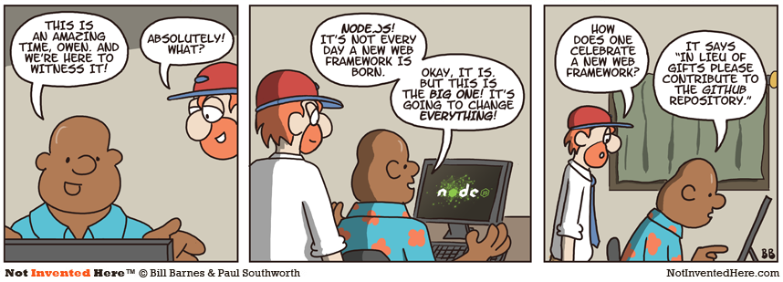

Javascript no servidor com 

 <!-- .element: class="no-border no-background" -->

[nodejs.org](http://nodejs.org)

<small>Versão 0.1</small>

Note:
Uma palestra iniciante sobre Node.js, 
com uma visão geral e alguns exercícios práticos baseados no nodeschool.io 
e espaço para discussões e perguntas e respostas.

====

### Conteúdo

* Conhecendo o Node.js
* Como instalar módulos via npm
* Aplicativos Node.js em linha de comando
* Mão na massa — lições do nodeschool.io

----

#### Paulo Diovani Gonçalves

Programador Web desde 2005 e usuário GNU/Linux a quase o mesmo tempo, domina as linguagens de programação PHP e Javascript e atualmente se dedica ao aprendizado de Node.js. 
<!-- .element: style="font-size:0.6em;" -->

Cursa Sistemas para Internet na Universidade Feevale.
<!-- .element: style="font-size:0.6em;" -->

[paulo@diovani.com](mailto:paulo@diovani.com)

[@paulodiovani](paulo@diovani.com)

[github.com/paulodiovani](http://github.com/paulodiovani)

----

### Um simples servidor web

```javascript
var http = require('http');

http.createServer(function (req, res) {
    res.writeHead(200, {'Content-Type': 'text/plain'});
    res.end('Hello World\n');
}).listen(1337, '127.0.0.1');

console.log('Server running at http://127.0.0.1:1337/');
```

Note:
Criando um webserver em 30 segundos

====

#### Rodando o webserver

```
$ node example.js
Server running at http://127.0.0.1:1337/

$ google-chrome http://127.0.0.1:1337/
```

Note:
Testando um webserver

----

> JavaScript (JS) is a programming language primary used by web browsers to allow dynamic scripting of web pages. It can also be used server side to perform any sort of action.

Fonte: <!-- .element: class="reference" -->
[MDN](https://developer.mozilla.org/en-US/docs/Glossary/JavaScript)

Note:
Definição de Javascript no glossáro da MDN (Mozilla Developer Network)

====

> Javascript (JS) é uma linguagem de programação usada primeiramente por _web browsers_ para permitir conteúdo dinâmico em páginas web. Ela pode também ser utilizada no servidor para qualquer tipo de ações.

Fonte: <!-- .element: class="reference" -->
[MDN](https://developer.mozilla.org/en-US/docs/Glossary/JavaScript)

Note:
Tradução livre

----

Node.js permite escrever aplicações _server side_ com Javascript, incluindo...

* Aplicações web
* Aplicações em linha de comando
* Interfaces (com widgets, CURSES, HTML, etc.)

Note:
Uma definição livre de Node.js

====

### Javascript no servidor

* 4D Wakanda
* APE project
* [Aptana Jaxer](https://github.com/aptana/Jaxer)
* Narwhal
* [Node.js](http://nodejs.org)
    * Joyent NodeJS
* [Rhino Javascript engine](https://developer.mozilla.org/en-US/docs/Mozilla/Projects/Rhino)
    * Sitepoint Persevere
    * RingoJS

Fonte: <!-- .element: class="reference" -->
[stackoverflow](http://stackoverflow.com/questions/1992367/best-server-side-javascript-servers)

Note:
Node.js não é a primeira, tampouco a única, solução para utilizar Javascript no servidor.

====

#### Com tantas opções, porque Node.js?

* Ótimo em lidar com grande quantidade de conexões concorrentes usando poucos recursos
* Comunidade crescente e participativa
* Fácil de usar -- qualquer programador Javascript pode aprender rapidamente
* NPM (_Node Packaged Modules_) -- repositórios via _github_, _gitbucket_, etc.

====



Note:
Tirinha que achei interessante, por dar foco à comunidade:

> Ao invés de enviar presentes, favor, contribua com o repositório git.

----

### Quem usa Node.js?

 <!-- .element: class="industry" -->
 <!-- .element: class="industry" -->
 <!-- .element: class="industry" -->
 <!-- .element: class="industry" -->
 <!-- .element: class="industry" -->
 <!-- .element: class="industry" -->
 <!-- .element: class="industry" -->

Fonte: <!-- .element: class="reference" -->
[nodejs.org](http://nodejs.org/industry/)

Note:
Algumas pequenas empresas que usam node.js

----

>Node.js is a platform built on [Chrome's Javascript runtime](http://code.google.com/p/v8/) for easily building fast, scalable network applications. 
>
>Node.js uses an event-driven, non-blocking I/O model that makes it lightweight and efficient, perfect for data-intensive real-time applications that run across distributed devices.

Note:
Definição do Node.js no site oficial.

==== 

> Node.js é uma plataforma construída sobre o [_Motor Javascript do Chrome's_](http://code.google.com/p/v8/) para criar aplicações em rede rápidas e escaláveis. 
> 
> Node.js usa um modelo de _I/O_ _non-blocking_, orientado a eventos, que o torna leve e eficiente, perfeito para aplicações em tempo real com grande tráfego de dados que rodam através de dispositivos distribuídos.

Note:
Tradução livre da descrição acima.

----

### Node.js não é uma linguagem nova

* Escrito em Javascript
* Baixa curva de aprendizagem

Note:
Apesar de ser essencialmente Javascript, Node.js possui um ecosistema próprio,

Basicamente ele suporta a sintaxe Javascript, enquanto possui sua própria forma
de programar.

====

#### Particularidades do Node.js

* _Single threaded_
* _Node callbacks_
* _Event driven_
* _Streams_

----

### _Single threaded_

Diferente de outras linguagens como PHP ou Java, Node.js foi desenvolvido
para utilizar uma única _thread_.

Esta única _thread_ recebe e trata de todas as conexões da aplicação.

====

#### Então estas conexões ficam em fila?

====

##### Não

**_non-blocking I/O_**: cada nova operação
não precisa esperar que as anteriores sejam completadas.

#### Mas como fazemos isso?

----

### Node _callbacks_

Basicamente, ao fazer uma operação demorada, ao invés de esperar que
esta seja finalizada, reservamos uma função para ser executada quando 
ela finalizar.

Assim, nosso servidor pode seguir com o processamento das demais operações
em paralelo.

Note:
Muito semelhante ao uso de AJAX em Javascript.

====

Um típico _node callback_ é uma função que recebe dois ou mais argumentos,
sendo o primeiro, um objeto de erro, caso ocorra algum, e os demais
contendo o resultado da operação.

```javascript
function myNodeCallback(err, data) {
    if (err) {
        //something wrong happened
    }

    //normal flow
}
```

====

```javascript
var fs = require('fs');

var callback = function(err, content) {
    if (err) console.error("Ocorreu um erro ao ler o arquivo");

    console.log(content.toString());
};

fs.readFile('./example.txt', callback);
```

Note:
Exemplo de uso de um callback node.js.

Uma função é definida, recebendo dois argumentos, sendo que o primeiro é fornecido em caso de erro.

----

### _Event driven_

Muitos objetos em Node.js emitem eventos.

Um `net.Server` emite um evento a cada vez que um cliente conecta 
a ele, um `fs.readStream` quando o arquivo é aberto.

Note:
Este comportamento se assemelha muito a cliques e outras ações do usuário em _web browsers_.

====

Para adicionar `listeners` aos eventos de um objeto, utiliza-se o método `emitter.addListener` ou `emitter.on`.

```javascript
emitter.addListener(event, listener)
```

```javascript
emitter.on(event, listener)
```

====

```javascript
var http = require('http');

http.get('http://example.com', function(response) {
    //dados recebidos, loga o conteúdo
    response.on('data', function(data) {
        console.log(data.toString());
    });

    //em caso de erro, loga a mensagem
    response.on('error', function(err) {
        console.error(err.stack || err);
    });
});
```

Note:
Um exemplo de evento.

Cada vez que dados são recebidos via http loga no console.
Em caso de erro, loga a mensagem.

----

### _Streams_

Uma _stream_ é uma interface abstrata implementada por vários objetos em Node.js.

_Streams_ podem ser _readable_, _writable_ ou ambos.

Todas streams são _emissores de eventos_.

====

```javascript
var fs = require("fs");
var filename = 'example.txt';

var stream = fs.createReadStream(filename);
stream.pipe(process.stdout);
```

note:
No exemplo, uma `stream` é criada com o módulo _filesystem_ ao ler o arquivo `example.txt`.

O método `pipe()` lê a _stream_ de origem e envia seu conteúdo diretamente para
uma `stream` que seja `writable` (no caso a saída padrão).

----

 <!-- .element: class="no-border no-background" -->

Node Packaged Modules

[npmjs.org](http://npm)

====

NPM é para Node o que PEAR/PECL é para o PHP, ou 
o que pip é para Python, ou ainda o que o gem é para
Ruby.

    $ npm install [module name]

----

Módulos são instalados localmente, sob a pasta `node_modules/`, com 

    $ npm install

ou globalmente (como super-usuário) com 

    $ sudo npm install -g

====

Após um módulo ser instalado (seja local ou globalmene) ele pode ser utilizado
num script com uso do `require()`.

```javascript
var _ = require('underscore');

_.each([1, 2, 3], console.log);
```

====

Para listar os módulos instalados utilize

    $ npm list

Ou, paral listar os módulos instalados globalmente

    $ npm list -g

----

As dependências de uma aplicação são definidas em um arquivo chamado `package.json`, o qual pode ser inicializado com `npm init`.

```
$ mkdir node_test
$ cd node_test

$ npm init
```

Você pode editar o arquivo manualmente após a criação.

```
$ vim package.json
```

====

Para instalar dependências e salvá-las na no `package.json`, basta utilizar
a opção `--save`.

    $ npm install --save underscore

Para instalar todas as dependência salvas no `package.json`, basta utilizar.

    $ npm install

====

Verificando os módulos insalados e suas próprias dependências

```
$ npm list

/media/userdata/diovani/Node/node_test
└── underscore@1.6.0
```

----

### Utilitários de linha de comando

Módulos em Node.js podem definir um executável com o atibuto `bin/`
no `package.json`.

Ao instalar globalmente um módulo, seu executável é adicionado ao `PATH`,
assim fica fácil criar aplicativos de linha de comando com Node.

====

#### Instalando jshint via NPM

    $ npm install -g jshint

Verificando a instalação

    $ jshint --version
    jshint v2.5.0

Listando as dependências

```
$ npm list -g

/usr/local/lib
└─┬ jshint@2.5.0
  └─┬ cli@0.4.5
    └─┬ glob@3.2.9
      └── inherits@2.0.1
```

----

### Créditos da apresentação

por [Paulo Diovani Gonçalves](mailto:paulo@diovani.com)

<small>[paulo@diovani.com](mailto:paulo@diovani.com)</small>
<small>[@paulodiovani](paulo@diovani.com)</small>
<small>[github.com/paulodiovani](http://github.com/paulodiovani)</small>

_powered by: [reveal.js](http://lab.hakim.se/reveal-js/)_

<small>[http://lab.hakim.se/reveal-js/](http://lab.hakim.se/reveal-js/)</small>
