Bases Fundamentais da:

# Metodologia 
# Científica

====

Pilares Metodológicos das:

# Pesquisas 
# Experimentais

====

Diretamente associados as:

# Boas Práticas 
# Científicas

====

> “[...] ocorrências particulares não suscetíveis de reprodução carecem de significado para a ciência.”
>
> <small>-- <cite>Karl Popper, 1934</cite> </small>

====

> “[...] podemos dizer que um fenômeno é experimentalmente demonstrável quando sabemos como conduzir um experimento que raramente não nos dará um resultado estatisticamente significativo.”
>
> <small>-- <cite>Ronald A. Fisher, 1935</cite> </small>

====

Mas afinal,

## O que é Repetibilidade?

## O que significa Reprodutibilidade?

## E Replicabilidade?

====

## Repetibilidade

> *“[...] a capacidade de um mesmo pesquisador obter **o mesmo resultado gerado após novas análises utilizando os mesmos dados e procedimentos adotados anteriormente**”*

-- <cite>Plesser (2018) e McArthur (2019)</cite>

====

## Reprodutibilidade

> *“[...] a capacidade de um pesquisador duplicar os resultados de um estudo anterior **usando os mesmos dados utilizados pela equipe original**”*
>
> <small>-- <cite>Subcomitê para a Replicabilidade da Ciência da U.S. National Science Foundation (NSF)</cite> </small>

====

## Replicabilidade

> *“[...] a capacidade de um pesquisador de duplicar os resultados de um estudo anterior se **os mesmos procedimentos forem seguidos, mas novos dados forem coletados**”*
>
> <small>-- <cite>Subcomitê para a Replicabilidade da Ciência da U.S. National Science Foundation (NSF)</cite></small>

====

Dois problemas de 

# Nomenclatura

====

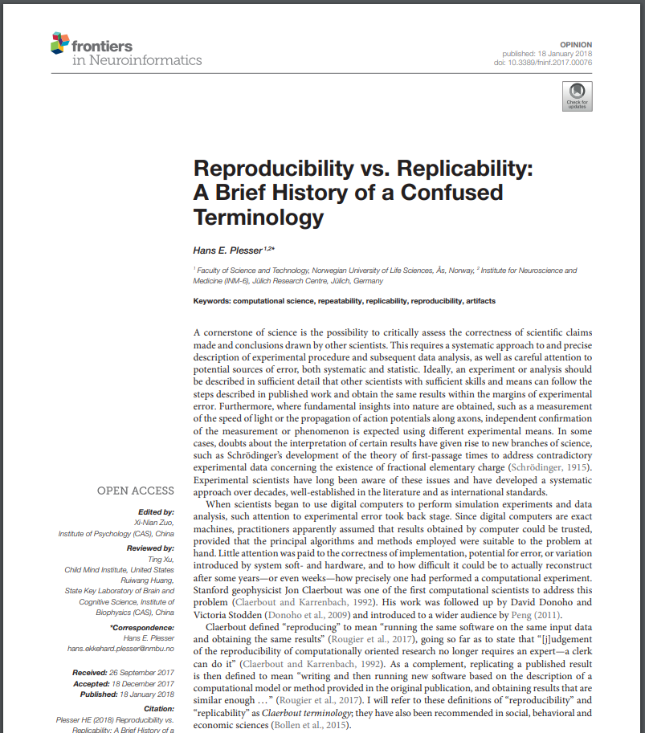

====

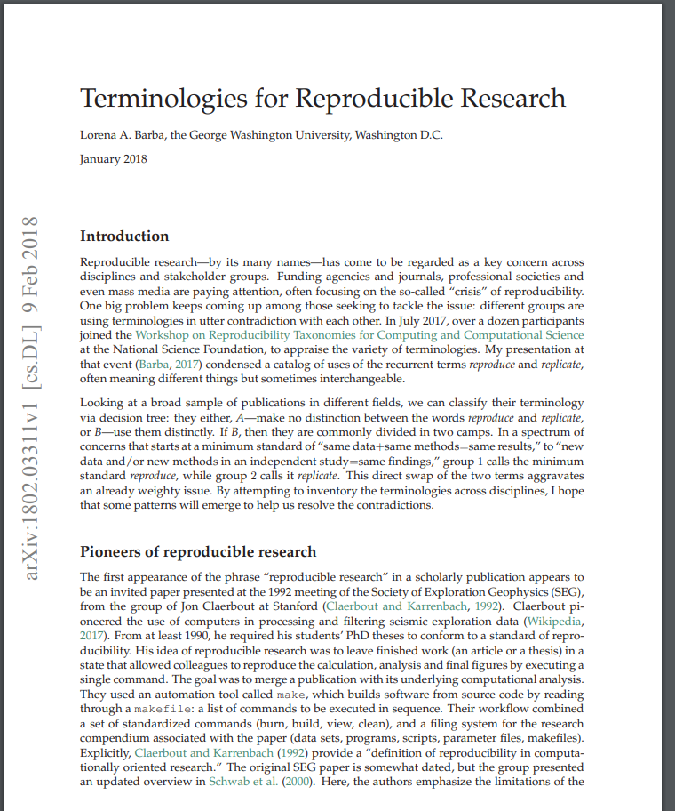

====

- **Grupo A:** autores não diferenciavam Reprodutibilidade e Replicabilidade.
- **Grupo B:** autores diferenciavam Reprodutibilidade e Replicabilidade.
  - **Grupo B1:** 
    - **Reprodutibilidade:** mesmos dados + mesmos métodos = mesmos resultados
    - **Replicabilidade:** novos dados e/ou novos métodos em um estudo independente = mesmas descobertas
  - **Grupo B2:**
    - **Reprodutibilidade:** novos dados e/ou novos métodos em um estudo independente = mesmas descobertas
    - **Replicabilidade:** mesmos dados + mesmos métodos = mesmos resultados

====

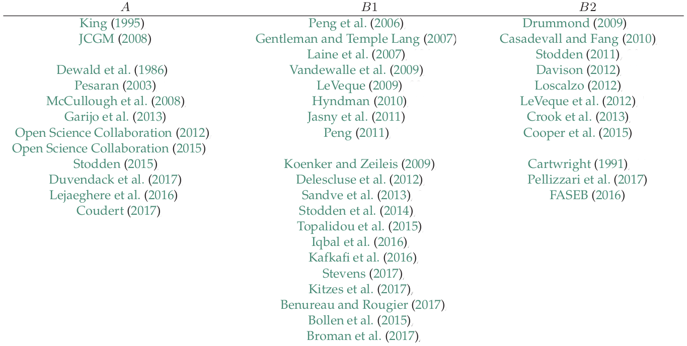

> <small>-- <cite>Barba, 2018</cite> </small>

====

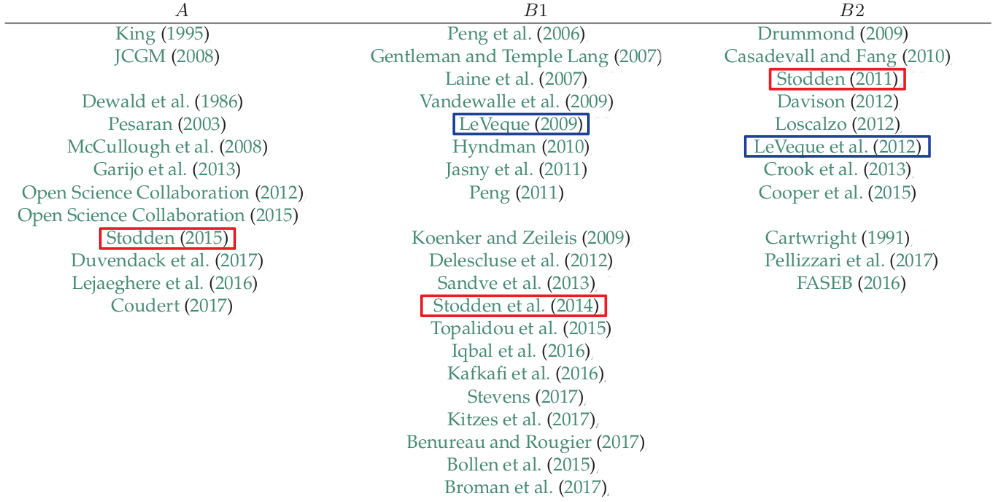

> <small>-- <cite>Barba, 2018</cite> </small>

====

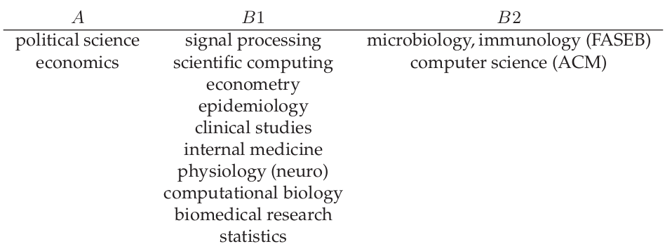

> <small>-- <cite>Barba, 2018</cite> </small>

====

## Terminologia para esse trabalho
 

> **Reprodutibilidade:** *“[...] a capacidade de um pesquisador duplicar os resultados de um estudo anterior **usando os mesmos dados utilizados pela equipe original**”.*

 

> **Replicabilidade:** *“[...] a capacidade de um pesquisador de duplicar os resultados de um estudo anterior se **os mesmos procedimentos forem seguidos, mas novos dados forem coletados**”.*

====

Um problema científico:

# Crise de 
# Reprodutibilidade

====

Em 2016...

> *"Mais de 70% dos pesquisadores tentaram e não conseguiram reproduzir os experimentos de outros cientistas, e mais da metade não conseguiu reproduzir seus próprios experimentos."*
>
> <cite><small>-- Baker, M. (2016). 1,500 Scientists Lift the Lid on Reproducibility. Nature 533 (7604):452–54. https://doi.org/10.1038/533452a</small></cite>

====

====

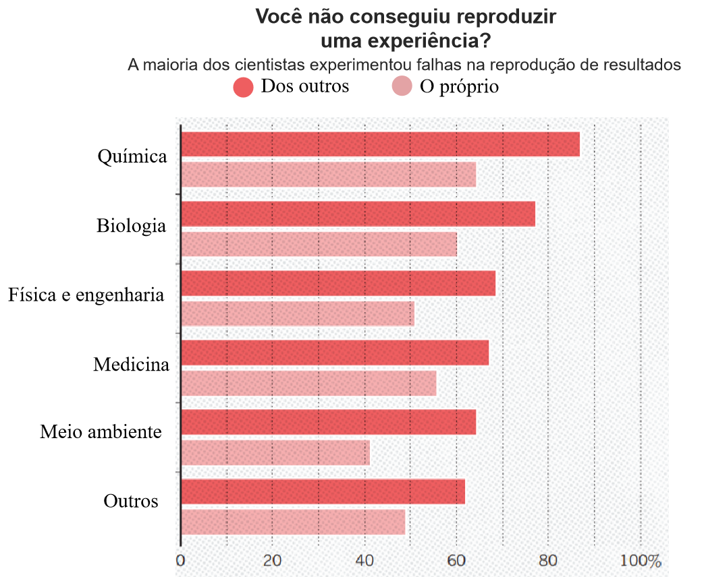

====

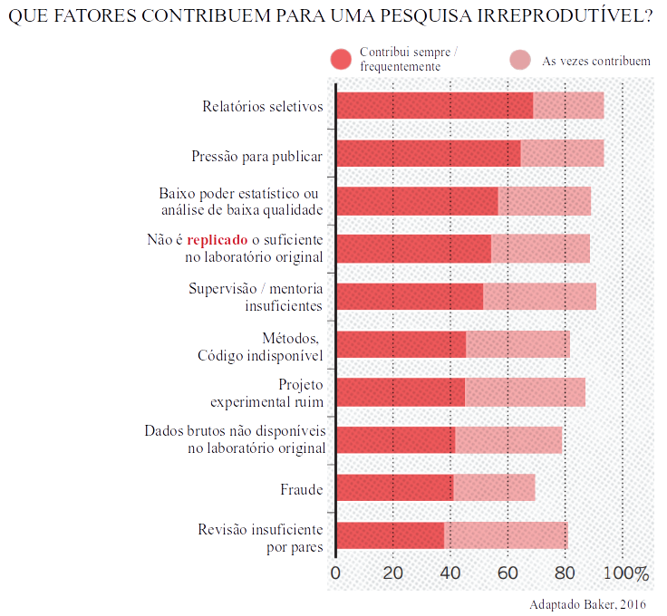

====

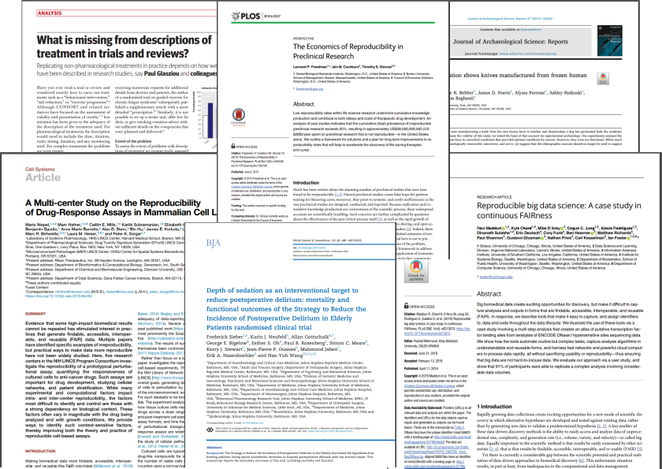

====

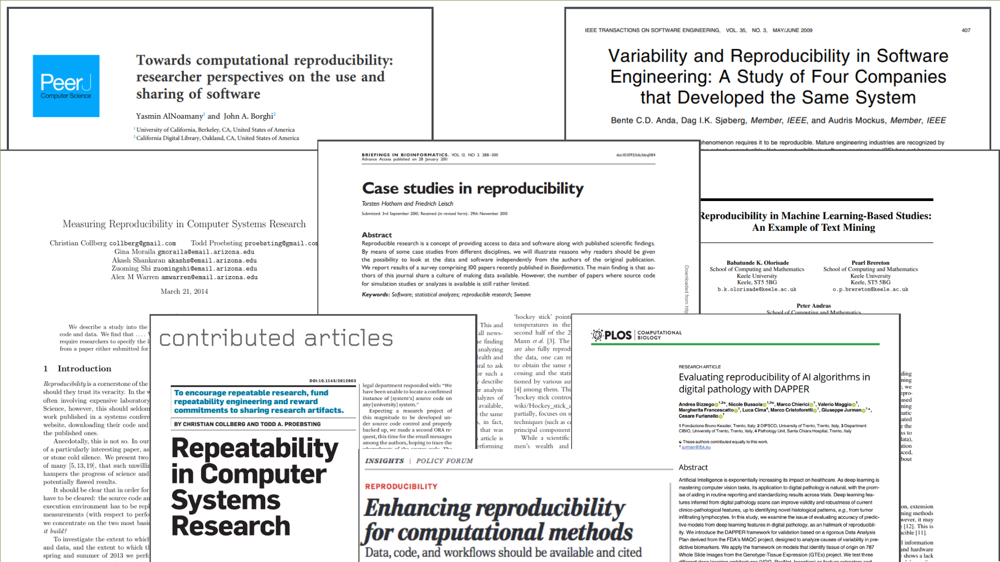

====

Crise de

# Reprodutibilidade Computacional

====

Contribuição para a Crise:

## Aumento das análises computacionais

====

> *"Irreprodutibilidade é a configuração padrão para toda a ciência, e a pesquisa irreprodutível é **particularmente comum nas ciências computacionais**."*
>
> <small><cite>Hong *et al.* (2015). Top Tips to Make Your Research Irreproducible. arXiv. https://arxiv.org/abs/1504.00062 </cite></small>

====

Quais seriam as
## Principais causas?

====

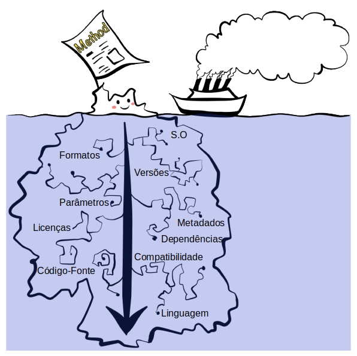

> <small><cite>Adaptado de Kim *et al.* (2018). Experimenting with reproducibility in bioinformatics. GigaScience, V.7, Issue 7, 2018, giy077.</cite></small>

====

## Outras causas na Bioinformática
 

- Tarefas intensivas e extremamente complexas.

- Crescente quantidade de dados biológicos e softwares.

- Sistemas de gerenciamento de pipelines complexos.

- Conjuntos de dados heterogêneos.

====

Tentativa de solucionar o problema:

## Sistemas Operacionais Científicos

====

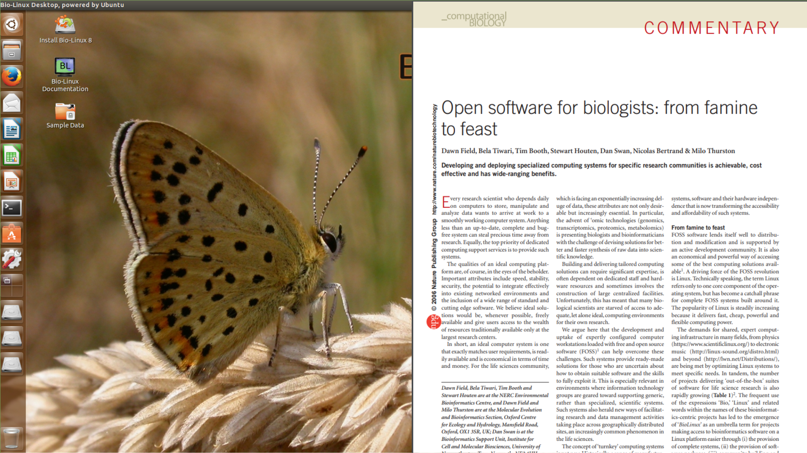

====

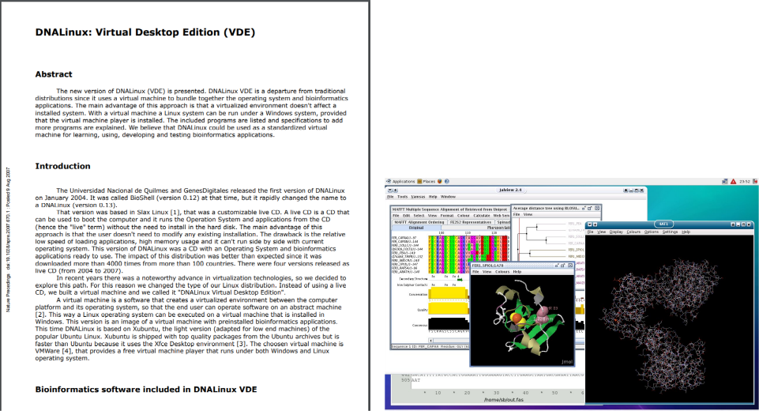

====

## Problemas:
 

- Difícil manutenção do Sistema Operacional (SO).

- Conhecimento avançado para o desenvolvimento.

- Necessidade de uma comunidade de apoio.

- Falta de compatibilidade com diferentes hardwares.

====

Tentativa de solucionar o problema:

## Virtualização por Hardware

<small> ou </small> 
<small> Virtualização por Hypervisor ou Clássica </small>

====

====

====

====

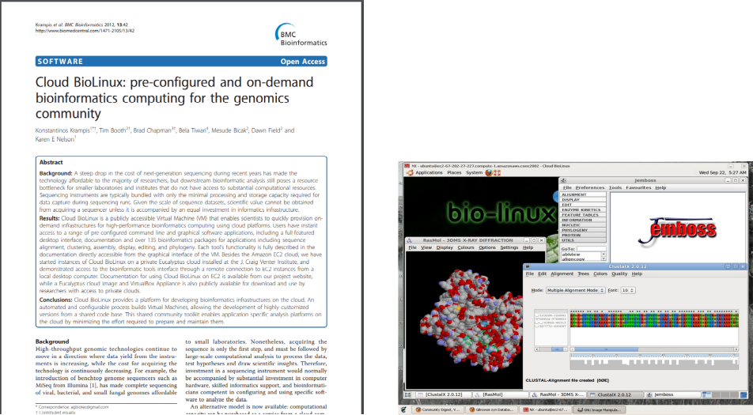

====

## Problemas:
 

- Elevados custos de infraestrutura computacional.

- Baixa escalabilidade.

- Dificuldades de implementação.

- Elevado consumo de recursos computacionais.

====

Tentativa de solucionar o problema:

## Virtualização por Software

<small> ou </small> 
<small> Virtualização por Contêineres ou Leve </small>

====

====

## Docker

> *"Docker é uma plataforma open source usada para construir, executar e distribuir ambientes através da tecnologia de virtualização por software."*

====

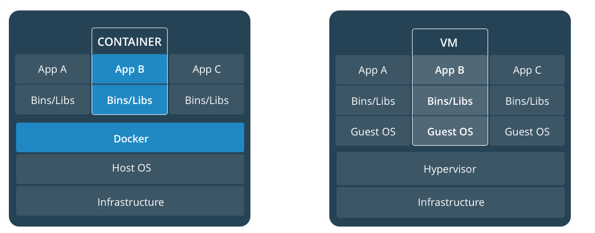

====

## Limitações das VMs
 

- Cada VM requer:   
&nbsp;&nbsp;&nbsp;&nbsp;&nbsp;&nbsp;&nbsp;&nbsp;&nbsp;&nbsp;&nbsp;&nbsp;&nbsp;&nbsp;&nbsp;&nbsp;(a) Alocação de CPU  
&nbsp;&nbsp;&nbsp;&nbsp;&nbsp;&nbsp;&nbsp;&nbsp;&nbsp;&nbsp;&nbsp;&nbsp;&nbsp;&nbsp;&nbsp;&nbsp;(b) Armazenamento  
&nbsp;&nbsp;&nbsp;&nbsp;&nbsp;&nbsp;&nbsp;&nbsp;&nbsp;&nbsp;&nbsp;&nbsp;&nbsp;&nbsp;&nbsp;&nbsp;(c) RAM  
&nbsp;&nbsp;&nbsp;&nbsp;&nbsp;&nbsp;&nbsp;&nbsp;&nbsp;&nbsp;&nbsp;&nbsp;&nbsp;&nbsp;&nbsp;&nbsp;(d) SO convidado  

 

- Quanto mais VMs, mais recursos serão necessários.

- SO convidado significa recursos desperdiçados.

- Portabilidade do aplicativo não garantida.

====

## Benefício dos contêineres Docker
 

- **Velocidade:** não necessita de boot de um SO convidado.

- **Portabilidade:** menos dependências entre as camadas.

- **Eficiência:** menos sobrecarga de SO e melhor densidade.

====

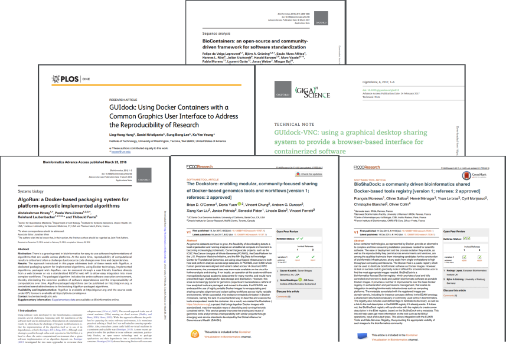

====

Nova estratégia computacional:

## Cloud Computing
