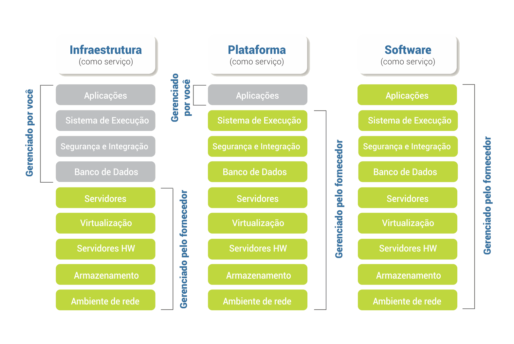

<!-- .slide: data-background="img/popper.png" data-background-size="45%" data-background-position="right" -->

    

        <blockquote style="padding-right: 1em">
            
<i>“[...] ocorrências particulares não suscetíveis de reprodução carecem de significado para a ciência.”</i>

            
<small>Karl Popper, <b>A Lógica da Pesquisa Científica</b> (1934)</small>

        </blockquote>
    

====

Bases Fundamentais da:

# Metodologia 
# Científica

====

Pilares Metodológicos das:

# Pesquisas 
# Experimentais

====

Diretamente associados as:

# Boas Práticas 
# Científicas

====

Problemas de 

# Terminologia

<small> Diferentes pesquisadores de diversas áreas utilizam terminologias conflitantes </small>

====

Definindo

# Terminologias

para esse trabalho

====

Definição do:

## Subcomitê para a 
## Replicabilidade da Ciência

<small> Fundação Nacional de Ciências dos EUA (NSF) </small>

====

## Reprodutibilidade

> *“[...] a capacidade de um pesquisador duplicar os resultados de um estudo anterior **usando os mesmos dados utilizados pela equipe original**”*

====

## Replicabilidade

> *“[...] a capacidade de um pesquisador de duplicar os resultados de um estudo anterior se **os mesmos procedimentos forem seguidos, mas novos dados forem coletados**”*

====

Um problema científico:

# Crise de 
# Reprodutibilidade

====

Em 2016...

> *"Mais de 70% dos pesquisadores tentaram e não conseguiram reproduzir os experimentos de outros cientistas, e mais da metade não conseguiu reproduzir seus próprios experimentos."*
>
> <cite><small>-- Baker, M. (2016). 1,500 Scientists Lift the Lid on Reproducibility. Nature 533 (7604):452–54. https://doi.org/10.1038/533452a</small></cite>

====
  

====

<!-- .slide: data-background="img/FIG5.png" data-background-size="1043px 856px" -->

====

<!-- .slide: data-background="img/FIG6.png" data-background-size="936px 880px" -->

====

<!-- .slide: data-background="img/FIG7.png" data-background-size="1840px 932px" -->

====

<!-- .slide: data-background="img/FIG8.png" data-background-size="1819px 979px" -->

====

Crise de

# Reprodutibilidade Computacional

====

Contribuição para a Crise:

## Aumento das análises computacionais

====

<!-- .slide: data-background="img/FIG35.png" data-background-size="50%" data-background-position="right" -->

    

        <blockquote style="padding-right: 1em">
            
Quais seriam as

            <h3>Principais causas?</h3>
        </blockquote>
    

====

Tentativa de solucionar o problema:

## Sistemas Operacionais Científicos

====

<!-- .slide: data-background="img/FIG9.png" data-background-size="1819px 979px" -->

====

====

## Problemas:
 

- Difícil manutenção do Sistema Operacional (SO).

- Conhecimento avançado para o desenvolvimento.

- Necessidade de uma comunidade de apoio.

- Falta de compatibilidade com diferentes hardwares.

====

Tentativa de solucionar o problema:

## Virtualização por Hardware

<small> ou </small> 
<small> Virtualização por Hypervisor ou Clássica </small>

====

====

====

## Problemas:
 

- Elevados custos de infraestrutura computacional.

- Baixa escalabilidade.

- Dificuldades de implementação.

- Elevado consumo de recursos computacionais.

====

Tentativa de solucionar o problema:

## Virtualização por Contêineres

<small> ou </small> 
<small> Virtualização por Software ou Leve </small>

====

<!-- .slide: data-background="img/FIG15.png" data-background-size="45%" data-background-position="right" -->

    

        <blockquote style="padding-right: 1em">
            
<b>DOCKER:</b>

            
<i>"[...] uma plataforma aberta para a construção, execução e distribuição de ambientes baseados na tecnologia de virtualização por contêineres."</i>

        </blockquote>
    

====

====

## Benefício dos contêineres Docker
 

- **Velocidade:** não necessita de boot de um SO convidado.

- **Portabilidade:** menos dependências entre as camadas.

- **Eficiência:** menos sobrecarga de SO e melhor densidade.

====

====

Nova estratégia:

# Computação em Nuvem

<small> ou </small> 
<small> Cloud Computing </small>

====

## Computação em Nuvem

> “[...] um modelo para permitir acesso conveniente e sob demanda da rede a um conjunto compartilhado de recursos de computação configuráveis (por exemplo, redes, servidores, armazenamento, aplicativos e serviços) que podem ser rapidamente provisionados e liberados com o mínimo esforço de gerenciamento ou interação com o provedor de serviços”
>
> <small>-- <cite>Instituto Nacional de Tecnologias e Padrões dos EUA (NIST)</cite></small>

====

## Principais modelos de serviço

====

## Outros modelos de serviço

 

- **Área de Trabalho como Serviço**
  - ou Desktop-as-a-Service (DaaS)
- **Banco de Dados como Serviço** 
  - ou Database-as-a-Service (DbaaS)
- **TUDO como um Serviço**
  - ou Anything-as-a-Service (XaaS)

====

Uma solução para Reprodutibilidade e Replicabilidade:

# Contêineres Docker
em conjunto com os modelos de Computação em Nuvem
