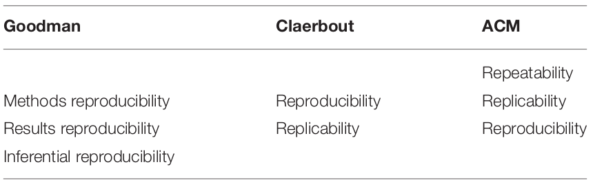

Bases Fundamentais da:

# Metodologia 
# Científica

====

Pilares Metodológicos das:

# Pesquisas 
# Experimentais

====

Diretamente associados as:

# Boas Práticas 
# Científica

====

> “[...] ocorrências particulares não suscetíveis de reprodução carecem de significado para a ciência.”
>
> <small>-- <cite>Karl Popper, 1934</cite> </small>

====

> “[...] podemos dizer que um fenômeno é experimentalmente demonstrável quando sabemos como conduzir um experimento que raramente não nos dará um resultado estatisticamente significativo.”
>
> <small>-- <cite>Ronald A. Fisher, 1935</cite> </small>

====

Mas afinal,

## O que é Reprodutibilidade?

## O que significa Replicabilidade?

====

## Reprodutibilidade

> “[...] a capacidade de um pesquisador duplicar os resultados de um estudo anterior **usando os mesmos dados utilizados pela equipe original**”
>
> <small>-- <cite>Subcomitê para a Replicabilidade da Ciência da U.S. National Science Foundation (NSF)</cite> </small>

====

## Replicabilidade

> *“[...] a capacidade de um pesquisador de duplicar os resultados de um estudo anterior se **os mesmos procedimentos forem seguidos, mas novos dados forem coletados**”*
>
> <small>-- <cite>Subcomitê para a Replicabilidade da Ciência da U.S. National Science Foundation (NSF)</cite></small>

====

Dois problemas de 

# Nomenclatura

====

> <small>-- <cite>Barba, 2018</cite> </small>

====

> <small>-- <cite>Barba, 2018</cite> </small>

====

> <small>-- <cite>Plesser, 2018</cite> </small>

====

## Outras terminologias:

- Reprodutibilidade empírica

- Reprodutibilidade estatística

- Reprodutibilidade computacional

====

## Terminologia para esse trabalho

====

> *“O principal objetivo das publicações científicas é ensinar novos conceitos, mostrar as implicações resultantes desses conceitos em uma ilustração e fornecer detalhes suficientes para tornar o trabalho reprodutível.”*
>
> <small>-- <cite>Claerbout, 1992</cite></small>

====

Um problema científico:

# Crise de 
# Reprodutibilidade

====

Em 2016...

> *"Mais de 70% dos pesquisadores tentaram e não conseguiram reproduzir os experimentos de outros cientistas, e mais da metade não conseguiu reproduzir seus próprios experimentos."*
>
> <cite><small>-- Baker, M. (2016). 1,500 Scientists Lift the Lid on Reproducibility. Nature 533 (7604):452–54. https://doi.org/10.1038/533452a</small></cite>

====

====

====

====

====

====

Crise de

# Reprodutibilidade Computacional

====

Contribuição para a Crise:

## Aumento das análises computacionais

====

> *"Irreprodutibilidade é a configuração padrão para toda a ciência, e a pesquisa irreprodutível é **particularmente comum nas ciências computacionais**."*
>
> <small><cite>Hong *et al.* (2015). Top Tips to Make Your Research Irreproducible. arXiv. https://arxiv.org/abs/1504.00062 </cite></small>

====

## Principais causas

- Tarefas intensivas e extremamente complexas.
- Crescente quantidade de dados biológicos e softwares.
- Sistemas de gerenciamento de pipelines complexos. 
- Diferentes padrões e formatos de arquivos. 
- Conjuntos de dados heterogêneos.

====

Tentativa de solucionar o problema:

## Sistemas Operacionais Científicos

====

====

====

## Problemas:

- Difícil manutenção do SO.
- Conhecimento avançado para o desenvolvimento.
- Necessidade de uma comunidade de apoio.
- Falta de compatibilidade com diferentes hardwares.

====

Tentativa de solucionar o problema:

## Virtualização por Hardware

<small> ou </small> 
<small> Virtualização por Hypervisor ou Clássica </small>

====

====

====

====

====

## Problemas:

- Elevados custos de infraestrutura computacional.
- Baixa escalabilidade.
- Dificuldades de implementação.
- Elevado consumo de recursos computacionais.

====

Tentativa de solucionar o problema:

## Virtualização por Software

<small> ou </small> 
<small> Virtualização por Contêineres ou Leve </small>

====

====

## Docker

> *"Docker é uma plataforma open source usada para construir, executar e distribuir ambientes através da tecnologia de virtualização por software."*

====

====

## Limitações das VMs

- Cada VM requer
  - alocação de CPU
  - Armazenamento
  - RAM
  - Um SO convidado completo
- Quanto mais VMs você executa, mais recursos você precisa
- SO convidado significa recursos desperdiçados
- Portabilidade do aplicativo não garantida

====

## Benefício dos contêineres Docker

- **Velocidade:** não necessita de boot de um SO convidado.
- **Portabilidade:** menos dependências entre as camadas.
- **Eficiência:** menos sobrecarga de SO e melhor densidade.
