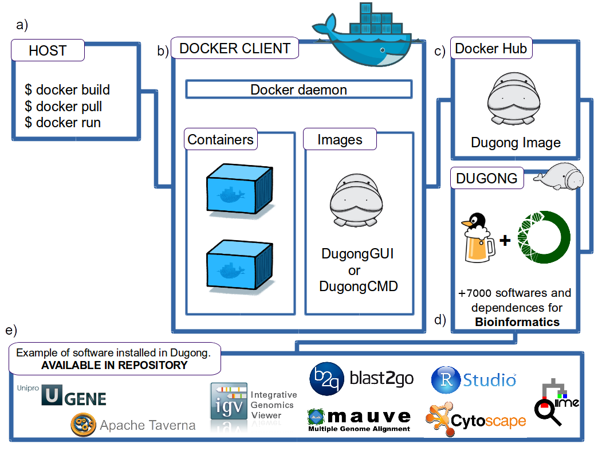
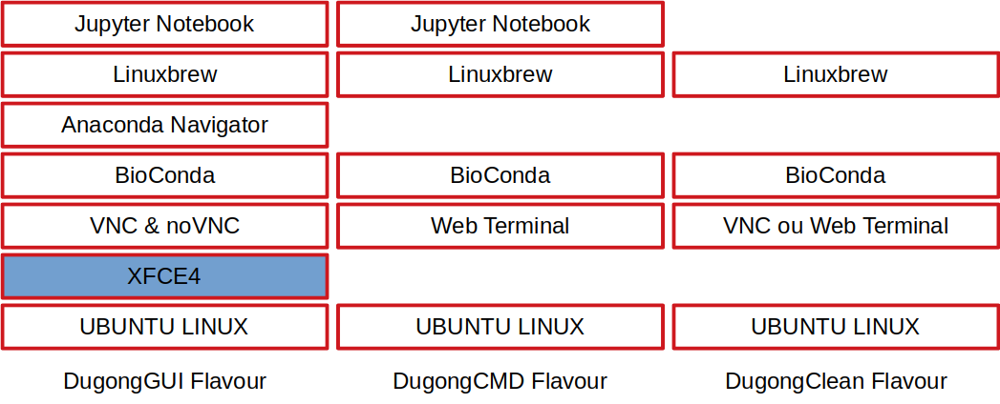
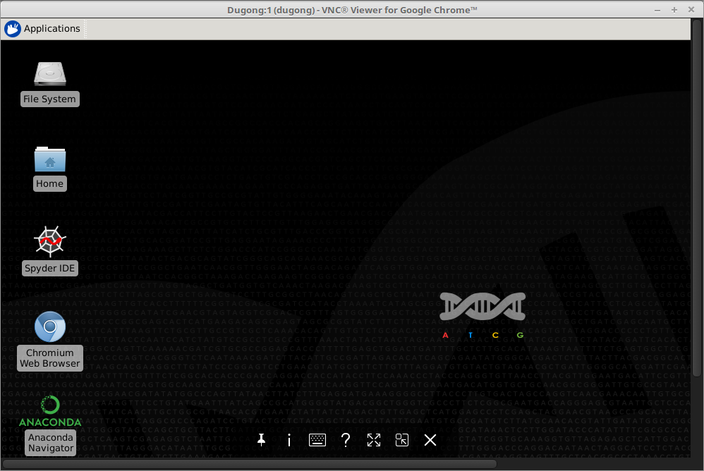
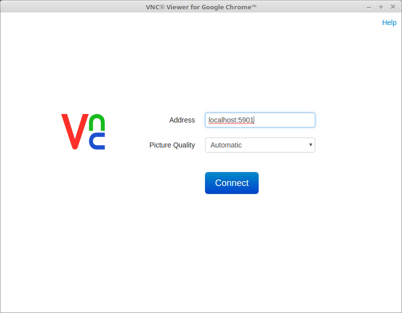
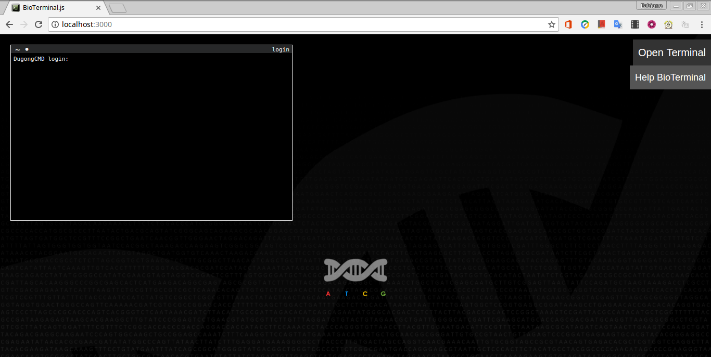
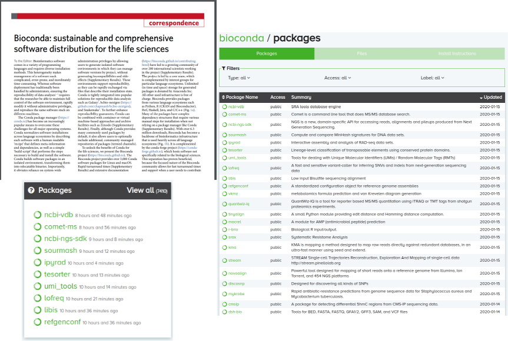
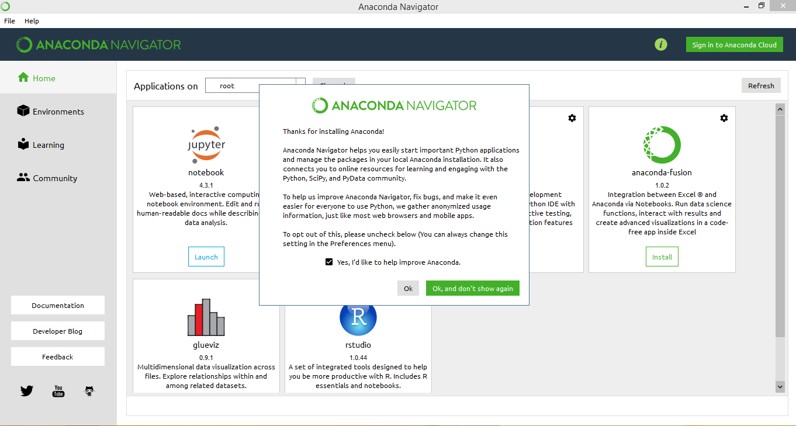
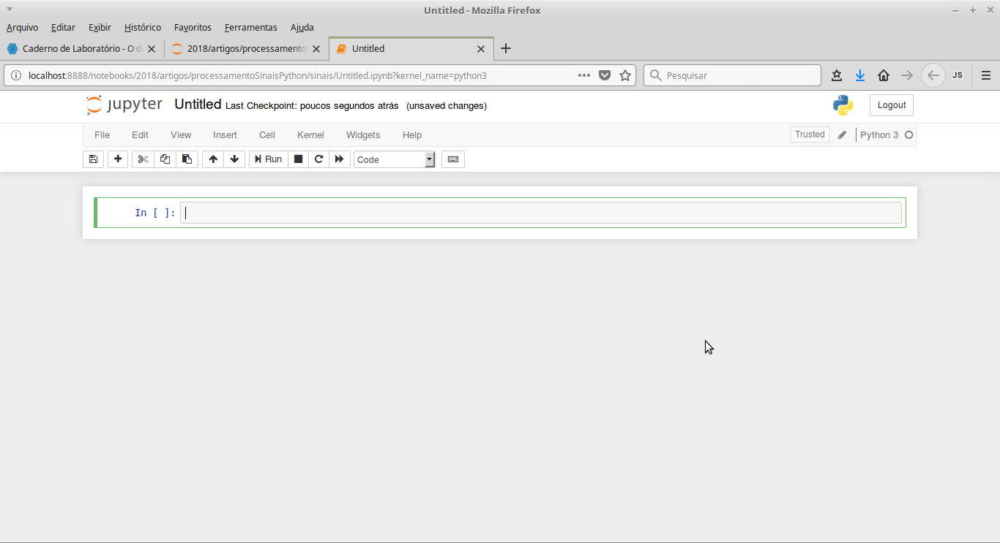
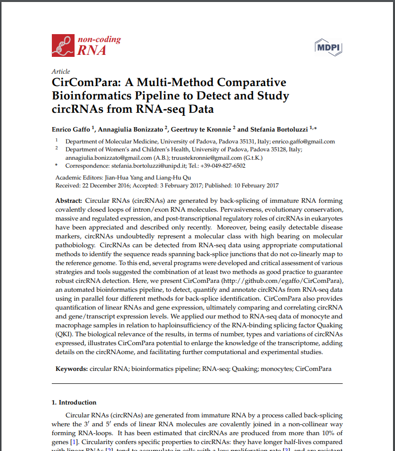

### DUGONG: uma imagem Docker, baseada no Ubuntu Linux, focada na Reprodutibilidade e Replicabilidade para análises de Bioinformática

Menegidio, F.B. *et al.*

Bioinformatics, 34(3), btx554

doi: https://doi.org/10.1093/bioinformatics/btx554

====

## Objetivo

====

> *Desenvolver uma área de trabalho virtual (*Desktop-as-a-Service, ou DaaS*) que possibilite a execução de uma grande variedade de análises de bioinformática, de maneira reprodutível , por usuários com baixa ou nenhuma experiência com a linha de comando.*

====

====

====

## Características do Dugong

====

## XFCE4

====

## VNC

====

## Web Terminal

====

## Repositório BioConda

====

## Anaconda Navigator

====

## Jupyter Notebook

====

### Comparação do Dugong com outros serviços de virtualização por hardware

====

### Comparação do Dugong com outros serviços de virtualização por contêiner

====

## Estudo de Caso: CirComPara

====

## Teste de Reprodutibilidade do CirComPara

====

## Conclusão
 

- Esforço pioneiro na implementação de um *DaaS*.

- Preocupação com a usabilidade dos utilizadores.

- Maior acervo de softwares de bioinformática.

- Acréscimo importante para a comunidade científica.

