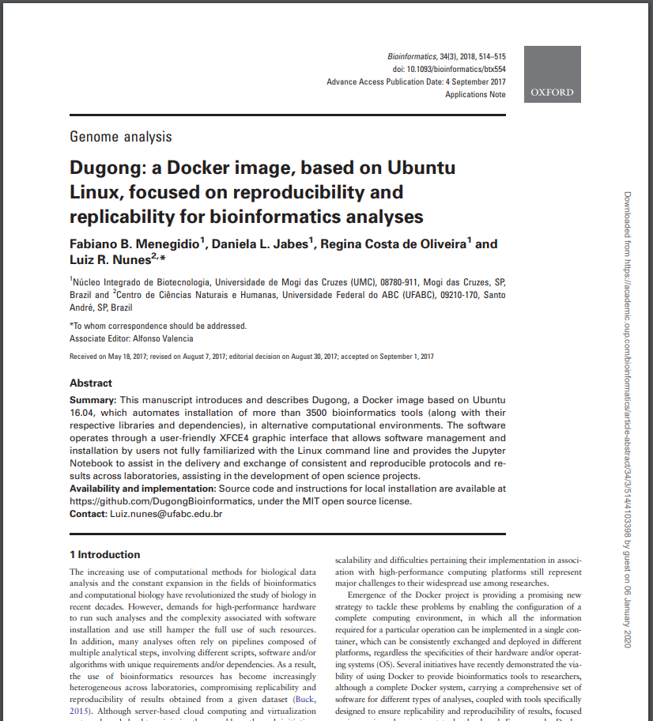
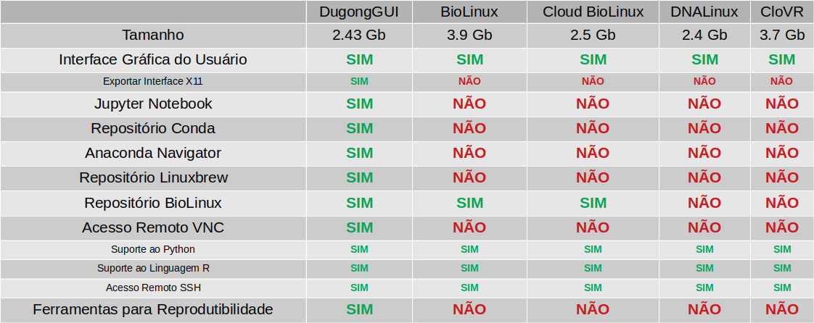
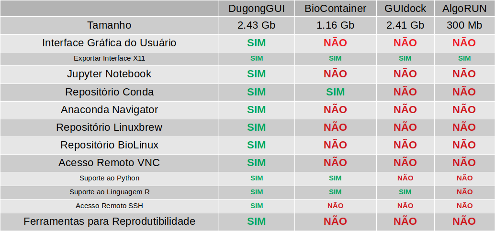
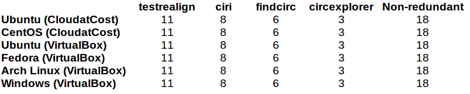

### DUGONG: uma imagem Docker, baseada no Ubuntu Linux, focada na Reprodutibilidade e Replicabilidade para análises de Bioinformática

Menegidio, F.B. *et al.*

**Bioinformatics**, 34(3), btx554. 

doi: https://doi.org/10.1093/bioinformatics/btx554

---

> **OBJETIVO:** "Desenvolver uma área de trabalho virtual que possibilite a execução de uma grande variedade de análises de bioinformática, de maneira reprodutível.

====

====

<!-- .slide: data-background="img/FIG18.png"  data-background-size="1058px 794px"  -->

====

<!-- .slide: data-background="img/FIG20.png" data-background-size="68%" data-background-position="right" -->

    

        <blockquote style="padding-right: 1em">
            
<b>
XFCE4
</b>

            <small><small>
Interface Gráfica do Usuário
</small></small>
        </blockquote>
    

====

<!-- .slide: data-background="img/FIG21.png" data-background-size="68%" data-background-position="right" -->

    

        <blockquote style="padding-right: 1em">
            
<b>
VNC
</b>

            <small><small>
Acesso Remoto
</small></small>
        </blockquote>
    

====

<!-- .slide: data-background="img/FIG23.png" data-background-size="68%" data-background-position="right" -->

    

        <blockquote style="padding-right: 1em">
            
<b>
Bioconda
</b>

            <small><small>
Repositório de Bioinformática
</small></small>
        </blockquote>
    

====

<!-- .slide: data-background="img/FIG24.png" data-background-size="68%" data-background-position="right" -->

    

        <blockquote style="padding-right: 1em">
            
<b>
Anaconda Navigator
</b>

            <small><small>
Bioconda GUI
</small></small>
        </blockquote>
    

====

<!-- .slide: data-background="img/FIG25.png" data-background-size="68%" data-background-position="right" -->

    

        <blockquote style="padding-right: 1em">
            
<b>
Jupyter Notebook
</b>

            <small><small>
Caderno de Laboratório Virtual
</small></small>
        </blockquote>
    

====

## Comparação

<!-- .slide: data-background="img/FIG27.png" data-background-size="80%" data-background-position="center bottom" -->

====

### Comparação do Dugong com outros serviços de virtualização por hardware

====

### Comparação do Dugong com outros serviços de virtualização por contêiner

====

<!-- .slide: data-background="img/FIG28.png" data-background-size="50%" data-background-position="right" -->

    

        <blockquote style="padding-right: 1em">
            
<b>
ESTUDO DE CASO:
</b>

            <small>
1. Adaptação do CirCompara.
</small>
            <small>
2. Análise de Reprodutibilidade.
</small>
        </blockquote>
    

====

## Teste de Reprodutibilidade

====

# Conclusão
 

- Esforço pioneiro na implementação de um *DaaS*.

- Real preocupação com a usabilidade.

- Maior acervo de softwares de bioinformática.

- Método eficaz para garantir Reprodutibilidade.

- Acréscimo importante para a comunidade científica.

