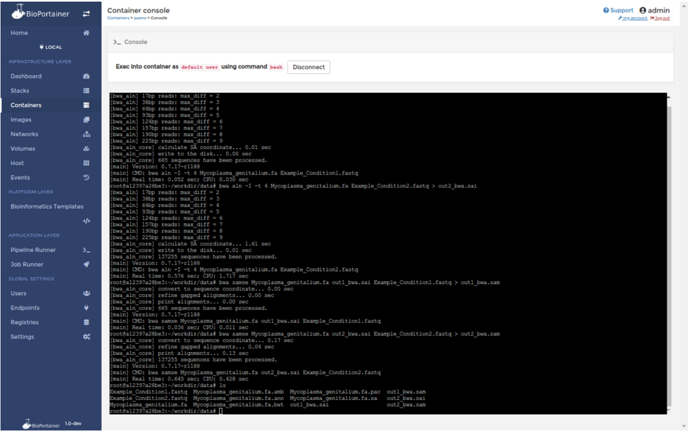
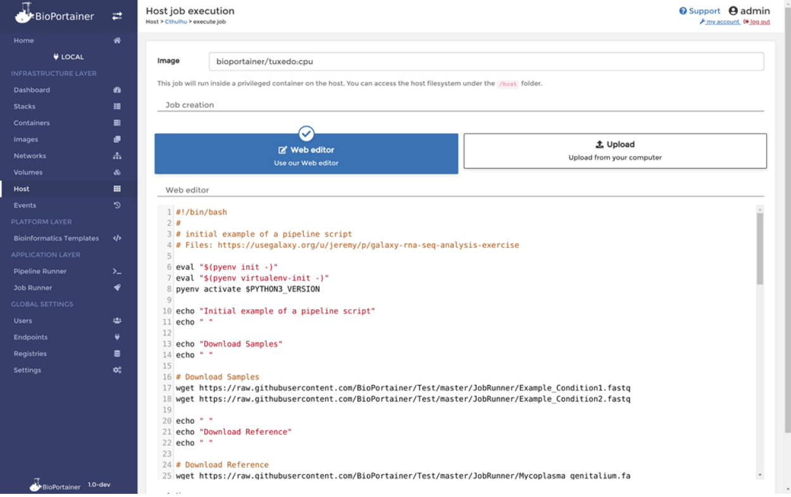
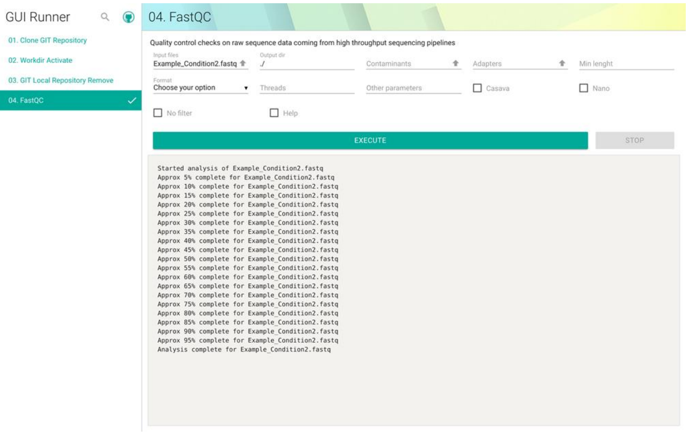
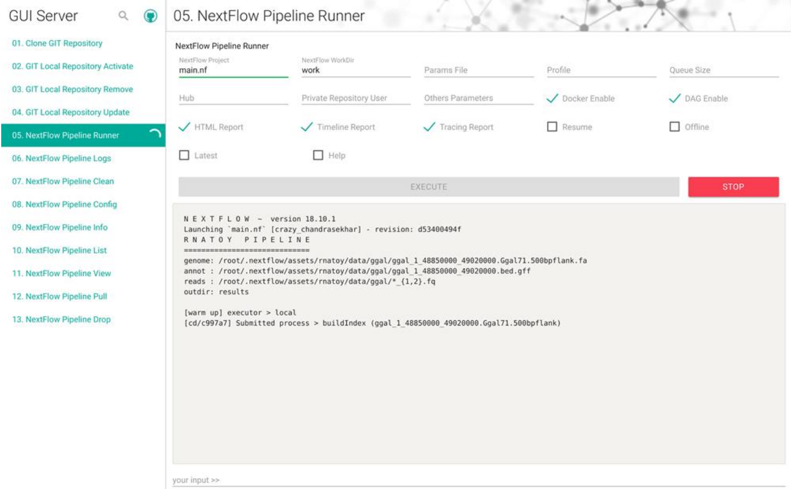
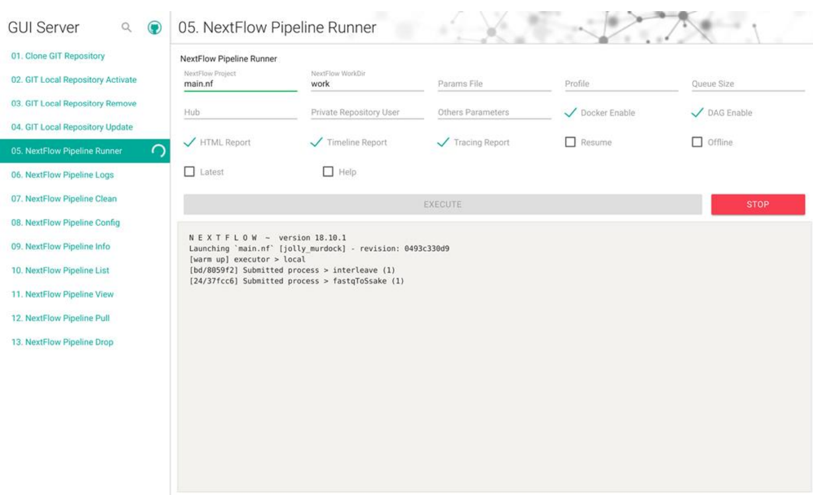

### BIOPORTAINER WORKBENCH: UM SISTEMA VERSÁTIL E FÁCIL DE USAR QUE INTEGRA A IMPLEMENTAÇÃO, O GERENCIAMENTO E O USO DE RECURSOS DE BIOINFORMATICOS EM AMBIENTES DOCKER

Menegidio, F.B. *et al.*

**GigaScience**, 8(4), giz041

doi: https://doi.org/10.1093/gigascience/giz041

---

**OBJETIVO:** *"Desenvolver uma plataforma virtual capaz de aprimorar o desempenho de ambientes de virtualização Docker em diferentes níveis e camadas computacionais (infraestrutura, plataforma e aplicação)".*

====

====

<!-- .slide: data-background="img/FIG31.png"  data-background-size="1287px 923px"  -->

====

<!-- .slide: data-background="img/bioportainer1.gif" data-background-size="1204px 680px" -->

====

<!-- .slide: data-background="img/bioportainer2.gif" data-background-size="65%" data-background-position="right" -->

    

        <blockquote style="padding-right: 1em">
            
<b>
Camada de
</b>

            
<b>
Infraestrutura
</b>

            
<b>
<small>BioPortainer Panel</small>
</b>
 
        </blockquote>
    

====

<!-- .slide: data-background="img/bioportainer2.gif" data-background-size="65%" data-background-position="right" -->

    

        <blockquote style="padding-right: 1em">
            
<b>
Camada de
</b>

            
<b>
Plataforma
</b>
 
            
<b>
<small>BioPortainer Bioinformatics Plataforms</small>
</b>

            

<small><small>68 plataformas em 11 categorias.</small></small>

        </blockquote>
    

====

    

        <blockquote style="padding-left: 1em">
            
<b>
Camada de
</b>

            
<b>
Aplicação
</b>
 
        </blockquote>
    

    

        <blockquote style="padding-right: 1em">
            
<b>
- BioPortainer Console
</b>

            
<b>
Plataforma
</b>
 
            
<b>
<small>68 plataformas em 11 categorias.</small>
</b>
 
        </blockquote>
    

====

## Aplicações:

 - BioPortainer Console

 - BioPortainer Job Runner
 

 - BioPortainer GUI-Runner
 

 - BioPortainer Pipeline Runner

====

## BioPortainer Console

> Acesso facilitado através de um console de terminal através da interface do BioPortainer Panel.

====

====

## BioPortainer Job Runner

> Interface para execução de scripts utilizando uma imagem Docker de preferência e contêinerização dos resultados.

====

====

## BioPortainer GUI-Runner

> Interface Web para ferramentas de linha de comando através de um formulário JSON.
>
> Apresenta mais de 109 ferramentas de bioinformática já configuradas.

====

====

## BioPortainer Pipeline Runner

> Interface Web baseada no BioPortainer GUI-Runner para execução de fluxos de trabalho do Nextflow. 
>
> Também possibilita a execução de pipelines através do Jupyter Notebook. 
>
> Baseada no conceito de Docker-in-Docker.

====

====

====

====

## Fluxos de Trabalho Nextflow

> Permite a utilização de mais de 80 fluxos de trabalho desenvolvidos e disponibilizados pela comunidade de usuários do Nextflow.

====

# Conclusão

 - Único em sua categoria. 

 - Pioneiro em integrar diferentes camadas computacionais. 

 - Facilita a implementação e gerenciamento de ambientes Docker. 

 - Possibilita a integração dos mais diversos projetos Docker em uma interface de fácil assimilação. 

 - Importante acréscimo para a comunidade Nextflow, fornecendo uma interface de fácil assimilação para a execução de pipelines. 

