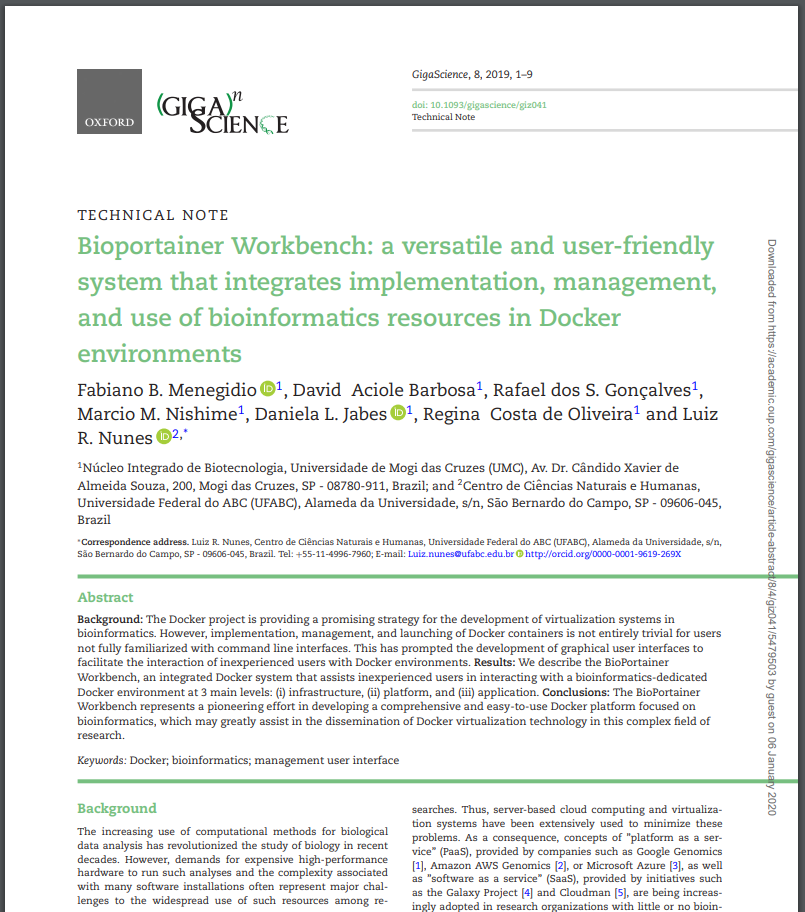

### BIOPORTAINER WORKBENCH: UM SISTEMA VERSÁTIL E FÁCIL DE USAR QUE INTEGRA A IMPLEMENTAÇÃO, O GERENCIAMENTO E O USO DE RECURSOS DE BIOINFORMATICOS EM AMBIENTES DOCKER

Menegidio, F.B. *et al.*

**GigaScience**, 8(4), giz041

doi: https://doi.org/10.1093/gigascience/giz041

---

**OBJETIVO:** *"Desenvolver uma plataforma virtual capaz de aprimorar o desempenho de ambientes de virtualização Docker em diferentes níveis e camadas computacionais (infraestrutura, plataforma e aplicação)".*

====

====

<!-- .slide: data-background="img/FIG31.png"  data-background-size="1287px 923px"  -->

====

<!-- .slide: data-background="img/bioportainer1.gif" data-background-size="1204px 680px" -->

====

<!-- .slide: data-background="img/bioportainer2.gif" data-background-size="65%" data-background-position="right" -->

    

        <blockquote style="padding-right: 1em">
            
<b>
Camada de
</b>

            
<b>
Infraestrutura
</b>

            
<b>
<small>BioPortainer Panel</small>
</b>
 
        </blockquote>
    

====

<!-- .slide: data-background="img/bioportainer3.gif" data-background-size="65%" data-background-position="right" -->

    

        <blockquote style="padding-right: 1em">
            
<b>
Camada de
</b>

            
<b>
Plataforma
</b>

            
<b>
<small>BioPortainer Bioinformatics Platforms</small>
</b>

            

<small><small>68 plataformas em 11 categorias.</small></small>

        </blockquote>
    

====

<!-- .slide: data-background="img/bioportainer4.gif" data-background-size="65%" data-background-position="right" -->

    

        <blockquote style="padding-right: 1em">
            
<b>
Camada de
</b>

            
<b>
Aplicação
</b>

            
<b>
<small>BioPortainer Console</small>
</b>

        </blockquote>
    

====

<!-- .slide: data-background="img/bioportainer5.gif" data-background-size="65%" data-background-position="right" -->

    

        <blockquote style="padding-right: 1em">
            
<b>
Camada de
</b>

            
<b>
Aplicação
</b>

            
<b>
<small>BioPortainer Job Runner</small>
</b>

        </blockquote>
    

====

<!-- .slide: data-background="img/bioportainer6.gif" data-background-size="65%" data-background-position="right" -->

    

        <blockquote style="padding-right: 1em">
            
<b>
Camada de
</b>

            
<b>
Aplicação
</b>

            
<b>
<small>BioPortainer GUI Runner</small>
</b>

            

<small><small>Mais de 100 ferramentas portadas.</small></small>

        </blockquote>
    

====

<!-- .slide: data-background="img/bioportainer7.gif" data-background-size="65%" data-background-position="right" -->

    

        <blockquote style="padding-right: 1em">
            
<b>
Camada de
</b>

            
<b>
Aplicação
</b>

            
<b>
<small>BioPortainer Pipeline Runner</small>
</b>

            
<b>
<small>Nextflow GUI</small>
</b>

            

<small><small>Mais de 80 pipelines disponíveis.</small></small>

        </blockquote>
    

====

<!-- .slide: data-background="img/bioportainer8.gif" data-background-size="65%" data-background-position="right" -->

    

        <blockquote style="padding-right: 1em">
            
<b>
Camada de
</b>

            
<b>
Aplicação
</b>

            
<b>
<small>BioPortainer Pipeline Runner</small>
</b>

            
<b>
<small>Netxflow Notebook</small>
</b>

            

<small><small>Mais de 80 pipelines disponíveis.</small></small>

        </blockquote>
    

====

# Conclusão

 - Único em sua categoria. 

 - Pioneiro em integrar diferentes camadas computacionais. 

 - Facilita a implementação e gerenciamento de ambientes Docker. 

 - Possibilita a integração dos mais diversos projetos Docker em uma interface de fácil assimilação. 

 - Importante acréscimo para a comunidade Nextflow, fornecendo uma interface de fácil assimilação para a execução de pipelines. 

