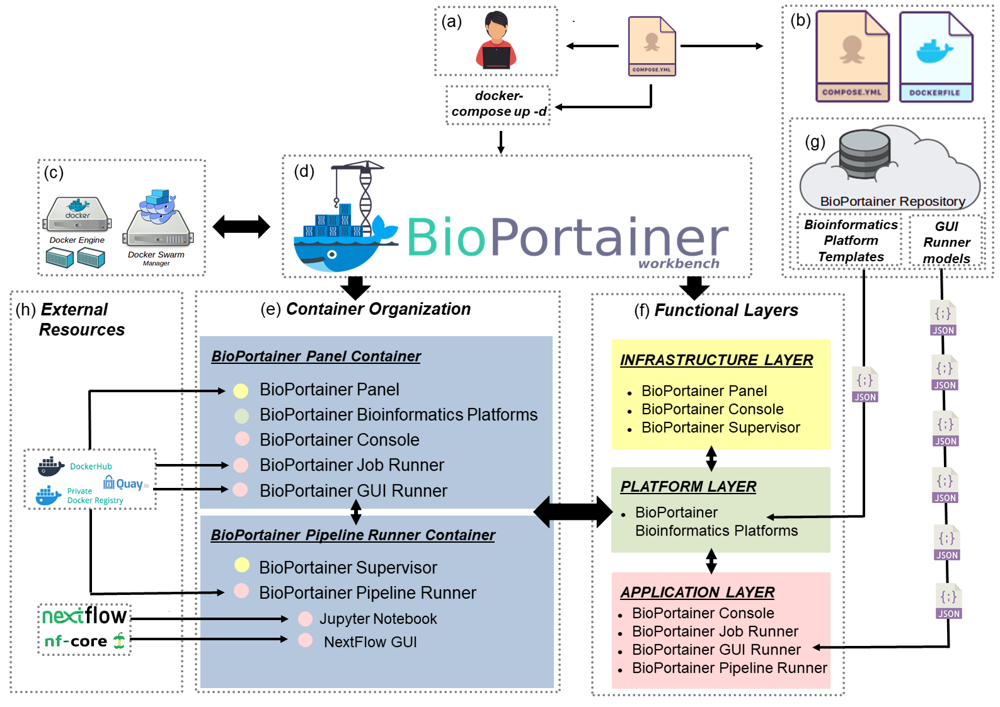
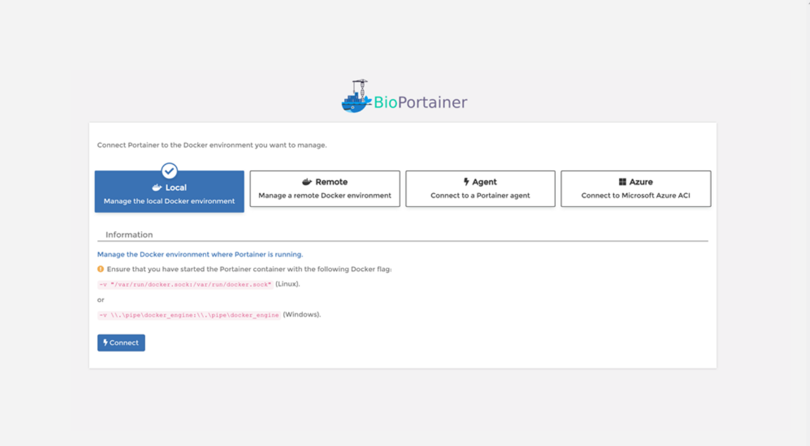
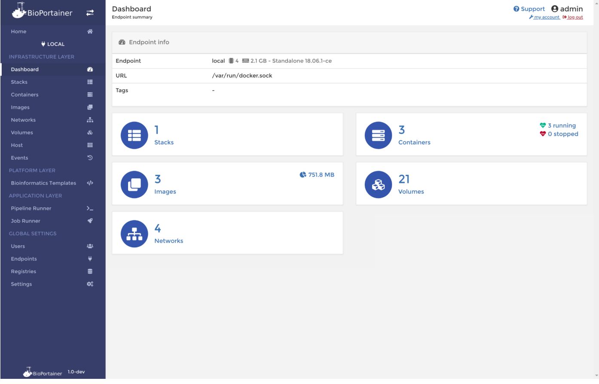
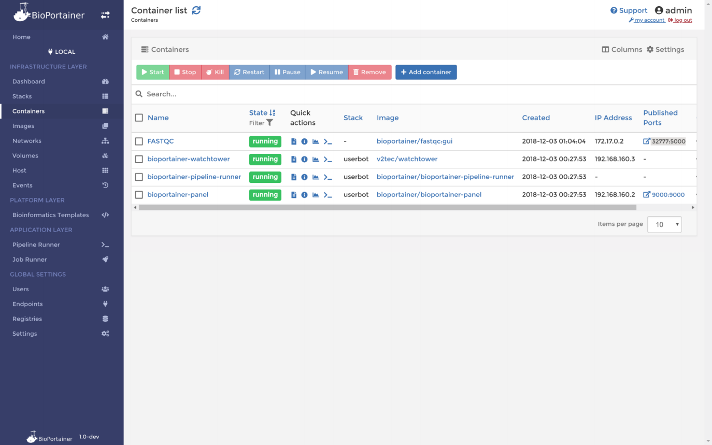
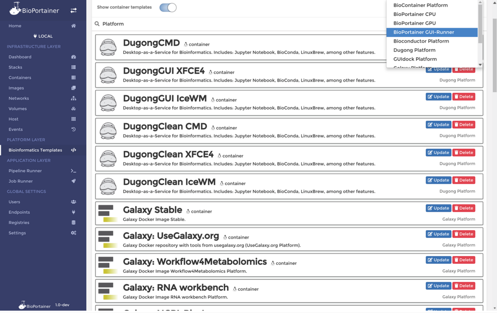

### BIOPORTAINER WORKBENCH: UM SISTEMA VERSÁTIL E FÁCIL DE USAR QUE INTEGRA A IMPLEMENTAÇÃO, O GERENCIAMENTO E O USO DE RECURSOS DE BIOINFORMATICOS EM AMBIENTES DOCKER

Menegidio, F.B. *et al.*

**GigaScience**, 8(4), giz041

doi: https://doi.org/10.1093/gigascience/giz041

> <small> **OBJETIVO:** *"Desenvolver uma plataforma virtual (*Platform-as-a-Service, ou PaaS*) capaz de aprimorar o desempenho de ambientes de virtualização Docker em diferentes níveis e camadas computacionais (infraestrutura, plataforma e aplicação)".* </small>

====

====

====

====

# Camada 
# de Infraestrutura

====

====

====

# Camada
# de Plataforma

====

## Plataformas:

 1. BioPortainer CPU Platform; 

 2. BioPortainer GPU Platform; 
 

 3. BioPortainer GUI Runner Platform; 

 4. Galaxy Platform; 

 5. Galaxy Tools Platform; 

 6. BioContainers Platform; 
 

 7. Dugong Platform; 

 8. GUIdock Platform; 
 

 9. Bioconductor Platform; 
 

 10. R and RStudio Platform; 

 11. Jupyter Notebook Platform. 

====

====

# Camada
# de Aplicação

====

# Conclusão
