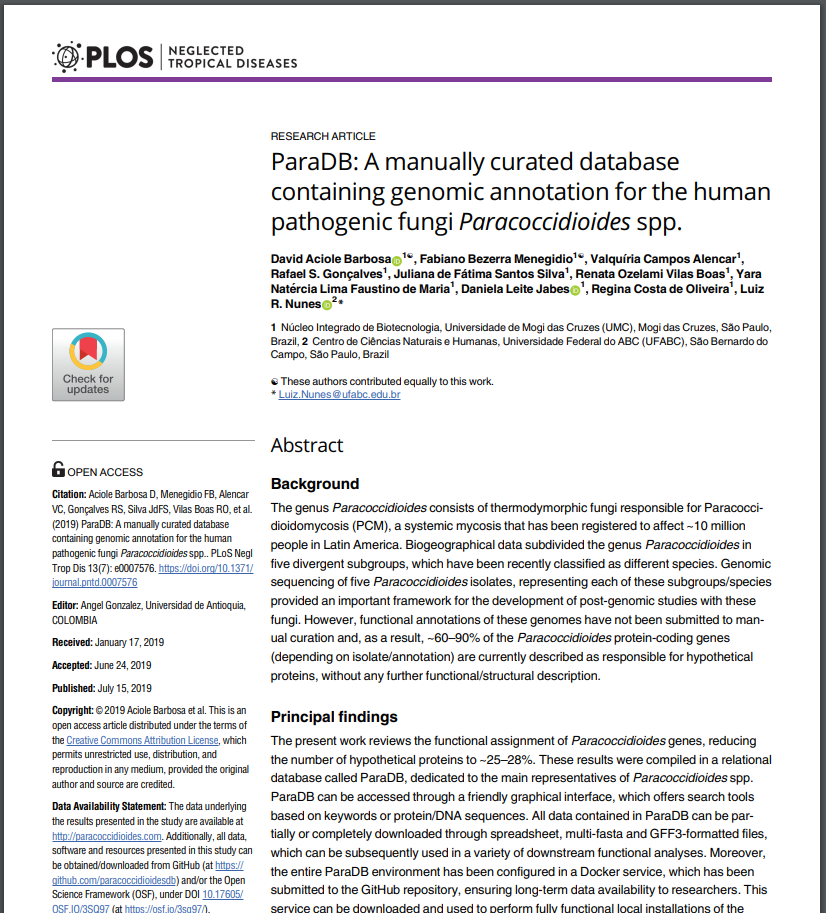

### PARADB: UMA BASE DE DADOS MANUALMENTE CURADA QUE CONTÉM ANOTAÇÃO GENÔMICA PARA OS FUNGOS PATOGÊNICOS HUMANOS *PARACOCCIDIOIDES SPP*.

Aciole Barbosa, D.¹; Menegidio, F.B.¹ *et al.*

PLOS Neglected Tropical Diseases, 13(7), e0007576

doi: https://doi.org/10.1371/journal.pntd.0007576

> <small> **OBJETIVO:** *Desenvolver um banco de dados virtual (Database-as-a-Service, ou DbaaS) como uma estratégia para garantir o armazenamento perene e reprodutível de dados genômicos à comunidade científica.* </small>

====

====

## Plano de Fundo:

 - *Paracoccidioides spp* - fungo patogênico humano. 

 - Paracoccidioidomicose, doença tropical negligenciada. 

 - Apresenta 5 isolados sequenciados atualmente. 

 - Primeira versão do genoma de 3 isolados (Pb1, Pb03 e Pb18) foram anotados e disponibilizados no banco de dados JGI do Broad Institute.

 - Resequenciamento e Reanotação dos 3 isolados iniciais (Pb01, Pb03 e Pb18) geraram inconsistências entre os bancos de dados. 

====

## Plano de Fundo (continuação):

 - Em 2015, o banco de dados do Broad Institute foi descontinuado.

 - Sequenciamento do genoma de 2 novos isolados (PbCNH e Pb300).

 - Dados funcionais foram distribuídos entre os bancos de dados genéricos Genbank/RefSeq e Ensembl, além dos bancos de dados especializados em fungos FungiDB e MycoCosm. 

====
