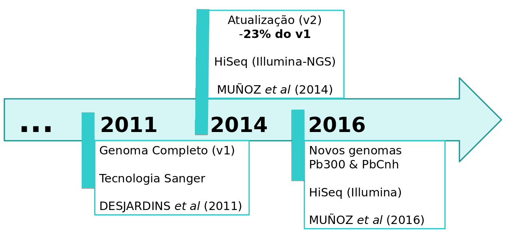
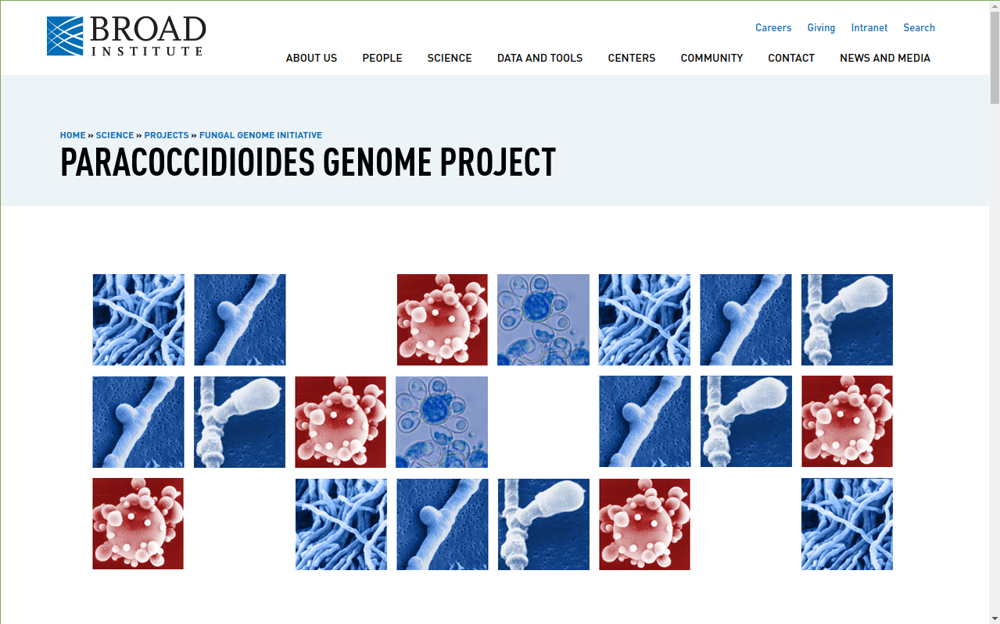
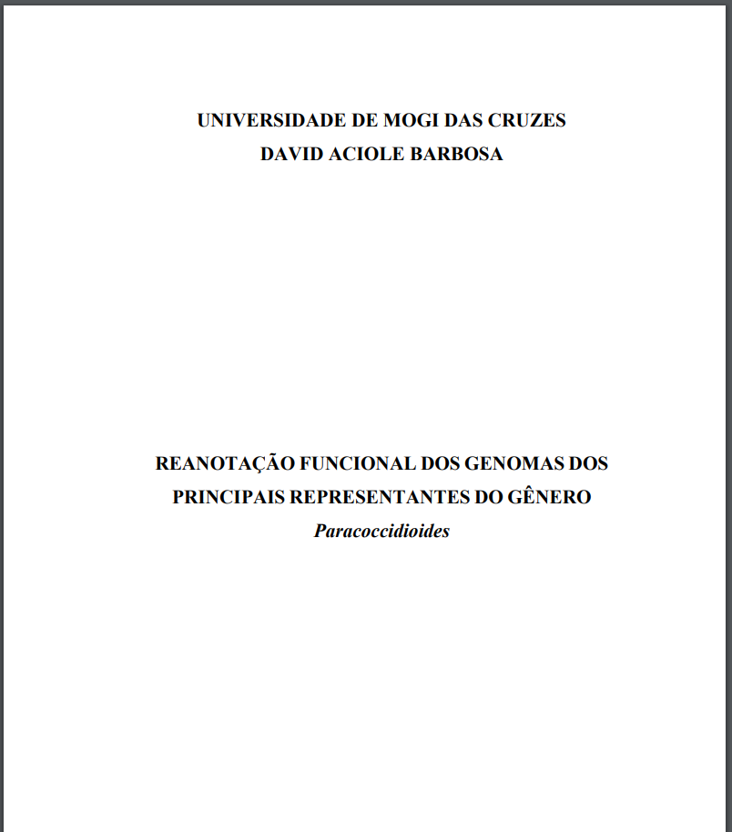
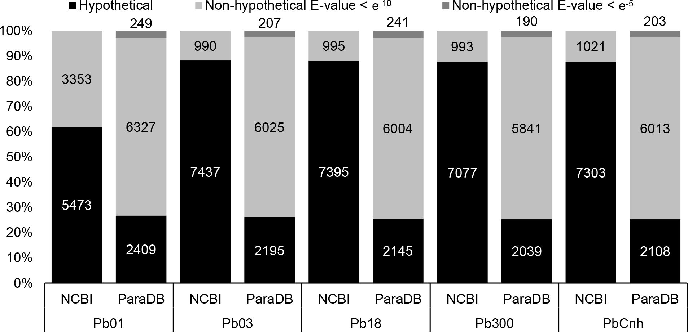

### PARADB: UMA BASE DE DADOS MANUALMENTE CURADA QUE CONTÉM ANOTAÇÃO GENÔMICA PARA OS FUNGOS PATOGÊNICOS HUMANOS *PARACOCCIDIOIDES SPP*.

Aciole Barbosa, D.¹; Menegidio, F.B.¹ *et al.*

PLOS Neglected Tropical Diseases, 13(7), e0007576

doi: https://doi.org/10.1371/journal.pntd.0007576

---

**OBJETIVO:** *Desenvolver um banco de dados virtual como uma estratégia para garantir o armazenamento perene e reprodutível de dados genômicos à comunidade científica.*

====

## Histórico

- Gênero: Paracoccidioides

- Fungos dimórficos patogênicos

- Doença tropical negligenciada

- Paracoccidioidomicose (PCM) 

- Responsável por +- 2 milhões de óbitos / ano

- Cinco grupos filogenéticos distintos:

- Pb01, Pb03, Pb18, Pb300 e PbCNH

====

## Sequenciamento dos isolados:

====

## BD Broad Institute

### Iniciativa de Genomas Fúngicos

====

Em 2015 o BD foi

# Descontinuado
tornando indisponível as anotações para a comunidade

====

Tentativa de solução:

# Dados Migrados

Sem qualquer curadoria manual e real validação

<small>RefSeq/Genbank, Ensembl, MycoCosm e FungiDB</small>

====

Problema:

# Versões e Dados
# Conflitantes

====

Mais de 80% dos genes:

# Proteínas Hipotéticas

Sem valor funcional para análises biológicas

====

Decisão:

# Reanotação Funcional

dos cinco isolados disponíveis

====

### Dissertação David Aciole

====

Processo de:

# Curadoria Manual

Mais de 3 meses e diversos envolvidos

====

====

====

<!-- .slide: data-background="img/FIG51.png"  data-background-size="1058px 794px"  -->

====

Contribuição:

# Database-as-a-Service

baseado em contêineres Docker

====

<!-- .slide: data-background="img/FIG52.png"  data-background-size="1058px 794px"  -->

====

<!-- .slide: data-background="img/paradb1.gif" data-background-size="65%" data-background-position="right" -->

    

        <blockquote style="padding-right: 1em">
            
<b>
Instalação Local
</b>

            
<b>
ParaDB
</b>

        </blockquote>
    

====

<!-- .slide: data-background="img/paradb2.gif" data-background-size="65%" data-background-position="right" -->

    

        <blockquote style="padding-right: 1em">
            
<b>
Acesso Local
</b>

            
<b>
ParaDB
</b>

        </blockquote>
    

====

# Conclusão

 - Primeiro DbaaS focado em Bioinformática. 

 - Infraestrutura de alta disponibilidade. 

 - Instalação de espelhos locais. 

 - Prova de conceito funcional da utilização do Docker para manutenção de banco de dados biológicos.

