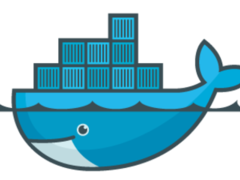
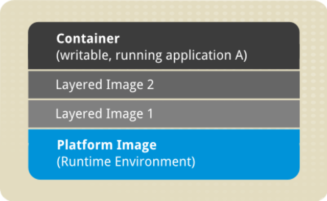

 <!-- .element: class="no-border no-background" -->

## Docker

[docker.com](https://www.docker.com)

====

> ### Build, Ship, Run
>
> Uma plataforma aberta de aplicações distribuídas
> para desenvolvedores e _sysadmins_

====

- Sistema de arquivos em camadas
- Ampla variedade de imagens base
- Imagens nunca são alteradas, apenas o containers no topo
- Rodam como serviços

====

 <!-- .element: class="no-border no-background bigger" -->

redhat.com <!-- .element: class="credits" -->

====

```console
➜  ~  docker pull hello-world
latest: Pulling from hello-world

535020c3e8ad: Pull complete
af340544ed62: Pull complete
hello-world:latest: The image you are pulling has been verified.
Important: image verification is a tech preview feature and
should not be relied on to provide security.

Digest: sha256:02fee8c3220ba806531f606525eceb83f4feb654f62b207191b1c9209188dedd
Status: Downloaded newer image for hello-world:latest
```

====

```console
➜  ~  docker run hello-world

Hello from Docker.
This message shows that your installation appears to be working correctly.

To generate this message, Docker took the following steps:
 1. The Docker client contacted the Docker daemon.
 2. The Docker daemon pulled the "hello-world" image from the Docker Hub.
 3. The Docker daemon created a new container from that image which runs the
    executable that produces the output you are currently reading.
 4. The Docker daemon streamed that output to the Docker client, which sent it
    to your terminal.

To try something more ambitious, you can run an Ubuntu container with:
 $ docker run -it ubuntu bash

Share images, automate workflows, and more with a free Docker Hub account:
 https://hub.docker.com

For more examples and ideas, visit:
 https://docs.docker.com/userguide/
```

====

- docker
- docker-compose
- docker-machine
- boot2docker

Note:
Ferramentas da suíte Docker

====

```console
➜  ~  vim Dockerfile
```

```Dockerfile
FROM docker/whalesay:latest

RUN apt-get -y update && apt-get install -y fortunes

CMD /usr/games/fortune -a | cowsay
```

```console
➜  ~  docker build -t docker-whale .
```

Note:
- Cria uma imagem a partir de um `Dockerfile`
- Roda um container a partir da imagem

====

```console
vim docker-compose.yml
```

```yml
web:
  build: .
  ports:
   - "5000:5000"
  volumes:
   - .:/code
  links:
   - redis

redis:
  image: redis
```

```console
docker-compose up -d
```

Note:
- Cria serviços `web` e `redis` com `docker-compose`
- Inicia os serviços
