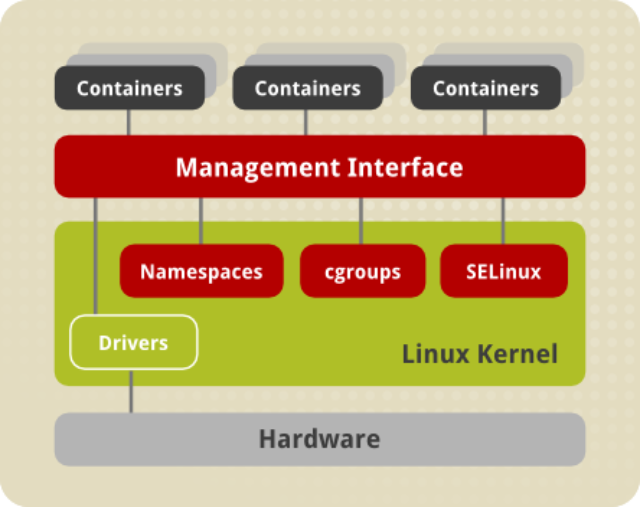

 <!-- .element: class="no-border no-background" -->

## Linux Containers

[linuxcontainers.org](https://linuxcontainers.org)

====

- LXC
- LXD
- CG Manager
- LXCFS

Note:
Conjunto de ferramentas do projeto Liunx Containers

====

 <!-- .element: class="no-border no-background bigger" -->

redhat.com <!-- .element: class="credits" -->

Note:
Arquitetura de containers

====

> Alguma coisa entre um _chroot_ e uma máquina virtual completa

- Apenas GNU/Linux
- Utiliza características de contenção do kernel Linux
- Roda no sistema de arquivos
- Compartilha o _Kernel_ com o _Host_
- _User space_ isolado

Note:
Características

====

- Não emula _Hardware_
- Não reserva recursos
- Controle de processos pelo _host_

Note:
Principais diferenças de uma VM

====

```console
lxc-create -t download -n my-container
lxc-attach -n my-container
```

Note:
- Cria um container a partir de uma imagem base
    + Exibe lista de distribuições, versões e arquiteturas
- Obtém acesso ao shell to container
