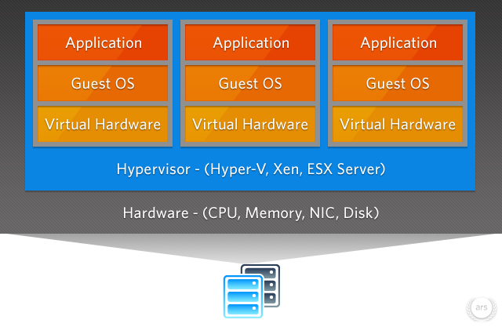

## Motivações

Ou, porque usar Vagrant ou Containers?

- Sem instalar dependências por projeto
- Subir todos serviços com um único comando
- Criar um ambiente fácil de reproduzir e distribuir
- Remover tudo facilmente

----

Primeiro vamos falar sobre

## Virtualização

====

- Virtual Box
- VM Ware
- Windows Hyper-V
- Xen

Note:
Alguns exemplos de Hypervisors

====



====

Virtualização depende de emulação de Hardware.

- Qualquer Sistema Operacional
- Reserva recursos (especialmente memória)
- Performance comprometida

Note:
Principais características

----

 <!-- .element: class="no-border no-background" -->

## Vagrant

https://www.vagrantup.com

====

> Ambientes de desenvolvimento facilitados

- _Box_ prontas para diversos fins
- Fácil de empacotar e distribuir
- Roda sobre Virtual Box ou VM Ware
- _Provisionamento_ (via _bash_, _Chef_, _Puppet_, etc.)

Note:
Principais características

- Também roda sobre Docker

====

Configuração feita através do arquivo `Vagrantfile`

====

```console
vagrant init hashicorp/precise32
vagrant up
```

Note:
- Inicializa um ambiente com base no Ubuntu hashicorp/precise32
- Sobe o ambiente

  O comando `up` baixa a _box_ e configura todo o necessário


----

 <!-- .element: class="no-border no-background" -->

## Linux Containers

https://linuxcontainers.org

====

- LXC
- LXD
- CG Manager
- LXCFS

Note:
Conjunto de ferramentas do projeto Liunx Containers

====

> Alguma coisa entre um _chroot_ e uma máquina virtual completa

- Apenas GNU/Linux
- Utiliza características de contenção do kernel Linux
- Roda no sistema de arquivos
- _User space_ isolado

Note:
Características

----

### Créditos das imagens

- arstechnica.com
