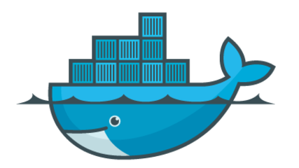

## Motivações

Ou, porque usar Vagrant ou Containers?

- Sem instalar dependências por projeto
- Subir todos serviços com um único comando
- Criar um ambiente fácil de reproduzir e distribuir
- Remover tudo facilmente

----

Primeiro vamos falar sobre

## Virtualização

====

- Virtual Box
- VM Ware
- Windows Hyper-V
- Xen

Note:
Alguns exemplos de Hypervisors

====


====

Virtualização depende de emulação de Hardware.

- Qualquer Sistema Operacional
- Reserva recursos (especialmente memória)
- Performance comprometida

Note:
Principais características

----

 <!-- .element: class="no-border no-background" -->

## Vagrant

https://www.vagrantup.com

====

> Ambientes de desenvolvimento facilitados

- _Box_ prontas para diversos fins
- Fácil de empacotar e distribuir
- Roda sobre Virtual Box ou VM Ware
- _Provisionamento_ (via _bash_, _Chef_, _Puppet_, etc.)

Note:
Principais características

- Também roda sobre Docker

====

Configuração feita através do arquivo `Vagrantfile`

====

```console
vagrant init hashicorp/precise32
vagrant up
```

Note:
- Inicializa um ambiente com base no Ubuntu hashicorp/precise32
- Sobe o ambiente

  O comando `up` baixa a _box_ e configura todo o necessário


----

 <!-- .element: class="no-border no-background" -->

## Linux Containers

https://linuxcontainers.org

====

- LXC
- LXD
- CG Manager
- LXCFS

Note:
Conjunto de ferramentas do projeto Liunx Containers

====

 <!-- .element: class="no-border no-background" -->

Note:
Arquitetura de containers

====

> Alguma coisa entre um _chroot_ e uma máquina virtual completa

- Apenas GNU/Linux
- Utiliza características de contenção do kernel Linux
- Roda no sistema de arquivos
- Compartilha o _Kernel_ com o _Host_
- _User space_ isolado

Note:
Características

====

- Não emula _Hardware_
- Não reserva recursos
- Controle de processos pelo _host_

Note:
Principais diferenças de uma VM

====

```console
lxc-create -t download -n my-container
lxc-attach -n my-container
```

Note:
- Cria um container a partir de uma imagem base
    + Exibe lista de distribuições, versões e arquiteturas
- Obtém acesso ao shell to container

----

 <!-- .element: class="no-border no-background" -->

## Docker

https://www.docker.com

====

> ### Build, Ship, Run
>
> Uma plataforma aberta para aplicações distribuídas
> para desenvolvedores e _sysadmins_

====

- docker
- docker-compose
- boot2docker
- docker-machine

Note:
Ferramentas da suíte Docker

====

 <!-- .element: class="no-border no-background" -->

- Sistema de arquivos em camadas
- Ampla variedade de imagens base
- A imagem nunca é alterada, apenas o container sobre ela
- Containers rodam como serviços

Note:
- Sistema de arquivos em camadas.
- Principais características

====

```console
docker pull hello-world
docker run hello-world
```

Note:
- Obtém a imagem Hello World
- Roda um container com a imagem

====

```console
vim Dockerfile
```

```docker
FROM docker/whalesay:latest


RUN apt-get -y update && apt-get install -y fortunes


CMD /usr/games/fortune -a | cowsay
```

```console
docker build -t docker-whale .
```

Note:
- Cria uma imagem a partir de um `Dockerfile`
- Roda um container a partir da imagem

====

```console
vim docker-compose.yml
```

```yml
web:
  build: .
  ports:
   - "5000:5000"
  volumes:
   - .:/code
  links:
   - redis
redis:
  image: redis
```

```console
docker-compose up -d
```

Note:
- Cria serviços `web` e `redis` com `docker-compose`
- Inicia os serviços

----

# Dúvidas?

----

### Créditos das imagens

- arstechnica.com
- redhat.com
- docker.com
