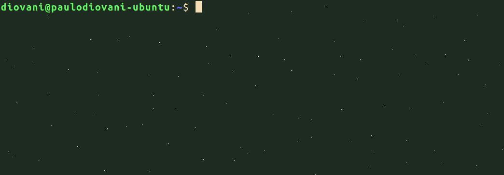

 <!-- .element: class="no-border" -->

#### Descomplicando o uso de VMs para desenvolvimento de software

<small>Versão 0.1</small>

Note:
Anotação para apresentador vai aqui.

----
<!-- .slide: data-background="img/coder-trans.png" -->

## Um caso comum

1. Sou desenvolvedor Java, PHP, Python, Go, Ruby, WTF...
2. Uso bases MySQL, Oracle, PostgreSQL, M$ SQL Server...
3. Programo para Windows, Linux, Mac OSX, BSD...

====
<!-- .slide: data-background="img/computer-setups-trans.png" -->

Preciso de várias máquinas?

<!-- .element: class="fragment" data-fragment="1" -->
ou <br>
Vários serviços rodando na minha?

====
<!-- .slide: data-background="img/overheat-trans.png" -->

### Problemas:

* Consumo de recursos
  
  _webserver_ + _database_ + compiladores

  <small>sem contar energia elétrica</small>

* Gerenciamento manual
  
  _init_ dos serviços

* Serviços disputando portas
  
  > Quem está usando a porta http 80?

====
<!-- .slide: data-background="img/lightcycle-trans.png" -->

### Solução mais "prática"

Máquinas virtuais (VMs)

<big>Mas será prática mesmo?</big> <!-- .element: class="fragment" data-fragment="1" -->

----

# Vagrant

Note: Vamos falar sobre o Vagrant

====
<!-- .slide: data-background="img/mendigo-trans.png" -->

### O que é Vagrant?

<!-- .element: class="fragment" data-fragment="1" -->
Não este tipo de _"vagrant"_

Note: "Vagrant" pode ser traduzido como "vagabundo"
ou "mendigo"

====
<!-- .slide: data-background="img/vagrant-bg-trans.png" -->

### O que é Vagrant?

http://vagrantup.com

http://vagrantcloud.com

http://github.com/mitchellh/vagrant

Note: Agora sim. O que é Vagrant?

====
<!-- .slide: data-background="img/vagrant-bg-trans.png" -->

### O que é Vagrant?

> Vagrant é uma ferramenta para construir e 
> distribuir ambientes de desenvolvimento.


Note: Descrição no github

====
<!-- .slide: data-background="img/vagrant-bg-trans.png" -->

Ambientes de desenvolvimento gerenciados pelo Vagrant podem
rodar em plataformas virtuais locais como **VirtualBox**
ou **VMware**, na _nuvem_ via **AWS** ou **OpenStack**,
ou ainda em _recipientes_ como **Docker** ou **LXC**.

Note: Ainda do github

====
<!-- .slide: data-background="img/vagrant-bg-trans.png" -->

Vagrant fornece o _framework_ e configurações para criar e
gerenciar ambientes de desenvolvimento completos e portáveis.

Disponível para Windows, Mac OSX e GNU/Linux.

Note: Mais ainda do github

----

### Começando...

ou inicializando um ambiente Vagrant "do zero"

```
vagrant init hashicorp/precise32
vagrant up
```

====
<!-- .slide: data-background="img/free-time-trans.png" -->

### O que ganho com isso?

====



Note: Gravação com exemplo de uso do vagrant

----

### Créditos da apresentação

por [Paulo Diovani Gonçalves](mailto:paulo@diovani.com)

<small>[paulo@diovani.com]((mailto:paulo@diovani.com)</small>

_powered by: [reveal.js](http://lab.hakim.se/reveal-js/)_

<small>[http://lab.hakim.se/reveal-js/](http://lab.hakim.se/reveal-js/)</small>

====
<!-- .slide: class="image-credits" -->

#### Créditos das imagens

* vagrant-logo, vagrant-bg http://vagrantup.com
* coder http://blog.locaweb.com.br
* computer-setups http://mosslounge.com
* overheat http://sevacall.com
* lightcycle http://simplywallpaper.net
* mendigo http://hubimg.com
* free-time http://kristinareken.wordpress.com