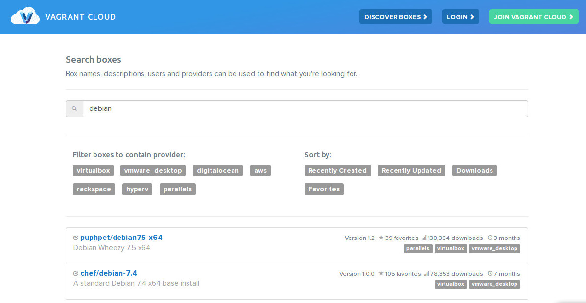
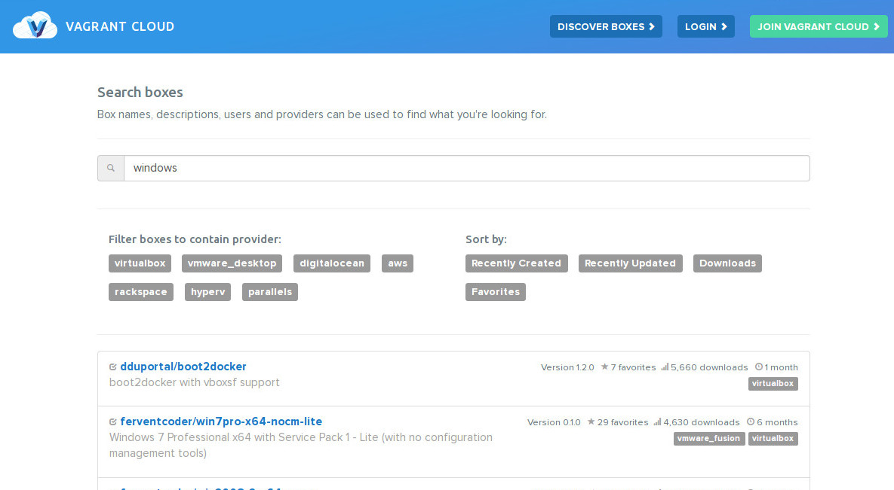

 <!-- .element: class="no-border" -->

#### Descomplicando o uso de VMs para desenvolvimento de software

<small>Versão 0.1</small>

Note:
Anotação para apresentador vai aqui.

----
<!-- .slide: data-background="img/coder-trans.png" -->

## Um caso comum

1. Sou desenvolvedor Java, PHP, Python, Go, Ruby, WTF...
2. Uso bases MySQL, Oracle, PostgreSQL, M$ SQL Server...
3. Programo para Windows, Linux, Mac OSX, BSD...

====
<!-- .slide: data-background="img/computer-setups-trans.png" -->

Preciso de várias máquinas?

<!-- .element: class="fragment" data-fragment="1" -->
ou <br>
Vários serviços rodando na minha?

====
<!-- .slide: data-background="img/overheat-trans.png" -->

### Problemas:

* Consumo de recursos
  
  _webserver_ + _database_ + compiladores

  <small>sem contar energia elétrica</small>

* Gerenciamento manual
  
  _init_ dos serviços

* Serviços disputando portas
  
  > Quem está usando a porta http 80?

====
<!-- .slide: data-background="img/lightcycle-trans.png" -->

### Solução mais "prática"

Máquinas virtuais (VMs)

<big>Mas será prática mesmo?</big> <!-- .element: class="fragment" data-fragment="1" -->

----

# Vagrant

Note: Vamos falar sobre o Vagrant

====
<!-- .slide: data-background="img/homeless-trans.png" -->

### O que é Vagrant?

<small>
_Vagrant:_ vagante, errante, vagabundo, mendigo <br>
Fonte: _google_
</small>

<!-- .element: class="fragment" data-fragment="1" -->
Não este tipo de _"vagrant"_

Note: "Vagrant" pode ser traduzido como "vagabundo"
ou "mendigo"

====
<!-- .slide: data-background="img/vagrant-bg-trans.png" -->

### O que é Vagrant?

http://vagrantup.com

http://vagrantcloud.com

http://github.com/mitchellh/vagrant

[© 2013 HashiCorp](http://www.hashicorp.com/)

Note: Agora sim. O que é Vagrant?

====
<!-- .slide: data-background="img/vagrant-bg-trans.png" -->

### O que é Vagrant?

Vagrant é uma ferramenta para construir e 
distribuir ambientes de desenvolvimento.


Note: Descrição no github

====
<!-- .slide: data-background="img/vagrant-bg-trans.png" -->

Ambientes de desenvolvimento gerenciados pelo Vagrant podem
rodar em plataformas virtuais locais como **VirtualBox**
ou **VMware**, na _nuvem_ via **AWS** ou **OpenStack**,
ou ainda em _recipientes_ como **Docker** ou **LXC**.

Note: Ainda do github

====
<!-- .slide: data-background="img/vagrant-bg-trans.png" -->

Vagrant fornece o _framework_ e configurações para criar e
gerenciar ambientes de desenvolvimento completos e portáveis.

Disponível para Windows, Mac OSX e GNU/Linux.

Note: Mais ainda do github

----

### Começando...

ou inicializando um ambiente Vagrant "do zero"

```bash
vagrant init hashicorp/precise32
vagrant up
```

====
<!-- .slide: data-background="img/free-time-trans.png" -->

### O que ganho com isso?

====

`vagrant init`

```
$ vagrant init chef/debian-7.4-i386
A `Vagrantfile` has been placed in this directory. You are now
ready to `vagrant up` your first virtual environment! Please read
the comments in the Vagrantfile as well as documentation on
`vagrantup.com` for more information on using Vagrant.
```

====

`vagrant up`

```
$ vagrant up
Bringing machine 'default' up with 'virtualbox' provider...
==> default: Importing base box 'chef/debian-7.4-i386'...
==> default: Matching MAC address for NAT networking...
==> default: Checking if box 'chef/debian-7.4-i386' is up to date...
==> default: Setting the name of the VM: wheezy32_default_1412389367652_67267
==> default: Clearing any previously set network interfaces...
==> default: Preparing network interfaces based on configuration...
    default: Adapter 1: nat
==> default: Forwarding ports...
    default: 22 => 2222 (adapter 1)
==> default: Booting VM...
==> default: Waiting for machine to boot. This may take a few minutes...
    default: SSH address: 127.0.0.1:2222
    default: SSH username: vagrant
    default: SSH auth method: private key
    default: Warning: Connection timeout. Retrying...
==> default: Machine booted and ready!
==> default: Checking for guest additions in VM...
==> default: Mounting shared folders...
    default: /vagrant => /media/userdata/diovani/Vagrant/wheezy32
```

====

`vagrant ssh`

```
$ vagrant ssh
Linux packer-debian-7 3.2.0-4-686-pae #1 SMP Debian 3.2.54-2 i686

The programs included with the Debian GNU/Linux system are free software;
the exact distribution terms for each program are described in the
individual files in /usr/share/doc/*/copyright.

Debian GNU/Linux comes with ABSOLUTELY NO WARRANTY, to the extent
permitted by applicable law.
Last login: Sat Oct  4 03:03:55 2014 from 10.0.2.2
vagrant@packer-debian-7:~$
```

```
vagrant@packer-debian-7:~$ uname -a
Linux packer-debian-7 3.2.0-4-686-pae #1 SMP Debian 3.2.54-2 i686 GNU/Linux
```

Note: Exemplo de uso do vagrant

----
<!-- .slide: data-background="img/armymen-trans.png" -->

### Comandos <small>usados com mais frequência</small>

* `vagrant init [box name] [box url]`

    <small>Inicializa o diretorio atual para ser um ambiente Vagrant, criando um `Vagrantfile` se ainda não existir.</small>

* `vagrant up`

    <small>Cria e configura uma VM de acordo com o `Vagrantfile`</small>

* `vagrant halt`

    <small>Desliga a VM que o Vagrant controle no diretório atual</small>

* `vagrant reload`
    
    <small>Equivalente a executar `vagrant halt` seguido de `vagrant up`. Usado para recarregar mudanças no `Vagrantfile`</small>

====
<!-- .slide: data-background="img/armymen-trans.png" -->

* `vagrant suspend`

    <small>Suspende a VM, ao invés de desligá-la completamente</small>

* `vagrant resume`
    
    <small>Retoma a execução de uma VM previamente parada com `vagrant suspend`</small>

* `vagrant ssh`

    <small>Acessa o _shell_ da VM atual via _ssh_ (VM Linux ou BSD, principalmente)</small>

* `vagrant rdp`

    <small>Inicia um cliente _RDP_ para acesso ao _desktop_ da VM (VM Windows, principalmente)</small>

====

#### Todos os comandos

    Below is a listing of all available Vagrant commands and a brief description of what they do.
    
    box             manages boxes: installation, removal, etc.
    connect         connect to a remotely shared Vagrant environment
    destroy         stops and deletes all traces of the vagrant machine
    docker-logs     outputs the logs from the Docker container
    docker-run      run a one-off command in the context of a container
    global-status   outputs status Vagrant environments for this user
    halt            stops the vagrant machine
    help            shows the help for a subcommand
    init            initializes a new Vagrant environment by creating a Vagrantfile
    list-commands   outputs all available Vagrant subcommands, even non-primary ones
    login           log in to Vagrant Cloud
    package         packages a running vagrant environment into a box
    plugin          manages plugins: install, uninstall, update, etc.
    provision       provisions the vagrant machine
    rdp             connects to machine via RDP
    reload          restarts vagrant machine, loads new Vagrantfile configuration
    resume          resume a suspended vagrant machine
    rsync           syncs rsync synced folders to remote machine
    rsync-auto      syncs rsync synced folders automatically when files change
    share           share your Vagrant environment with anyone in the world
    ssh             connects to machine via SSH
    ssh-config      outputs OpenSSH valid configuration to connect to the machine
    status          outputs status of the vagrant machine
    suspend         suspends the machine
    up              starts and provisions the vagrant environment
    version         prints current and latest Vagrant version

----
<!-- .slide: data-background="img/files-trans.png" -->

## Vagrantfile

```ruby
# -*- mode: ruby -*-
# vi: set ft=ruby :

# Vagrantfile API/syntax version. Don't touch unless you know what you're doing!
VAGRANTFILE_API_VERSION = "2"

Vagrant.configure(VAGRANTFILE_API_VERSION) do |config|
  # All Vagrant configuration is done here. The most common configuration
  # options are documented and commented below. For a complete reference,
  # please see the online documentation at vagrantup.com.

  # Every Vagrant virtual environment requires a box to build off of.
  config.vm.box = "hashicorp/precise32"

  # Disable automatic box update checking. If you disable this, then
  # boxes will only be checked for updates when the user runs
  # `vagrant box outdated`. This is not recommended.
  # config.vm.box_check_update = false

  # Create a forwarded port mapping which allows access to a specific port
  # within the machine from a port on the host machine. In the example below,
  # accessing "localhost:8080" will access port 80 on the guest machine.
  # config.vm.network "forwarded_port", guest: 80, host: 8080
  config.vm.network "forwarded_port", guest: 80, host: 8080

  # Create a private network, which allows host-only access to the machine
  # using a specific IP.
  # config.vm.network "private_network", ip: "192.168.33.10"

  # Create a public network, which generally matched to bridged network.
  # Bridged networks make the machine appear as another physical device on
  # your network.
  # config.vm.network "public_network"

  # If true, then any SSH connections made will enable agent forwarding.
  # Default value: false
  # config.ssh.forward_agent = true

  # Share an additional folder to the guest VM. The first argument is
  # the path on the host to the actual folder. The second argument is
  # the path on the guest to mount the folder. And the optional third
  # argument is a set of non-required options.
  # config.vm.synced_folder "../data", "/vagrant_data"
  config.vm.synced_folder "/home/diovani/Git/sw-freedom-day", "/var/www"

  # Provider-specific configuration so you can fine-tune various
  # backing providers for Vagrant. These expose provider-specific options.
  # Example for VirtualBox:
  #
  # config.vm.provider "virtualbox" do |vb|
  #   # Don't boot with headless mode
  #   vb.gui = true
  #
  #   # Use VBoxManage to customize the VM. For example to change memory:
  #   vb.customize ["modifyvm", :id, "--memory", "1024"]
  # end
  #
  # View the documentation for the provider you're using for more
  # information on available options.

  # Enable provisioning with CFEngine. CFEngine Community packages are
  # automatically installed. For example, configure the host as a
  # policy server and optionally a policy file to run:
  #
  # config.vm.provision "cfengine" do |cf|
  #   cf.am_policy_hub = true
  #   # cf.run_file = "motd.cf"
  # end
  #
  # You can also configure and bootstrap a client to an existing
  # policy server:
  #
  # config.vm.provision "cfengine" do |cf|
  #   cf.policy_server_address = "10.0.2.15"
  # end

  # Enable provisioning with Puppet stand alone.  Puppet manifests
  # are contained in a directory path relative to this Vagrantfile.
  # You will need to create the manifests directory and a manifest in
  # the file default.pp in the manifests_path directory.
  #
  # config.vm.provision "puppet" do |puppet|
  #   puppet.manifests_path = "manifests"
  #   puppet.manifest_file  = "site.pp"
  # end

  # Enable provisioning with chef solo, specifying a cookbooks path, roles
  # path, and data_bags path (all relative to this Vagrantfile), and adding
  # some recipes and/or roles.
  #
  # config.vm.provision "chef_solo" do |chef|
  #   chef.cookbooks_path = "../my-recipes/cookbooks"
  #   chef.roles_path = "../my-recipes/roles"
  #   chef.data_bags_path = "../my-recipes/data_bags"
  #   chef.add_recipe "mysql"
  #   chef.add_role "web"
  #
  #   # You may also specify custom JSON attributes:
  #   chef.json = { mysql_password: "foo" }
  # end

  # Enable provisioning with chef server, specifying the chef server URL,
  # and the path to the validation key (relative to this Vagrantfile).
  #
  # The Opscode Platform uses HTTPS. Substitute your organization for
  # ORGNAME in the URL and validation key.
  #
  # If you have your own Chef Server, use the appropriate URL, which may be
  # HTTP instead of HTTPS depending on your configuration. Also change the
  # validation key to validation.pem.
  #
  # config.vm.provision "chef_client" do |chef|
  #   chef.chef_server_url = "https://api.opscode.com/organizations/ORGNAME"
  #   chef.validation_key_path = "ORGNAME-validator.pem"
  # end
  #
  # If you're using the Opscode platform, your validator client is
  # ORGNAME-validator, replacing ORGNAME with your organization name.
  #
  # If you have your own Chef Server, the default validation client name is
  # chef-validator, unless you changed the configuration.
  #
  #   chef.validation_client_name = "ORGNAME-validator"
end
```

Note: O arquivo de configuração do Vagrant.
    Ele tem esse nome, porque realmente se chama `Vagrantfile`

====
<!-- .slide: data-background="img/files-trans.png" -->

## Vagrantfile

A função principal do `Vagranfile` é descrever o tipo 
de VM necessária para um projeto e como configurar 
e preparar esta VM.

Note: Fonte: Documentação do Vagrant 

====

### Redirecionamento de portas

```ruby
  # Create a forwarded port mapping which allows access to a specific port
  # within the machine from a port on the host machine. In the example below,
  # accessing "localhost:8080" will access port 80 on the guest machine.
  # config.vm.network "forwarded_port", guest: 80, host: 8080
  config.vm.network "forwarded_port", guest: 80, host: 8080
```

Note: Algumas coisas que se define no Vagrantfile

====

### Sincronizando diretórios

```ruby
  # Share an additional folder to the guest VM. The first argument is
  # the path on the host to the actual folder. The second argument is
  # the path on the guest to mount the folder. And the optional third
  # argument is a set of non-required options.
  # config.vm.synced_folder "../data", "/vagrant_data"
  config.vm.synced_folder "/home/diovani/Git/sw-freedom-day", "/var/www"
```

Note: Algumas coisas que se define no Vagrantfile

====

#### Acesso transparente <small>(como se fosse local)</small>

* Vagrant box rodando com Apache instalado.
* Portas e diretórios configurados como nos slides anteriores.

```
$ vagrant halt
```

```
$ curl http://localhost:8080
curl: (7) Failed to connect to localhost port 8080: Connection refused
$ ls /home/diovani/Git/sw-freedom-day
$
```

```
$ vagrant up
```

```
$ echo "olá Feevale" > /home/diovani/Git/sw-freedom-day/index.html
$ ls /home/diovani/Git/sw-freedom-day
index.html
$ curl http://localhost:8080
olá Feevale
```

Note: Primeiro garantimos que a VM não esteja rodando e testamos o acesso a porta 8080.
    Depois, iniciamos a VM a criamos uma página index.html para testar novamente.

----
<!-- .slide: data-background="img/goku-trans.png" -->

## Vagrant cloud

http://vagrantcloud.com/

====

Vagrant Cloud combina com Vagrant para permitir **acesso, 
visualização e colaboração** entre times.

====

As características do Vagrant Cloud vão desde **versionamento** 
até **compartilhamento de acesso remoto** a ambiente Vagrant.

----
<!-- .slide: data-background="img/cat-in-box-trans.png" -->

### Mas o que é uma "box"?

_Boxes_ são o formato de pacotes para ambientes Vagrant.

Uma _box_ pode ser usada por qualquer pessoa em qualquer
plataforma suportada pelo Vagrant para erguer um ambiente
funcional idêntico.

Note: Já falamos de "box", ou pelo menos vimos nos exemplos...

====

### Descobrindo "boxes"

http://vagrantcloud.com/discover/featured

Note: página do vagrant cloud que permite encontrar boxes compartilhadas
    Também é possível criar compartilhar boxes customizadas

====



Note: Procurando uma box com Debian 

====



Note: Tem Windows também

----
<!-- .slide: data-background="img/world-trans.png" -->

## Vagrant share

`vagrant share` lhe permite compartilhar seu ambiente com
qualquer pessoa no mundo.

====
<!-- .slide: data-background="img/world-trans.png" -->

`vagrant share` possui três modos ou características principais:

* HTTP Sharing
* SSH sharing
* General sharing

====

#### Compartilhando a porta HTTP

```
$ vagrant up
```

```
$ vagrant share
==> default: Detecting network information for machine...
    default: Local machine address: 127.0.0.1
    default:  
    default: Note: With the local address (127.0.0.1), Vagrant Share can only
    default: share any ports you have forwarded. Assign an IP or address to your
    default: machine to expose all TCP ports. Consult the documentation
    default: for your provider ('virtualbox') for more information.
    default:  
    default: Local HTTP port: 8080
    default: Local HTTPS port: disabled
    default: Port: 2222
    default: Port: 8080
==> default: Checking authentication and authorization...
==> default: Creating Vagrant Share session...
    default: Share will be at: stifling-hyena-3069
==> default: Your Vagrant Share is running! Name: stifling-hyena-3069
==> default: URL: http://stifling-hyena-3069.vagrantshare.com
==> default:  
==> default: You're sharing your Vagrant machine in "restricted" mode. This
==> default: means that only the ports listed above will be accessible by
==> default: other users (either via the web URL or using `vagrant connect`).
```

Note: As portas comparilhadas, como especificadas no Vagrantfile, são expostas para o mundo.
    O compartilhamento persiste enquanto o terminal ficar reservado (Interrompe com `ctrl+C`)

====

#### Acessando o compartilhamento <small>de qualquer lugar do mundo</small>

```
$ curl http://stifling-hyena-3069.vagrantshare.com
olá Feevale
```

====

#### Modificando em tempo real

```
$ echo "Até mais Feevale. Espero que tenham gostado da palestra" > /home/diovani/Git/sw-freedom-day/index.html 
```

```
$ curl http://stifling-hyena-3069.vagrantshare.com
Até mais Feevale. Espero que tenham gostado da palestra
```

----

### "Tema de casa"

* Provisioning
* `vagrant package`
* Box distribution

Note: Nem todas características do Vagrant couberam na palestra,
    ainda há mais o que pesquisar

====
<!-- .slide: data-background="img/questions-trans.png" -->

## Dúvidas

----

### Créditos da apresentação

<small>[slides.diovani.com](http://slides.diovani.com/)</small>

por [Paulo Diovani Gonçalves](mailto:paulo@diovani.com)

<small>[paulo@diovani.com]((mailto:paulo@diovani.com)</small>

_powered by: [reveal.js](http://lab.hakim.se/reveal-js/)_

<small>[http://lab.hakim.se/reveal-js/](http://lab.hakim.se/reveal-js/)</small>

====
<!-- .slide: class="image-credits" -->

#### Créditos das imagens

* vagrant-logo, vagrant-bg http://vagrantup.com
* coder http://blog.locaweb.com.br
* computer-setups http://mosslounge.com
* overheat http://sevacall.com
* lightcycle http://simplywallpaper.net
* mendigo http://hubimg.com
* free-time http://kristinareken.wordpress.com
* animação criada com https://github.com/sublimehq/anim_encoder
* army men http://danbecker.info
* goku http://mdnsolutions.com
* files http://southfloridalawyers.blogspot.com.br
* cat in a box http://photo-dictionary.com
* world http://thecultureist.com
* questions http://newschool.edu