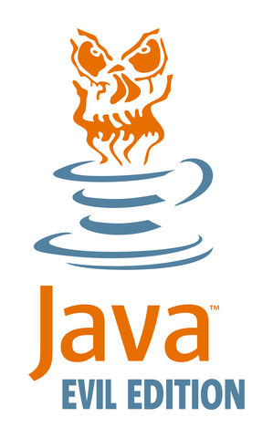
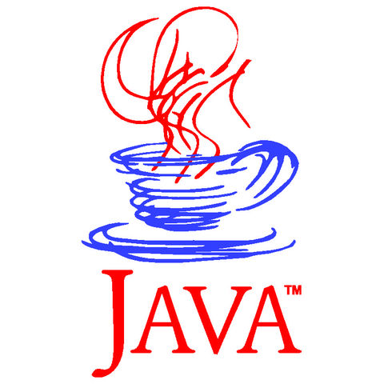
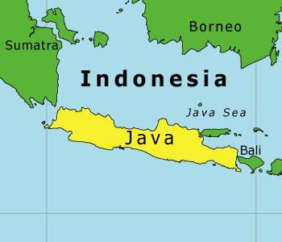
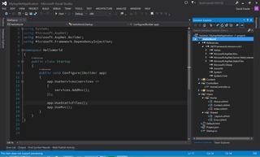
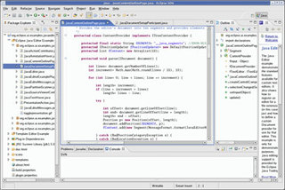
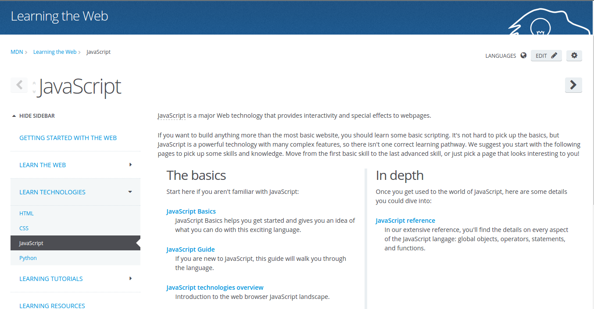
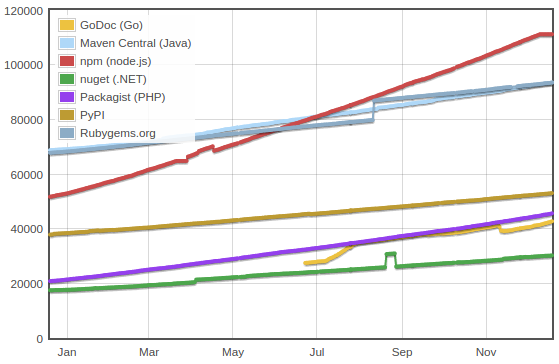
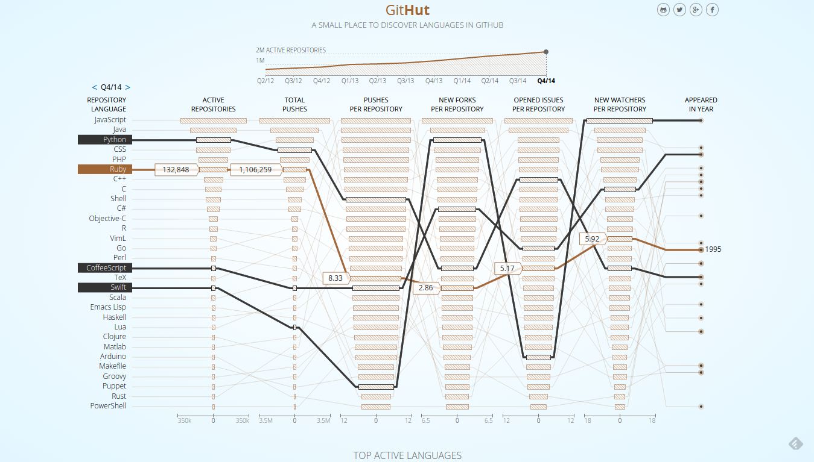

 <!-- .element: class="pull-right" -->

## Por que diabos vou usar Java?

Uma apresentação sobre linguagens de programação modernas,
com foco em escrita rápida e código legível.

<small>Versão 0.1.0</small>

====
<!-- .slide: class="author" -->

#### Paulo Diovani Gonçalves

-  <!-- .element: class="pull-right" -->
- Desenvolvedor na Codeminer 42
- Acadêmico de graduação em Tecnologia em Sistemas
    para Internet pela Universidade Feevale
- Usuário GNU/Linux desde 2005
- PHP, Javascript, Java, Node.js, Ruby, Python, Arduino

![codeminer42][code-logo] <!-- .element: class="no-border no-background" -->

<small>
[codeminer42.com][code-site]
<br>[become@codeminer42.com][code-become]
</small>

[code-site]: http://codeminer42.com/
[code-logo]: img/codeminer42.png
[code-become]: mailto:become@codeminer42.com

====

#### Importante!

Isso **não é** uma _crítica a Java_

<small>
Java&trade; é uma linguagem de programação
desenvolvida pela Sun Microsystems em 1991, a qual foi adquirida
pela Oracle&reg; Corporation em 2009-2010.
</small>

Note:
...mas é.

Na verdade estou usando Java como exemplo de linguagem _verbosa_,
poderia ser C++, C#, Delphi, etc.

====

#### Importante!

Cada linguagem de programação é apropriada ou, pelo menos,
indicada, para um ou mais tipos de problemas específicos.

Note:
...mesmo Java.

Os exemplos usados aqui podem facilmente ser refutados
se consideradas condições diversas.

PHP, por exemplo, é amplamente conhecida como uma linguagem
apropriada para desenvolvimento web.
Java, por sua vez, é indispensável para desenvolvimento
Android.

====

#### ~~Não tão~~ importante!

Os argumentos apresentados aqui são baseados em experiências
próprias e opinioes pessoais.

<small>Evitem _flame wars_</small>

Note:
...concordem se quiserem.

----



[Oracle Java](https://oracle.com/java) <!-- .element: class="with-url" -->

Note:
O logo (conhecidíssimo) da linguagem Java é uma xícara de café.

====




Note:
O nome e logo da linguagem vem da ilhas de Java, na indonésia,
onde se produz um café forte, escuro e doce.

====

 <!-- .element: style="transform: scale(1.6)" -->

Note:
...Eu, particularmente, acho que o logo está muito mais
ligado à quantidade de tempo que o programador java vai
precisar ficar acordado. E na quantidade de café que
precisa tomar para isso.

Eis um _típico programador Java_

====


Note:
Minha intenção, com esta apresentação, é mostrar que existem
linguagens que permitem um trabalho mais produtivo e menos
cansativo.

Eis um _típico programador Ruby_.

----

```java
// Hello World in Java
class HelloWorld {
    static public void main( String args[] ) {
        System.out.println( "Hello World!" );
    }
}
```

<small>Fonte: http://www.roesler-ac.de/wolfram/hello.htm</small>

====

```ruby
# Hello World in Ruby
puts "Hello World!"
```

<small>Fonte: http://www.roesler-ac.de/wolfram/hello.htm</small>

====

```java
// Read and write files in Java
class FileStreamsReadnWrite {
    public static void main(String[] args) {
        try {
            File stockInputFile  = new File("/tmp/stockIn.txt");
            File stockOutputFile = new File("/tmp/StockOut.txt");
            FileInputStream fis  = new FileInputStream(stockInputFile);
            FileOutputStream fos = new FileOutputStream(stockOutputFile);
            int count;

            while ((count = fis.read()) != -1) {
                fos.write(count);
            }

            fis.close();
            fos.close();
        } catch (FileNotFoundException e) {
            System.err.println("FileStreamsReadnWrite: " + e);
        } catch (IOException e) {
            System.err.println("FileStreamsReadnWrite: " + e);
        }
    }
}
```

<small>Fonte: http://javarevisited.blogspot.in/2011/12/read-and-write-text-file-java.html</small>

Note:
Abrir dois arquivos como Streams e gravar as informações
do primeiro no segundo.

====

```javascript
// Read and write files in Node.js
var fis = fs.createReadStream("/tmp/stockIn.txt");
var fos = fs.createWriteStream("/tmp/stockOut.txt");

fis.pipe(fos);
```

<small>Fonte: `self`</small>

Note:
A mesma coisa, mas muito mais fácil. :D

----

| Menos produtivo     | Mais produtivo         |
| --                  | --                     |
| Dependência de IDEs | Boa documentação       |
| Inconsistências     | Comunidade ativa       |
| Regras radicais     | Convenções             |
| Verbosidade         | Linguagem natural      |
|                     | Gerenciador de pacotes |
|                     | Simplicidade           |

<small>Menos trabalho == Mais produtividade</small>

----

### Menor produtividade

====

#### Dependência de IDEs

 <!-- .element: class="pull-right" -->
 <!-- .element: class="pull-right clear" -->

Problemas:

- Consumo de memória
- Exigência de _GUI_
- Ofuscação de dependências
- Programador não sabe/consegue
    - Desenvolver sem IDE?
    - Compilar via linha de comando?
    - Fazer deploy?

Note:
Screenshots de Visual Studio e Eclipse para ilustrar.

====

#### Inconsistências

Falta de padronização nas bibliotecas tornam a linguagem
difícil de aprender/memorizar.

```php
// PHP naming (does not have) conventions

strlen(); str_pad();

urlencode(); utf8_encode();

gethostname(); php_uname();

trim(); substr(); chr();
```

====

#### Regras radicais

Muitas regras podem deixar a linguagem confusa e
incentivam _bikeshedding_.

- Nomes de arquivos
- Tipagem forte
- Conversões explícitas / _casting_

====

#### Verbosidade

Muitas linhas de código para resolver tarefas simples.

<small>Já falamos sobre Java?</small>

----

### Maior produtividade

====

#### Boa documentação



Note:
Documentação de fácil acesso e fácil de entender.

Screenshor do Mozilla Developer Center.

====

#### Comunidade ativa



<small>Fonte: http://modulecounts.com</small>

Note:
Em Julho/2014, a quantidade de módulos do 
npm superou as do Rubygems e Maven (Java).

====

#### Convenções

Convenções ao invés de configurações

- Menos decisões
- Simplicidade
- Sem perder flexibilidade

Note:
Isto depende muito mais da comunidade e
frameworks do que da linguagem.

====

#### Linguagem natural

```ruby
5.times do
  puts "Hello"
end
```

É melhor que

```c
for (int i = 0; i < 5; i++) {
    printf("Hello");
}
```

====

#### Gerenciador de pacotes

 <!-- .element: class="no-border no-background" -->
 <!-- .element: class="no-border no-background" -->
 <!-- .element: class="no-border no-background" -->
 <!-- .element: class="no-border no-background" -->
 <!-- .element: class="no-border no-background" style="width: 240px" -->

Note:
Um bom gerenciador de pacotes pode fazer a diferença
na produtividade, especialmente quando existe uma
grande comunidade criando, testando e mantendo pacotes
existentes.

====

#### Simplicidade

KISS <!-- .element: style="font-size:8em; font-weight: bold;" -->

<small>_keep it simple, stupid_</small>

Note:
Mesmo com Orientação a objetos, MVC, patterns, etc.
As vezes o melhor é o mais simples.

----



<small>http://githut.info</small>

----

### Algumas linguagens

<small>Exemplos de códigos</small>

Note:
Agora vou mostrar exemplos de algumas linguagens
de programaçãomais _fáceis_ de se trabalhar.

====

#### Python

```python
# Python 3: Fibonacci series up to n
def fib(n):
    a, b = 0, 1
    while a < n:
        print(a, end=' ')
        a, b = b, a+b
    print()

fib(1000)
# out: 0 1 1 2 3 5 8 13 21 34 55 89 144 233 377 610 987
```

<small>http://python.org</small>

Note:
- Menos código escrito
- Blocos separados por indentação
- Grande quantidade de bibliotecas
- Ótimo para IO

====

#### Ruby

```ruby
# The Greeter class
class Greeter
  def initialize(name)
    @name = name.capitalize
  end

  def salute
    puts "Hello #{@name}!"
  end
end

# Create a new object
g = Greeter.new("world")

# Output "Hello World!"
g.salute
```

<small>http://ruby-lang.org</small>

Note:
- Liguagem natural
- Convention over configuration
- Grande comunidade (e unida)
- Ecossistema conciso
- Melhores frameworks de testes (TDD/BDD)

====

#### Node.js

```javascript
var http = require('http');

var server = http.createServer(function (req, res) {
  res.writeHead(200, {'Content-Type': 'text/plain'});
  res.end('Hello World\n');
});

server.listen(1337, '127.0.0.1');

console.log('Server running at http://127.0.0.1:1337/');
```

<small>http://nodejs.org</small>

Note:
- Javascript (sintaxe conhecida)
- Event based, non-blocking IO
- Comunidade crescente
- Muitos módulos disponíveis
- Convenções sobre callbacks, streams, etc
- Ótima documentação

====

#### CoffeeScript

```coffeescript
# Assignment:
number   = 42
opposite = true

# Conditions:
number = -42 if opposite

# Functions:
square = (x) -> x * x

# Arrays:
list = [1, 2, 3, 4, 5]

# Objects:
math =
  root:   Math.sqrt
  square: square
  cube:   (x) -> x * square x

# Splats:
race = (winner, runners...) ->
  print winner, runners

# Array comprehensions:
cubes = (math.cube num for num in list)
```

<small>http://coffeescript.org</small>

Note:
CoffeeScript (compila para Javascript)

- Menos código escrito
- Blocos separados por indentação
- Liguagem natural
- Ótima para escrever testes

====

#### Apple Swift

```swift
func hasAnyMatches(list: [Int], condition: Int -> Bool) -> Bool {
    for item in list {
        if condition(item) {
            return true
        }
    }
    return false
}
func lessThanTen(number: Int) -> Bool {
    return number < 10
}
var numbers = [20, 19, 7, 12]
hasAnyMatches(numbers, lessThanTen)
```

<small>http://developer.apple.com/swift/</small>

Note:
- Moderna
- Com foco em segurança
- Simples (em comparação com Objective-C)

----

### Alternativas

> Preciso desenvolver em certa linguagem,
> nas não gosto / acho difícil.

Note:
Existem linguagens ou ferramentas que permitem desenvolver
em, por exemplo, Java, de uma forma mais simples e fácil.

====

#### CoffeeScript

> CoffeScript é uma pequena linguagem que compila em Javascript.

```coffeescript
# CoffeeScript source
fill = (container, liquid = "coffee") ->
  "Filling the #{container} with #{liquid}..."
```

```javascript
// compiled Javascript
var fill;

fill = function(container, liquid) {
  if (liquid == null) {
    liquid = "coffee";
  }
  return "Filling the " + container + " with " + liquid + "...";
};
```

Note:
Já falamos de CoffeeScript, mas faltou uma comparação
como esta.

====

#### Xtend

> Xtend é um dialeto de Java flexível e expressivo, que compila
> em código-fonte compatível com Java 5.

```xtend
package my.company

import java.util.list

class Greeter {
    def greetABunchOfPeople(List<String> people) {
        people.forEach [
            printLn(sayHello)
        ]
    }

    def sayHello(String personToGreet)'''
        Hello <<personToGreet>>!
    '''
}
```

<small>http://eclipse.org/xtend/</small>

Note:
- Criada pelo time do Eclipse
- Simplifica a forma de escrever Java

====

#### Mirah

> Mirah é uma nova forma de ver linguagens para a JVM.

```ruby
def foo
  home = System.getProperty "java.home"
  System.setProperty "hello.world", "something"
  hello = System.getProperty "hello.world"

  puts home
  puts hello
end

puts "Hello world!"
foo
```

<small>http://www.mirah.org/</small>

Note:
- Sintaxe similar a Ruby
- Compila para .class
- Rápida com Java (sério?)

====

#### JRuby

> JRuby é uma implemantação de Ruby usando a JVM

```ruby
def total_elements nested_ary
  nested_ary.inject(0) { | sum, ary|
    sum += ary.size
  }
end

a1 = %w{ a b c d}
a2 = %w{ u v w x y }
nested =  [a1, a2]

total = total_elements nested

p total
```

<small>http://jruby.org/</small>

Note:
- É Ruby interpretado pela JVM
- Alta performance
- Real Threading
- Grande gama de bibliotecas

----

<small>_Fim_</small>

## Que linguagem você vai usar?

====

> Se deseja contratar um bom programador Java,
> contrate um programador Python.
>
> <small>-- _Fábio Olivé_ </small>

Note:
Algums citações...

====

> Um **bom programador** só pode ser considerado
> como tal quando conhece várias linguagens.
>
> Aprenda tantas linguagens diferentes quanto
> puder.
>
> <small>-- _alguém disse num Tchelinux_</small>

Note:
Algums citações...

----

### Créditos das imagens

<small>Em ordem de apresentação</small>

* thedailywtf.com
* clearsoftinc.com
* martinjeeblog.files.wordpress.com
* images.bwbx.io
* svs.github.io
* codeminer42.com
* msdn.com
* eclipse.org
* modulecounts.com

====

#### Créditos das imagens (cont.)

<small>Em ordem de apresentação</small>

* developer.mozilla.org
* rubigems.org
* npmjs.org
* getcomposer.org
* maven.apache.org
* nuget.org
* githut.info

====

### Créditos da apresentação

por [Paulo Diovani Gonçalves](mailto:paulo@diovani.com)

<small>[paulo@diovani.com]((mailto:paulo@diovani.com)</small>

_powered by: [reveal.js](http://lab.hakim.se/reveal-js/)_

<small>[http://lab.hakim.se/reveal-js/](http://lab.hakim.se/reveal-js/)</small>
